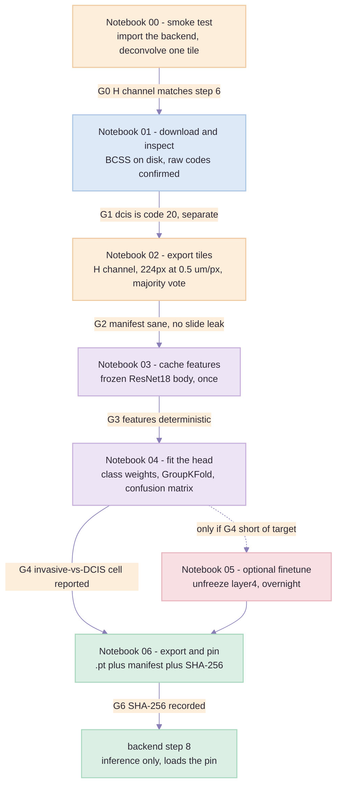

# Approach 1 — Build Plan: BCSS → H-channel ResNet18 tile classifier

> Created: 2 Sep 2026 | Audience: whoever writes the code. Basic ML knowledge assumed, no pathology
> background needed.
> Decided by: [`segmentation-approaches-comparison.md`](segmentation-approaches-comparison.md) Part 7 —
> "build Approach 1 with Approach 3's initialisation".
> Companion: [`approach-3-training-plan.md`](approach-3-training-plan.md) — the same pipeline with one
> box swapped, and the A/B that decides which model ships.
> Companion: [`approach-4a-training-plan.md`](approach-4a-training-plan.md) — the same pipeline with the
> **class-`1` label source** swapped, written in response to the census in Part 2 below.
> Feeds: guide step 9 = **code step 8**, `backend/app/pipeline/step08_tissue_type_segmentation/`.

---

## Part 0 — What this document is, and what it is not

This is the **build order** for the one model this project trains. It says what to download, from
where, into which folder; which notebook to write next; and **which test has to be green before the
next notebook is worth writing at all**. It does not re-argue the design — that argument is in
[`segmentation-approaches-comparison.md`](segmentation-approaches-comparison.md), and every decision
below is downstream of it.

Read Part 1 before writing any code. It is the audit of what already exists, and about half the work
this plan describes turns out to be *not writing* something the backend already has.

**The deliverable, in one line:** `models/tissue_type/invasive_tile_v1_imagenet.pt` — a 3-class head
on a frozen ResNet18 that reads a 224 px haematoxylin-channel tile at 0.5 µm/px and answers
*invasive epithelium / non-invasive epithelium / non-epithelium* — plus the confusion matrix that
says how much to trust it.

---

## Part 1 — What steps 1 to 7 already give us *(read this first)*

Steps 1–7 are implemented and run for real against an uploaded slide. This is not a greenfield
training project; it is a training project with a fixed input contract already written in code. Four
of the things this plan needs already exist, and re-implementing any of them in a notebook is how
training and inference drift apart.

| # | Step | Module | What it hands the training work |
| --- | --- | --- | --- |
| 1 | Read the slide | `app/ingestion/slide_reader.py` | `best_level_for_mpp()` — the rule that resolution is chosen in **microns, never by level index**. The exporter must obey it too. |
| 2 | Quality control | `app/pipeline/step02_quality_control/` | GrandQC artefact mask. **Non-commercial licence — benchmark only.** Not used in training, and its `models.py` is the reference for how this codebase loads a foreign checkpoint safely. |
| 3 | Tissue mask | `step03_tissue_mask/mask.py` | Saturation + Otsu/triangle tissue mask at 2 µm/px, with morphology in microns. This is what tells inference *where* to run. |
| 4 | White calibration | `step04_white_calibration/calibration.py` | Per-slide `I₀` from the 95th percentile of glass, plus an optional fitted vignette surface. **This is Step A of the channel conversion, already built and already cached.** |
| 5 | Optical density | `step05_optical_density/` + `app/common/imaging.optical_density` | `OD = -log10(I/I₀)`, the `stained` mask at Macenko's β = 0.15, and `tiles.read_tile()` — which resamples **in intensity space with BOX averaging, before the logarithm**. Copy that ordering exactly. |
| 6 | Colour deconvolution | `step06_colour_deconvolution/deconvolution.separate` + `app/common/stains.py` | **Step B, already built.** `RUIFROK_HDAB` (fixed vectors, column 0 = haematoxylin) and `separate(od, matrix).haematoxylin`. The one function that defines what the H channel *is* in this codebase. |
| 7 | Tiling | `step07_tiling/index.py` | The funnel — every tile → on tissue → clean — and the `Tile` address shape (level-0 `x`, `y`, `span`). Coordinates, never pixels. |

### The rule that follows from this

> **The exporter does not own a colour-deconvolution implementation.** It imports
> `app.common.stains` and `app.pipeline.step06_colour_deconvolution.deconvolution.separate`, the same
> two things inference calls. If a notebook ever reaches for `skimage.color.rgb2hed` instead, the
> model is being trained on a different definition of "haematoxylin channel" from the one it will be
> served, and the failure will look like a model problem for a week before anyone finds the plumbing.

Concretely, the H channel is:

```python
from app.common.imaging import optical_density
from app.common.stains import RUIFROK_HDAB
from app.pipeline.step06_colour_deconvolution.deconvolution import separate

od = optical_density(rgb, white)                    # step 4's I0, step 5's transform
h  = separate(od, RUIFROK_HDAB).haematoxylin        # step 6's column 0
x  = np.clip(h, 0.0, 1.5) / 1.5                     # the model's input range
```

### Three things the audit turned up that change the plan

**1. `settings.tile_size` moves from 512 to 224, for the whole pipeline.**

`settings.tile_size` was 512 at `target_mpp = 0.5` — a 256 µm field. The training tile in both design
documents is **224 px at 0.5 µm/px** — a 112 µm field, "about nine cells across", which is the number
the DCIS-versus-invasive argument rests on.

The obvious repair is to leave the config alone and give step 8 its own grid. **We are not doing
that**, because the codebase's own principle says not to: `config.py` states twice that the working
geometry is "one decision for the whole pipeline, made and reported at step 1" and that "a second
copy here would be a second answer to the same question". A second tile size living in step 8 is
exactly that second answer. And step 7's docstring already concedes the point — *"size: the model's,
not the biology's"* — so when the model's number becomes 224, so does the pipeline's.

Measured on the demo slide (126,976² px at 0.2222 µm/px, 25 % overlap), the change is close to free:

| `tile_size` | grid | tiles over the whole canvas | px per forward pass | total px |
| --- | --- | --- | --- | --- |
| 512 | 147 × 147 | 21,609 | 262,144 | 5.7 G |
| **224** | 336 × 336 | **112,896** | 50,176 | **5.7 G** |

Identical pixel work — the overlap ratio is what sets that, not the tile size — and 112,896 is well
inside `tiling_max_tiles = 400,000`, so step 7 does not refuse. What it buys is a class map on a
112 µm grid instead of a 256 µm one, which is a visibly better ROI boundary at step 9.

Three consequences to handle **with** the constant, not after it:

- **Step 5's tile chooser has a latent truncation bug that this makes worse.** `tiles.rank_tiles`
  does `cols = min(MAX_BLOCKS, width // block)`, which *caps* the screened region at the top-left
  corner rather than striding across the thumbnail. On this slide the tissue mask lands at ~6.9 µm/px
  (the `tissue_mask_max_px = 4096` cap binds), so at 512 the chooser already screens only ~58 % of
  the section; at 224 it would screen ~25 %. Fix it to stride over the full thumbnail. This is a
  pre-existing bug — fix it independently, then change the constant.
- **The prose goes stale, and in this codebase prose is load-bearing.** `step07_tiling/index.py`
  ("256 or 512 px", "~256 µm", "quantised to about 6 % on a 512 px tile"), `config.py`
  ("about 26,000 tissue pixels" → ~5,000 at 224), and `step05_optical_density/tiles.py`
  ("At 256 um a tile ... 64 blocks an axis covers 16 mm"). Edit them in the same commit.
- **Step 5's demo tile becomes a 112 µm field** — 50,176 px for the Macenko cloud, still 100× the
  `MIN_ESTIMATE_PIXELS = 500` the estimator needs, so the arms are unaffected. The on-screen tile is
  simply smaller.

Keep `TILE_PX` in the exporter config regardless, so the 512 px variant stays a one-line experiment
rather than a rewrite. It is listed in Part 7 as ablation A4.

**2. ~~There is no H&E slide on disk~~ — RESOLVED, and Phase 5 is now scheduled as approach 4
Route A.** *(updated 2 Sep 2026)*

The original finding was that all 16 uploads in `data/slides/` are the same file,
`CAN_00251_26_A.svs` — an **IHC** slide (letter code `A`), 830 MB each. **That is still literally
true of the upload folder**, but it is no longer the constraint it was read as: all six cases now have
an H&E in the source library at `images/`:

```
images/CAN_00251_26_H&E.svs   images/CAN_00270_26_H&E.svs
images/CAN_00259_26_H&E.svs   images/CAN_00303_26_H&E.svs
images/CAN_00267_26_H&E.svs   images/CAN_00865_26-_H&E.svs   <- note the "-_"
```

The pseudo-label input is an **offline notebook reading `images/` directly**, not an API upload, so
nothing is blocked. Its trigger condition — "the day an H&E slide arrives" — has been met.

**Phase 5 is superseded rather than merely unblocked.** It is now written up in full as
[`approach-4a-training-plan.md`](approach-4a-training-plan.md) **Route A**, with BEETLE's released
nnU-Net ensemble in place of AICAN. Two reasons for the substitution, both decisive: AICAN's published
weak spot is in-situ classification — precisely our boundary — whereas BEETLE's non-invasive
epithelium class is its whole reason for existing; and BEETLE ships weights at our target 0.5 µm/px.
**Route A is the committed route** *(decided 2 Sep 2026)*. Phase 5's discipline carries over
unchanged and is restated there: pseudo-label rows get lower loss weight, BCSS keeps full weight, and
the rows survive only if an ablation says they help.

**⚠ 4. The H&E → IHC haematoxylin bridge is a *shape* difference, and the jitter now spans it.**
*(measured and resolved 2 Sep 2026 — gate G0b, Notebook 00)*

The H channel of an IHC slide is not a fainter version of the H channel of an H&E slide; it is a
differently shaped distribution. Measured on `CAN_00251_26`, the IHC/H&E density ratio runs from
**0.087 at p75 to 2.03 at p99** — a 23× spread where a pure strength difference would be one
constant — with a third the stained fraction and 0.43 % of pixels clipping at `OD_CLIP`.

Two candidate explanations were tested and **both rejected**, which is what made the finding
trustworthy rather than a measurement artefact:

| Hypothesis | Result |
| --- | --- |
| The H&E slide is deconvolved with the **H-DAB** basis, so eosin leaks into the H channel | rebuilt an **H-E** basis from the same `REFERENCE_BY_NAME` vectors: **18.8×**, no better |
| `I₀` is taken **per tile**, which self-normalises a densely stained tile | took one `I₀` **per slide** from glass, step 4's rule: **36.7×**, worse |

So the difference is real: an IHC counterstain is sparse and punchy — three quarters of its tissue
pixels near zero with a hard dark tail — where H&E haematoxylin is broad and mid-toned.

**The consequence that decided the fix: no monotone correction can close it.** Scaling by any
constant multiplies every quantile by that constant, so the *ratio* between two quantiles is
unchanged — and a ratio disagreement is exactly what was measured. That rules out widening `alpha`,
and it rules out per-slide normalisation of any kind. `to_model_input` therefore gained a **`gamma`**
term, applied to the value *after* it is scaled into `[0, 1]`, where a power genuinely reshapes.

**And the gate's question changed with it.** Aligning the two stains is not achievable and was never
the goal; what matters is that the model never extrapolates. So G0b now asks whether the **training
envelope contains the serving distribution**:

| Jitter | Percentiles of the served IHC distribution inside the H&E training envelope |
| --- | --- |
| `alpha` only *(what this plan had)* | **1 / 6** |
| `alpha` + `gamma` | 4 / 6 |
| `alpha` + `gamma` + `standardise` | **6 / 6 — G0b PASS** |

**1 of 6 is the size of the problem this gate caught.** On the old jitter the model would have been
extrapolating on nearly every tile it was ever served. See Part 6 for the ranges and
`tests/test_gamma_and_standardise.py` for the monotone argument, executed.

> **Correction to an earlier draft of this document,** which said the fix "must be decided before
> Notebook 02 exports tiles, because `OD_CLIP` defines the stored format". **That is wrong.** The
> stored tile is the raw quantised *density*; `gamma` and `standardise` are applied at load, in
> `from_stored`. Changing either costs a re-cache of the frozen features (~1.5 h) and a re-fit —
> **not** a re-export. The exporter is safe to run before this is finally settled.

**3. Disk is the binding constraint, not compute.** **33 GB free on `C:`** *(measured 2 Sep 2026;
476 GB total, 94 % used)*. BCSS at 0.25 µm/px is ~5–10 GB and the working copies double that. Part 2
carries a disk budget, and Part 4's Notebook 02 deletes as it goes.

> ⚠ **Route A now competes for the same headroom.** Its budget is ~8.5 GB (4 GB teacher + 3 GB
> sampled regions + 1 GB pseudo-label masks + 250 MB tiles), against BCSS's ~10–20 GB working set and
> 33 GB free. **Sequence them: finish BCSS's Notebook 02 and delete the raw masks before downloading
> `model.zip`.** Both at once does not fit with margin, and a half-written export is the expensive
> failure here.

---

## Part 2 — Downloads: what, from where, to where, and how you know it worked

Nothing here is fetched at runtime, ever. Everything is downloaded once, checksummed, and pinned.

### The table

| # | Asset | Type | Where from | Size | Licence | Lands in |
| --- | --- | --- | --- | --- | --- | --- |
| **D1** | **BCSS** images + masks | annotated data | **the authors' HistomicsTK server** (regions cropped server-side) + **figshare** (masks). `--route girder`, the default | ~4 GB | **CC0** | `bcss_bracs_hchannel_resnet18/data/bcss/{images,masks}/` |
| **D2** | `gtruth_codes.tsv` | metadata | [raw file](https://raw.githubusercontent.com/CancerDataScience/CrowdsourcingDataset-Amgadetal2019/master/meta/gtruth_codes.tsv) | 1 KB | MIT (code repo) | `data/bcss/meta/gtruth_codes.tsv` |
| **D3** | torchvision ResNet18 `IMAGENET1K_V1` | weights | torchvision, cached to `TORCH_HOME` | 45 MB | **BSD-3** | `models/tissue_type/pretrained/resnet18-imagenet.pth` (vendored copy) |
| D4 | *(Approach 3)* SimCLR ResNet18 | weights | see [`approach-3-training-plan.md`](approach-3-training-plan.md) | 46 MB | MIT | `models/tissue_type/pretrained/` |
| D5 | *(deferred)* AICAN breast-epithelium | weights | pyFAST datahub | — | MIT — **verify the weights, not the repo badge** | only when an H&E slide exists |

**Routes for D1 — measured, not guessed.** Two are implemented and only one works:

- **`--route girder` (default, and the one to use).** Each ROI is cropped server-side out of its
  whole slide by the authors' own HistomicsTK instance at
  `https://demo.kitware.com/histomicstk/api/v1`, and its mask comes from figshare via the
  `mask_link` column of `meta/roiBounds.csv`. ~20 s and ~27 MB per region, ~4 GB total, **no
  quota**, and resumable per region. Image and mask arrive in the *same* coordinate space —
  level-0 pixels of the source slide — so they align exactly with no resampling on either side.
- **`--route gdrive`.** The "convenient single link" the BCSS README offers. It rate-limits hard:
  on this machine it served **42 of 302 files** and then answered every subsequent request with
  *"Cannot retrieve the public link … or have had many accesses"*. No amount of resuming gets past
  a quota. Kept for the day Drive relents; do not plan around it.
- Not implemented: the Kaggle mirror `whats2000/breast-cancer-semantic-segmentation-bcss`, which
  needs an API token and needs checking hardest, because mirrors of the merged 5-class version
  exist.

**Whichever route, confirm the masks carry the raw 22 codes** — that is gate G1, and
`bcss.remap` refuses any mask carrying a code the raw release does not use.

> ⚠️ **Do not mix routes.** The two produce different geometry. The girder route is at each
> slide's native resolution; the Drive release is resampled to something else entirely (the first
> region is 4040 px wide natively and 3394 px in the Drive copy — about 0.30 µm/px). Mixing a
> girder image with a Drive mask gets caught by the exporter's dimension check, but only after
> you have spent the download.

### The resolution trap — the most important thing this run turned up

**Every filename in this dataset ends `MPP-0.2500`. The slides are not 0.25 µm/px, and the spread
is not a rounding difference.** Measured from each slide's own tile metadata, across all 151:

| Measured µm/px | What it is | Slides |
| --- | --- | --- |
| 0.1644 | a finer-than-40x scan | 1 |
| 0.2325 - 0.2527 | the 40x bulk | most |
| 0.4979 - 0.5005 | **20x scans** | several |
| *(none recorded)* | metadata absent entirely | 1 - excluded, see below |

The Drive folder is called `0_Public-data-Amgad2019_0.25MPP` and every filename says
`MPP-0.2500`, so every tutorial assumes 0.25 - and so did the first draft of this plan.

**Why it is not survivable.** The masks are in **level-0 pixels of the source slide**, verified
directly: for slides at 0.1644, 0.2521 and 0.4992 the figshare mask is *exactly* the ROI's pixel
extent in all three (ratio 1.000). So image and mask always agree with each other, and the only
thing the resolution feeds is the resample to the pipeline's 0.5 um/px. Believing the filename
would therefore put every tile from a 20x slide at **1.0 um/px covering 224 um instead of 112** -
four times the intended area - silently, on a fifth of the cohort. A 224 px tile is meant to be
112 um because that is nine cells across, and that is the *entire* argument for the tile size.

**The fix, in three places.** `download_girder` records each slide's own `mm_x` into
`data/bcss/slide_mpp.json` as it downloads; `export_region` takes `source_mpp` with **no
default**, because a default here is an assumption; and the export script refuses to run without
the sidecar. This is the rule pipeline step 1 already states in code - convert between resolutions
using mpp, never a hard-coded factor - applied to the training data.

### ⚠ BCSS contains almost no DCIS — measured, and it changes what can be claimed

**This is the most consequential thing the run turned up, and it is a fact about the dataset
rather than a bug to fix.** Census over all 150 masks, 3.69 Gpx, the official figshare masks read
directly:

| Raw code | Pixels | Share | Regions containing it |
| --- | --- | --- | --- |
| `1 tumor` | 1,126,405,674 | 30.5 % | most |
| `2 stroma` | 1,021,921,314 | 27.7 % | most |
| `0 outside_roi` *(ignored)* | 853,158,807 | 23.1 % | all |
| `3 lymphocytic_infiltrate` | 290,566,722 | 7.9 % | most |
| `4 necrosis_or_debris` | 181,906,717 | 4.9 % | many |
| `13 normal_acinus_or_duct` | 2,906,319 | **0.079 %** | **26 of 150** |
| **`20 dcis`** | **1,845,143** | **0.050 %** | **1 of 150** |

Collapsed into our three classes:

| Our class | Share of pixels |
| --- | --- |
| `0` non-epithelium | 44.2 % |
| `2` invasive epithelium | 30.6 % |
| *ignore* (`outside_roi` + `exclude` + `undetermined`) | 25.1 % |
| **`1` non-invasive epithelium** | **0.129 %** |

**And the one DCIS-bearing region is in institution `AR` — a training institution. There is zero
DCIS in the held-out institutions.**

This is consistent with the literature rather than a sign of a wrong mask source: every published
BCSS result reports the **merged 5-class** scheme (tumour / stroma / inflammatory / necrosis /
other). Nobody reports DCIS separately, and now it is clear why.

#### What follows, stated plainly

1. **Keeping the raw codes was still right** — it costs nothing and it keeps `normal_acinus_or_duct`
   out of the tumour class, which the 5-class merge does not. The trap warning stands.
2. **But the headline metric cannot be what the design documents call it.** "Dice, invasive vs
   DCIS" is not measurable on held-out BCSS, because held-out BCSS has no DCIS. What *is*
   measurable is **invasive vs non-invasive epithelium, where class 1 is almost entirely normal
   ducts and lobules.** Every report must say so; calling it a DCIS number would be false.
3. **The model is not thereby useless.** The cue class 1 teaches — epithelium sitting inside an
   intact duct, rather than infiltrating — is the *same architectural* cue that separates DCIS from
   invasive carcinoma. A model that learns it from normal ducts is learning the right shape from
   the wrong instance of it. That is a reasonable transfer hypothesis and an **untested** one, and
   it must be labelled as such.
4. **Class 1 will be tiny in tile terms.** At 0.129 % of pixels, with a tile needing half its
   labelled pixels to be non-invasive, expect tens of class-1 tiles out of the ~14,000 total
   (~8,200 of them once the ambiguity filter has taken its share — Notebook 02 prints both). The Dice on
   that cell comes with its tile count and a confidence interval, or it does not get reported.
5. **This is the strongest argument yet for the plan's own ranking.** *Pathologist outlines > your
   own clicked tiles > label hygiene > input representation > which backbone you picked.* No
   choice of backbone recovers a class the training data does not contain. A few hundred DCIS
   tiles clicked on OncoStem's own slides in QuPath would be worth more than everything else in
   this document.
6. **The dataset-side response is written up separately.**
   [`approach-4a-training-plan.md`](approach-4a-training-plan.md) replaces this class-`1` source with
   BEETLE, whose non-invasive epithelium is ~225 mm² across 527 patients and seven scanners and whose
   four classes map 1:1 onto ours. It does **not** supersede point 5 — it is a better dataset, not a
   pathologist, and its own labels are model-drawn and human-corrected.

### One region is excluded, on purpose

**`TCGA-OL-A5RW` has no resolution anywhere.** No `mm_x`, no `magnification`, and its own Aperio
header is truncated before the `AppMag`/`MPP` fields - it reads only
`Aperio Image Library v12.1.3 ... 12879x13618 (256x256) J2K/KDU Q=70` and stops. Since the cohort
spans 0.1644 to 0.5005, a guess could be wrong by a factor of two, and every tile from that slide
would be at the wrong physical scale.

So it is **excluded rather than guessed**, the reason is written to `data/bcss/excluded.json`, and
`verify()` accounts for it explicitly - 150 on disk plus 1 excluded equals the release's 151, so a
short count still reads as a partial download rather than as this decision. The cost is 1 region of
151 (0.7 %); `OL` keeps its other slides in the held-out set.

### The label codes, verified against `gtruth_codes.tsv`

Confirmed contents, so the mapping can be written as integers and the TSV used as the check:

```
0 outside_roi      6 blood                 12 mucoid_material        18 blood_vessel
1 tumor            7 exclude               13 normal_acinus_or_duct  19 angioinvasion
2 stroma           8 metaplasia_NOS        14 lymphatics             20 dcis
3 lymphocytic_infiltrate  9 fat            15 undetermined           21 other
4 necrosis_or_debris     10 plasma_cells   16 nerve
5 glandular_secretions   11 other_immune_infiltrate  17 skin_adnexa
```

| Our class | BCSS codes |
| --- | --- |
| `2` invasive epithelium | `1 tumor`, `19 angioinvasion` |
| `1` non-invasive epithelium | `20 dcis`, `13 normal_acinus_or_duct` |
| `0` non-epithelium | `2, 3, 4, 5, 6, 8, 9, 10, 11, 12, 14, 16, 17, 18, 21` |
| **ignore** (zero weight, never a class) | `0 outside_roi`, `7 exclude`, `15 undetermined` |

> **`0 outside_roi` is not "other".** The BCSS authors are explicit: zero pixels are outside the
> annotated region and must carry zero weight. Folding them into class `0` would teach the model
> that unannotated glass is non-epithelium and inflate every accuracy number.

### The disk budget

| What | Size | When it can be deleted |
| --- | --- | --- |
| BCSS images + masks, 0.25 µm/px | ~5–10 GB | after Notebook 02 exports tiles **and its manifest checksums pass** |
| Exported H-channel tiles (~14,000 × 224², uint8 PNG) | ~250 MB *(estimate)* | keep — it is the training set |
| Cached frozen features (14,000 × 512 float32) | ~30 MB | keep — refitting the head reads only this |
| Checkpoints + reports | < 200 MB | keep |

*The 14,000-tile figure is an estimate:* 151 ROIs × ~1.18 mm² mean area, at 0.5 µm/px, over 224²
non-overlapping tiles, before the ambiguity filter throws tiles away. Notebook 02 prints the real
number; if it comes back under ~4,000 the filter or the mapping is wrong, not the dataset.

---

## Part 3 — Where the code lives

Two new folders beside `grandqc/`, one per approach, as asked. Approach 3 **imports** approach 1's
exporter rather than copying it — same reason inference imports `stains.py`.

```
Cancer_Scoring_System/
├── grandqc/                                  (existing, unchanged)
├── Breast_Cancer_IHC_Tissue_Scoring_Demo/
│   ├── backend/app/...                       (steps 1-7, imported by the notebooks)
│   ├── models/tissue_type/                   ← every checkpoint this plan produces
│   └── docs/approach-{1,3}-training-plan.md  (this file and its sibling)
│
├── bcss_bracs_hchannel_resnet18/                   ← NEW
│   ├── README.md                             what this is, how to re-run, licences
│   ├── requirements.txt                      the extra packages, pinned
│   ├── notebooks/
│   │   ├── 00_smoke_test.ipynb                 gates G0 and G0b - GENERATED, see below
│   │   ├── 01_download_and_inspect_bcss.ipynb
│   │   ├── 02_export_h_channel_tiles.ipynb
│   │   ├── 03_cache_frozen_features.ipynb
│   │   ├── 04_fit_head_and_evaluate.ipynb
│   │   ├── 05_optional_finetune_layer4.ipynb
│   │   └── 06_export_and_pin_model.ipynb
│   ├── src/                                  importable, so notebooks stay thin
│   │   ├── backend_path.py                   puts backend/ on sys.path — one place
│   │   ├── bcss.py                           codes, mapping, ROI/slide/institution parsing
│   │   ├── hchannel.py                       the ONE input transform, train and serve
│   │   ├── export.py                         tiling + majority vote + manifest
│   │   ├── datasets.py                       torch Dataset, HED-equivalent jitter
│   │   ├── models.py                         backbone factory (imagenet | simclr)
│   │   └── report.py                         confusion matrix, Dice, per-bin tables
│   ├── tests/                                33 tests - the mapping trap, the vote,
│   │                                         the transform. Run before notebook 02.
│   ├── data/                                 gitignored: bcss/, tiles/, features/
│   └── reports/                              gitignored: figures, JSON metrics
│
└── moco_init_resnet18/                       ← NEW (see the sibling plan)
```

`src/` is importable and the notebooks are thin on purpose: a function in `src/` can be unit-tested
and imported by `backend/app/pipeline/step08_*`, and a cell cannot.

### Environment

Reuse the backend venv — it already has torch 2.8.0+cpu, torchvision 0.23, numpy, Pillow, scipy,
tifffile, tiffslide. Missing and needed: `jupyter`/`ipykernel`, `scikit-learn` (confusion matrix,
GroupKFold), `matplotlib`, `pandas`, `gdown` (D1), `tqdm` is already there. Pin them in
`bcss_bracs_hchannel_resnet18/requirements.txt` and install into `backend/.venv` so the notebooks and the API share
one interpreter — that is what makes `import app.common.stains` work at all.

> **Windows path length.** `requirements-qc.txt` records that torch ≥ 2.9 unpacks a licence tree deep
> enough to blow MAX_PATH under this project's path. Do not upgrade torch to get a notebook running.

---

## Part 4 — Development order: six notebooks, each with a gate

The order is not preference. Each notebook consumes the previous one's *checked* output, and the gate
at the end of each is what makes the next one worth writing.



### Notebook 00 — smoke test: gates G0 and G0b *(1 hour, write it first)*

> **Status: written and run, 2 Sep 2026.** `notebooks/00_smoke_test.ipynb`, 12 cells, generated by
> `scripts/00_make_smoke_notebook.py` so the thresholds live in one place — re-run the generator
> after changing one, do not edit the `.ipynb` by hand. Results land in
> `reports/00_smoke_test.json`. **G0 PASS. G0b FAIL — see below, and read it before Notebook 01.**

Everything downstream assumes two things, and this notebook is where both are tested.

#### G0 — the notebook gets the same H channel the API would *(PASS)*

1. `import backend_path`, then the `app.*` imports — proves the path bootstrap.
2. `hchannel.haematoxylin_od` against `optical_density` + `separate` applied by hand: **max abs
   difference 0.000e+00.** This is the check that catches a stray `skimage.color.rgb2hed`.
3. The transform contract: `quantise` → `dequantise` round-trips to 0.00192 OD against a
   0.00588 OD level; `to_model_input` returns `3x224x224` float32 with three identical channels;
   and the polarity holds — haematoxylin 0.325 OD against DAB −0.018, so **nuclei are bright**.

**Gate G0:** all three green. It is.

#### ⚠ G0b — the H&E → IHC haematoxylin bridge *(FAIL — measured, and it blocks Notebook 02)*

**The assumption every approach in this project rests on, and until now the only one nothing
measured.** The model trains on a haematoxylin channel derived from **H&E** and is served on one
derived from **IHC**, where haematoxylin is only a light counterstain. Part 6's stain-strength
jitter `alpha ~ U(0.80, 1.25)` is the hedge; G0b is the test of whether the hedge fits.

Method: `CAN_00251_26_H&E.svs` and `CAN_00251_26_A.svs`, 200 tiles each, read at level 0 and
**BOX-averaged down to 0.5 µm/px on the RGB before the logarithm** — these slides are 0.2222 µm/px
with no pyramid level near 0.5, so `best_level_for_mpp` returns level 0 and the downsample is ours
to do, by step 5's rule. Both slides get the same 99th-percentile white point.

| H-channel OD | p50 | p75 | p90 | p95 | p99 | p99.5 | stained | clipped |
| --- | --- | --- | --- | --- | --- | --- | --- | --- |
| **H&E** | 0.044 | 0.141 | 0.208 | 0.270 | 0.510 | 0.620 | 0.226 | 0.00000 |
| **IHC (CD44)** | 0.005 | 0.012 | 0.117 | 0.289 | 1.037 | 1.414 | 0.076 | 0.00431 |
| **ratio** | 0.111 | **0.087** | 0.563 | 1.068 | **2.032** | 2.281 | **0.337** | — |

**A pure stain-strength difference is one multiplicative constant, so those ratios would all be the
same number. They span 23×.** The IHC H channel is not a fainter H&E channel — it is a differently
*shaped* distribution: mostly empty (p75 twelve times lower) with a much darker tail (p99 twice as
high, and 0.43 % of pixels clipping at `OD_CLIP = 1.5` where H&E clips none). That is what a light
selective counterstain looks like against H&E's broad mid-tones.

**Three consequences, and none of them is "widen the jitter":**

1. **No `alpha` bridges this.** Widening the jitter would only blur both stains. The median alpha
   over p75–p99 is 0.816 — inside the jitter — and that number is meaningless on its own, which is
   exactly why the gate judges the *spread* first and the alpha second.
2. **The fix is a per-slide normalisation:** divide the H channel by that slide's own p95 before
   `to_model_input` clips it. It must live **inside `hchannel`**, so training and step 8 cannot
   diverge — the same rule as everything else in that module.
3. **It must be settled before Notebook 02 writes a single tile,** because `OD_CLIP` defines the
   stored tile format. Re-exporting 14,000 tiles because the input definition changed is the
   avoidable version of this cost; discovering it after Notebook 04 is the expensive one.

**Gate G0b:** `spread ≤ 1.5×` **and** `alpha ∈ [0.80, 1.25]` **and** `stained ratio ∈ [0.5, 2.0]`
**and** `IHC clipped ≤ 1 %`. Currently 2 of 4 fail. The thresholds are in the generator, not
scattered through cells.

> **What G0b does not prove.** It compares intensity distributions, not morphology. Passing would
> mean the input *range* matches, not that a duct looks the same under an IHC counterstain as under
> H&E. Also: one case, one marker. Widen to slide `00267` — our low-contrast case, 17.5 mm² of
> tissue against ~84.8 on its siblings — before treating any of this as cohort-wide.

### Notebook 01 — download and inspect BCSS *(1–2 hours, mostly network)*

- Download D1 and D2 into `data/bcss/`. Write a `download_manifest.json`: filename, bytes, SHA-256.
- Parse filenames into `(roi_id, slide_id, institution)`. BCSS names are TCGA barcodes —
  `TCGA-A2-A0YE-DX1_xmin...` — so the institution is field 2 (`A2`) and the case is fields 1–3.
- Histogram the mask codes **across the whole dataset**, and print the count for code `20`.
- Show three ROIs: the RGB, the mask colour-coded by our 3 classes, and the ignore mask.

**Gate G1 — the trap gate.**
- [ ] Code `20 dcis` is present with a non-trivial pixel count, and **is not equal to** code `1`.
- [ ] Codes `0`, `7`, `15` are counted as ignore and are a meaningful share (they will be large).
- [ ] Every code found in the masks appears in `gtruth_codes.tsv`; any code above 21 means the
      wrong version of the dataset.
- [ ] ROI count is 151, and the institution split by the published rule
      (test = `OL, LL, E2, EW, GM, S3`) gives roughly 108 train / 43 test ROIs.

> If code 20 is absent you have the merged 5-class release. Stop. Re-download. Everything this
> project is for lives in that code.

### Notebook 02 — export H-channel tiles *(~1 hour, disk-bound)*

The heart of the plan, and the only place a mistake is expensive: every later notebook trusts it.

For each ROI, in this order and no other:

1. **Read** the RGB region and its mask.
2. **Resample to 0.5 µm/px** — BCSS ships at 0.25, so a 2× BOX downsample **on the RGB, in intensity
   space, before any logarithm** (step 5's rule, and `read_tile`'s comment says why: averaging
   transmissions is what a coarser sensor physically does; averaging densities is the log of a
   geometric mean, biased low, and no instrument records it). The mask downsamples by **nearest
   neighbour** — a label is not an intensity and must not be interpolated into a class that was never
   there.
3. **White point.** BCSS ROIs are extracted regions, not slides, so step 4's glass-sampling machinery
   has no glass to sample. Use the 99th percentile of each RGB channel over the ROI as `I₀`, and
   **record which rule was used in the manifest** — training tiles from BCSS and inference tiles from
   an OncoStem slide get their `I₀` from different rules, and that is a real domain difference worth
   being able to point at later.
4. **Optical density** with `app.common.imaging.optical_density`, then **`separate(od,
   RUIFROK_HDAB).haematoxylin`**.
5. **Store** as `uint8 = round(clip(H, 0, 1.5) / 1.5 * 255)` — a lossless-enough 8-bit quantisation of
   the model's own input range, at ~15 KB/tile as PNG. Store the H channel, **not** the RGB: the
   stored artefact should be the thing the model eats, so no training run can accidentally take a
   different path to it.
6. **Cut** 224 × 224 tiles, stride 224 (no overlap in training — overlapping tiles are near-duplicates
   and inflate every validation number).
7. **Label by majority vote**, discarding the ambiguous, exactly as specified:

```
usable = share of pixels whose code is not in {0, 7, 15}
if   usable < 0.70:            drop
elif invasive_frac    >= 0.50: label = 2
elif noninvasive_frac >= 0.50: label = 1
elif nonepi_frac      >= 0.80: label = 0
else:                          drop   # too mixed to learn from
```
The fractions are over the **usable** pixels, not the whole tile. Count every drop by reason.

8. **Write `tiles_manifest.parquet`** (or CSV): `tile_path, roi_id, slide_id, institution, label,
   usable, invasive_frac, noninvasive_frac, nonepi_frac, mean_h, source='bcss', i0_rule, tile_px,
   mpp`. Provenance per row, so any later question about a tile is answerable without re-running.

**Gate G2 — before a single feature is extracted.**
- [ ] Total kept tiles within ~2× of the ~14,000 estimate; drop reasons printed and add up.
- [ ] All three classes present, **or their absence explained.** ⚠ An earlier draft of this gate read
      "if class `1` is under ~2 % of tiles, the mapping or the vote is wrong, because BCSS has plenty
      of `dcis`" — **that is false**, and the census in Part 2 is what disproves it. Class `1` is
      0.129 % of pixels, so expect **tens of class-`1` tiles**, not a percentage. Do
      not go debugging a correct exporter. Invert the test: a class `1` *above* ~2 % is the bug,
      because BCSS cannot supply that much.
- [ ] **Print the per-class tile count, and assert class `2` > 1,000 and class `0` > 1,000.** Class
      `1` is *recorded, not asserted*, and its count travels with every metric derived from it. This
      assertion is what should have caught the class-`1` gap at export time, instead of a manual
      pixel census afterwards.
- [ ] **No `slide_id` appears in more than one split.** Assert it, do not eyeball it.
- [ ] Eyeball 12 random tiles per class against their RGB source. A human with no pathology training
      can confirm class `0` fat and stroma; if class `2` tiles look like empty space, the mask is
      misaligned with the image (check the resample and any off-by-one crop).
- [ ] Re-running the exporter on one ROI reproduces byte-identical tiles.

### Notebook 03 — cache frozen features *(~1.5 h CPU, once)*

Load ResNet18 with `IMAGENET1K_V1`, strip `fc`, run every tile through the frozen body **with
augmentation off**, and store the 512-vector per tile in one `float32` array plus the manifest's row
order.

This is the notebook that makes the project feel small: after it, fitting the head is seconds, so the
class definitions, the loss weights, the input polarity and the whole of Approach 3 become
experiments you run in a coffee break rather than decisions you defend in advance.

**Vendor the weights** — `torch.hub` download once, copy the file into
`models/tissue_type/pretrained/`, record its SHA-256. Nothing is fetched from a model hub at runtime.

**Gate G3:**
- [ ] Feature array rows == manifest rows, same order, asserted by a hash of the path column.
- [ ] Re-running on 100 tiles reproduces identical vectors (eval mode, no dropout, no augmentation).
- [ ] A quick sanity probe — logistic regression on the cached features, random split — clears ~0.75
      accuracy. This number is *meant* to be optimistic; it only proves the features carry signal.

### Notebook 04 — fit the head and evaluate *(minutes, the actual training)*

```python
m = torchvision.models.resnet18(weights=None)           # weights loaded from the vendored file
m.fc = torch.nn.Linear(512, 3)
for p in m.parameters():    p.requires_grad = False
for p in m.fc.parameters(): p.requires_grad = True
```

- **Loss:** cross-entropy with class weights **inversely proportional to frequency**. Without them the
  model answers `0` every time, looks ~80 % accurate and is useless.
- **The fit, pinned.** These are the values in `src/train.py`, not a recipe to re-derive. Fitting a
  3-way linear head on 512-d cached features is a convex problem, so the optimiser barely matters —
  but an *unwritten* choice is two people getting two different models, and the A/B between two
  initialisations is only meaningful while it stays fixed.

  | | Setting | Where |
  | --- | --- | --- |
  | Optimiser | `AdamW(lr=1e-3, weight_decay=1e-4)` | `train.LR`, `train.WEIGHT_DECAY` |
  | Schedule | **none** — fixed LR | — |
  | Batching | **none** — full batch, all rows every step | `train.fit_head` |
  | Epochs | **400** | `train.EPOCHS` |
  | Loss | `CrossEntropyLoss(weight=…)`, weights inverse to frequency | `datasets.class_weights` |
  | Seed | `torch.manual_seed(0)` | `train.SEED` |
  | Fine-tune *(Notebook 05 only)* | `layer4` + head, 10 epochs, `lr=1e-4` | — |

  **Full batch is not a simplification, it is correct at this size.** 9,000 × 512 floats is 18 MB;
  mini-batching would add gradient noise to a convex problem for no benefit. 400 full-batch steps of
  a `Linear(512, 3)` is **1.8 s measured**, so the whole of Notebook 04 — five cross-validation
  folds, the final fit and the two-run class-weight ablation, eight fits in all — is **under 15
  seconds**. The expense in this plan is the frozen-body feature pass that feeds it, and that is paid
  once.

  > ⚠ **Do not turn augmentation on for these fits.** Flips, rotations and the `gamma` jitter change
  > the input every epoch, so the cache cannot be used and the frozen body must run per epoch:
  > 400 × 9,000 × 21 ms ≈ **21 hours** against 15 seconds. Augmentation belongs to the final
  > candidate over a subset, as Part 6 says — never to the cross-validation sweep.
- **Augmentation:** flips, 90° rotations, and the stain jitter described in Part 6. On cached features
  augmentation is off; the head is fit on the cached vectors first. Re-fit **with** augmentation
  through the live body only for the final candidate (still minutes on CPU for a linear head, because
  the body is frozen and can be run once per augmented epoch over a subset).
- **Splitting:** `GroupKFold` by `slide_id` for model selection, then **one report on the held-out
  institutions** `OL, LL, E2, EW, GM, S3`. Never a random tile split: tiles from one slide are near-
  duplicates and a random split reports a beautiful number that means nothing.
- **Report:** 3 × 3 confusion matrix, per-class Dice/F1, and the **invasive ↔ non-invasive cell on its
  own line**. Then the two stratifications the guide insists on: by tumour content bin (share of
  invasive tiles per ROI: 0–5 %, 5–20 %, 20–50 %, > 50 %), because a 2 mm focus in a 2 cm block is the
  clinically common hard case and an average hides it.

**Gate G4 — the project's own bar.**
- [ ] Confusion matrix printed on **held-out institutions**, not on a random split.
- [ ] Invasive-vs-non-invasive Dice reported alone. **Target ≥ 0.75.** Estimated range for this
      approach is 0.70–0.80 — an engineering estimate, not a measurement.
- [ ] Per-tumour-content-bin table printed, with tile counts per bin (a bin with 40 tiles is a
      curiosity, not a result).
- [ ] The class-weight ablation is run: unweighted loss shown to collapse to class `0`, so the weights
      are demonstrated rather than asserted.

If Dice lands short of 0.75, go to Notebook 05. If it lands short of ~0.60, **do not** reach for a
bigger model: re-read Gate G2's eyeball check, because at that level the usual cause is a label or
alignment fault, not capacity.

### Notebook 05 — optional fine-tune of `layer4` *(~15 h CPU, overnight — only if needed)*

Unfreeze `layer4` and the head, 10 epochs, low LR (~1e-4), same splits, same report. Nothing else
changes. **Do not start this before G4 exists**: without the frozen-body number there is nothing to
say whether the 15 hours bought anything.

### Notebook 06 — export and pin *(30 minutes)*

Write `models/tissue_type/invasive_tile_v1_imagenet.pt` — `state_dict` only, never a pickled module
(step 2's `models.py` is the cautionary tale) — beside a `manifest.json`:

```json
{
  "name": "invasive_tile_v1_imagenet",
  "sha256": "...",
  "arch": "resnet18", "init": "imagenet1k_v1", "frozen_body": true,
  "classes": ["non_epithelium", "non_invasive_epithelium", "invasive_epithelium"],
  "input": {"tile_px": 224, "mpp": 0.5, "channel": "haematoxylin",
            "od_clip": 1.5, "replicate_to_3ch": true, "normalisation": "imagenet"},
  "training_data": {"bcss_rois": 108, "tiles": 0, "pseudo_labels": false},
  "held_out_institutions": ["OL","LL","E2","EW","GM","S3"],
  "metrics": {"dice_invasive_vs_noninvasive": 0.0, "confusion": [[]]},
  "provenance": {"bcss_manifest_sha256": "...", "exporter_git_rev": "..."}
}
```

**Gate G6:**
- [ ] SHA-256 recorded in the manifest **and** in `models/README.md`.
- [ ] A fresh process loads the checkpoint, runs the 20 tiles listed in the manifest, and reproduces
      the recorded logits to 1e-5. This is the test that catches a normalisation mismatch between
      training and serving, and it is the single most valuable test in this document.
- [ ] `models/.gitignore` still excludes the binary. The checkpoint is not committed.

---

## Part 5 — Test order, stated as dependencies

"What should be tested before what", collected in one place. Left to right; nothing on the right is
worth running until everything on its left is green.

```
G0 backend imports, H channel matches step 6
   └─ G1 BCSS raw codes, dcis == 20 and separate
        └─ G2 tile manifest sane, no slide leaks across splits, tiles look right
             └─ G3 features deterministic, row order asserted
                  └─ G4 confusion matrix on held-out institutions, invasive-vs-DCIS alone
                       ├─ G5 (optional) fine-tune beats G4 by more than fold noise
                       └─ G6 checkpoint reloads in a fresh process and reproduces logits
                            └─ G7 step 8 integration: same tile, same answer, API and notebook
```

### Unit tests, in `bcss_bracs_hchannel_resnet18/tests/` — not notebook cells

They live beside the code they test rather than in `backend/tests/`, because that is where the
exporter and the transform live; step 8's integration test (G7) goes in `backend/tests/`, next
to the existing `test_deconvolution.py` and `test_tiling.py`. Three files, written **while** the
notebooks are, because these are the failures that are quiet:

| Test | Asserts |
| --- | --- |
| `test_hchannel_transform.py` | `hchannel.to_model_input()` is the identical function the exporter and step 8 call, and a synthetic pure-haematoxylin patch maps near 1.0 while pure DAB maps near 0.0. |
| `test_bcss_mapping.py` | The 22-code → 3-class map is total (every code assigned or explicitly ignored), and `1`/`20` land in **different** classes. A regression test against the merge trap. |
| `test_majority_vote.py` | The five branches of the vote, on hand-built masks, including the two boundary cases `usable == 0.70` and `nonepi_frac == 0.80`, and that the fractions are over *usable* pixels rather than the whole tile. |

**Status: written and green.** 33 tests in `bcss_bracs_hchannel_resnet18/tests/`, 8 in
`moco_init_resnet18/tests/` (4 of which skip until the checkpoints are downloaded). Run them with
the backend venv:

```powershell
cd bcss_bracs_hchannel_resnet18
..\Breast_Cancer_IHC_Tissue_Scoring_Demo\backend\.venv\Scripts\python -m pytest tests -q
```

---

## Part 6 — Training details worth writing down once

### The input transform is one function

```python
# src/hchannel.py — imported by the exporter, the dataset, and step 8. One definition.
def to_model_input(h_od, *, alpha=1.0, beta=0.0):
    """H in OD units -> the 3-channel float tensor the network sees."""
    x = np.clip(h_od * alpha + beta, 0.0, 1.5) / 1.5
    x = np.repeat(x[None], 3, axis=0)                     # ResNet wants 3 channels
    return (x - IMAGENET_MEAN) / IMAGENET_STD             # the pretrained weights' own scale
```

Three identical channels because ResNet expects three. ImageNet mean/std because that is the scale the
pretrained weights were fitted under — and, importantly, **the same normalisation is used for
Approach 3**, so the A/B is a comparison of initialisations and not of preprocessing.

### "HED augmentation" on a single channel is a stain-strength jitter

Tellez-style HED augmentation perturbs the haematoxylin, eosin and DAB concentrations of an RGB image
and recomposes it. Our input **is** the H channel alone, so the recomposition has nothing to
recompose: applying `rgb2hed`-style jitter to a 3-identical-channel tensor would perturb three copies
of one number in three different directions and produce a colour cast that no slide can have.

The honest single-channel equivalent is what stain variation actually does to the H channel — scale
it, shift it slightly, and **reshape it**:

```
alpha ~ U(0.80, 1.25)                 # how strongly this slide was counterstained
beta  ~ U(-0.05, 0.05)                # in OD units, before the clip
gamma ~ logU(0.5, 3.5)                # the SHAPE term, on the normalised value, after the clip
```

applied per tile inside `to_model_input`, which is why that function takes them as arguments. Plus
flips and 90° rotations: a slide has no canonical orientation.

**`gamma` is not a refinement, it is the term that makes the pipeline work at all on IHC.** Gate G0b
measured the served distribution falling inside the `alpha`-only training envelope at **1 percentile
out of 6**; with `gamma` and `standardise` it is 6 of 6. The reasoning is under Part 1 finding 4, and
the short version is that `alpha` and every per-slide normalisation are *monotone*, and a monotone map
cannot change the ratio between two quantiles of one image — which is precisely the difference G0b
found. Raising the normalised value to a power can.

Three details that are decisions, not defaults:

- **After the clip, not before.** On a density, `gamma` would also move the saturation point, and one
  knob would be doing two jobs. On the `[0, 1]` value it is a pure shape change: 0 stays 0, the top of
  the range stays at the top, and the order of pixels is untouched.
- **Log-uniform.** `gamma` is an exponent, so 2.0 and 0.5 are the same size of change in opposite
  directions; a uniform draw would put most of its mass above 1. The range spans the measured
  H&E → IHC direction (fitting the quantiles wants ≈ 2.0–3.6) *and* the other way, because nothing
  guarantees the next slide's counterstain is heavier rather than lighter than `00251`'s.
- **`standardise` is separate, and it is an input property rather than an augmentation.** It divides
  the tile by its own p99, which closes the *scale* gap `alpha`'s range cannot reach (H&E p99 0.50
  against IHC 1.03 — twice), and does nothing for shape. It is therefore set identically on the
  training and inference paths, guarded by `STANDARDISE_FLOOR = 0.10` so a tile with no stain in it is
  passed through rather than having its sensor noise stretched across the input range. It is recorded
  in `hchannel.descriptor()` and checked at load.

This is the augmentation that buys stain tolerance and is what lets the pipeline skip stain
normalisation (guide step 6) entirely.

### The polarity question — one free experiment

Our H channel puts **nuclei bright** (high haematoxylin concentration = high value). A grayscale H&E
photograph puts nuclei **dark**, and that is the polarity ImageNet's filters were fitted against. The
design documents specify the bright convention, so that is the default — but with cached features the
inverted variant (`1 - x`) costs one extra feature-extraction pass and one head fit, and it is worth
knowing which the frozen body prefers. Run it, record both numbers, keep the winner, and state the
choice in the manifest so inference cannot disagree.

---

## Part 7 — Optional ablations, ranked by value per hour

Each is a config flag and a re-fit on cached features. Run them in this order; stop when the gains go
quiet.

| # | Ablation | Cost | Why it might matter |
| --- | --- | --- | --- |
| A1 | **SimCLR vs ImageNet init** | one feature pass | This is [Approach 3](approach-3-training-plan.md). Do it first — the docs are right that there is no reason not to. |
| A2 | Input polarity, bright vs dark nuclei | one feature pass | Part 6. Cheap, and nobody knows the answer. |
| A3 | Stain-jitter range: none / narrow / the Part 6 range | 3 head fits | Proves the augmentation earns its place instead of assuming it. |
| A4 | Tile 224 px vs 512 px at 0.5 µm/px | one export + one feature pass | Settles the Part 1 geometry question with a number rather than an argument. If 512 wins, `settings.tile_size` goes back and the comments go with it. |
| A5 | Unfreeze `layer4` | ~15 h | Notebook 05. Last, because it is 100× the cost of everything above it. |
| **A6** | **Lower the class-1 vote threshold** (0.50 → 0.30) | one export + one feature pass | See below. Only if the measured non-invasive tile count is too small to report a Dice on. |

### A6 — what to do if in-situ carcinoma is too rare to measure

The first masks off the wire say this may be the binding constraint rather than the backbone.
Across an early sample, `dcis` (code 20) appeared in **none** of them, and non-invasive epithelium
came to **0.17 % of labelled pixels** — all of it `normal_acinus_or_duct`. If that holds
cohort-wide, then a tile needing **half** its labelled pixels to be non-invasive before the vote
will call it class 1 leaves very few class-1 tiles, and the invasive-vs-in-situ Dice — the one
number this project exists to produce — rests on a handful of them.

**The honest order is measure first, then decide.** Once the full export has run:

1. **Report it, do not paper over it.** The Dice comes with its tile count and a confidence
   interval, always. A number computed on 40 tiles is a curiosity, and saying so is the result.
2. **Then consider lowering the class-1 threshold to ~0.30**, and *only* class 1. That is
   defensible on the same grounds as the existing asymmetry — the thresholds are already 0.50 for
   epithelium against 0.80 for non-epithelium, because a tile that is 60 % stroma and 40 % tumour
   is a tumour tile with stroma in it. A duct is a small object; a tile containing a whole DCIS
   duct surrounded by stroma is a DCIS tile by the same reasoning. It is a change in what the
   label *means*, so it gets its own row in the results table and is never silently swapped in.
3. **What it cannot fix.** If BCSS simply does not contain enough in-situ carcinoma, no threshold
   recovers it. That is an argument for the plan's own honest ranking — *pathologist outlines >
   your own clicked tiles > label hygiene > input representation > which backbone you picked* —
   and specifically for clicking a few hundred DCIS tiles on OncoStem's own slides in QuPath,
   which is item 4 of the comparison document's "what to actually do".

**Not on this list, deliberately:** a bigger backbone, a U-Net, and any non-commercially-licensed
encoder. The first two break the CPU budget the whole design rests on; the third cannot ship. The
honest ranking from the comparison document stands — *pathologist outlines > your own clicked tiles >
label hygiene > input representation > which backbone you picked* — and every row above is in the last
two tiers.

---

## Part 8 — Handing it to step 8

The training work is done when `step08_tissue_type_segmentation/pipeline.py` stops raising
`StepNotImplementedError`. That module is **inference only** and needs:

1. `settings.tissue_model_dir` (default `models/tissue_type/`) and `tissue_model_name`, following the
   `qc_models_dir` pattern in `core/config.py` — a checkpoint path is a deployment fact, not a knob.
2. A loader that reads the pinned `state_dict`, **verifies the SHA-256 against the manifest**, and
   refuses to run rather than silently scoring with an unknown model. `step02_quality_control/models.py`
   is the precedent, and `scripts/check_qc_models.py` the precedent for the pre-flight check — add
   `scripts/check_tissue_model.py` beside it.
3. **No grid of its own.** With `settings.tile_size = 224` (Part 1, finding 1) step 7's kept tiles
   *are* the model's inputs: one tile, one forward pass, no second geometry anywhere in the codebase.
   Read pixels through `read_tile` and the H channel through `separate` — the same two functions the
   exporter used. The overlap that smooths the class map is step 7's `tiling_overlap`, which is
   already there and already the compute dial.
4. `hchannel.to_model_input(..., alpha=1.0, beta=0.0)` — augmentation off, the identical transform.
5. Output shaped like every other step: a per-window class map plus the counts, so step 9's ROI mask
   has something to smooth and the UI has something to overlay.

**Gate G7:** the same slide tile, scored through the notebook and through
`POST /api/v1/pipeline/...`, returns the same class map. Until that passes, the model is not deployed —
it is merely trained.

Also, at that point, update these to match reality: `app/data/pipeline_steps.py` (`implemented=True`
for `tissue-type-segmentation`), `models/README.md` (a second section for `tissue_type/`, with the
SHA-256s and the CC0/BSD-3/MIT licence trail), and the step's own folder README.

---

## Part 9 — Schedule, and what is deliberately not in it

Working days, CPU only, one person. Compute is minutes; the days are reading masks, checking tiles and
writing the report.

| Day | Work | Ends at |
| --- | --- | --- |
| 1 | Folders, venv, Notebook 00 | **G0** |
| 1–2 | BCSS download (background) + Notebook 01 | **G1** |
| 3–4 | Notebook 02, the exporter, and its unit tests | **G2** |
| 4 | Notebook 03, features cached | **G3** |
| 5 | Notebook 04, the fit and the report | **G4** |
| 5 | Ablations A1 (→ Approach 3) and A2 | two numbers to compare |
| 6 | Notebook 06, pin and reload check | **G6** |
| 7 | `tile_size` 512 → 224: fix `rank_tiles`' block truncation first, then the constant and every comment quoting 512 px / 256 µm | steps 5 and 7 still green |
| 7–8 | Step 8 integration, `check_tissue_model.py`, doc updates | **G7** |
| *(next)* | **Phase 5, now [approach 4 Route A](approach-4a-training-plan.md)** — BEETLE teacher on the six H&E slides in `images/`, ~2 days plus one overnight run | its own gates; the ablation in that plan's Notebook 06 decides whether the pseudo-labels ship at all |

**Phase 5 — AICAN pseudo-labels.** ⚠ **Superseded by
[`approach-4a-training-plan.md`](approach-4a-training-plan.md) Route A**, which uses the BEETLE ensemble
instead of AICAN and is the committed route. Kept below because the *method* is unchanged and the
"judge the teacher on whether it withholds DCIS" test is the sharpest line in it. Read it as the
rationale; read approach 4 for what to actually build. The day an H&E slide lands in `images/`: verify the *weights* licence (one hour, and the whole input rests on it); `pip install
pyfast`, `runPipeline --datahub breast-epithelium-segmentation --file <H&E slide>`; sample ~40 regions
of 2048² per case; tile the output through the **same exporter** with `source='aican'`; weight those
rows **lower** in the loss; and run the ablation — train with and without, compare on held-out BCSS,
and **drop them if they do not help**. Judge AICAN on whether it correctly *withholds* DCIS, not on
whether it finds tumour: in-situ classification is its published weak spot, which is precisely our
boundary. If pyFAST will not run on CPU (it needs an OpenCL runtime), try Intel's CPU OpenCL, then
stop. Train on BCSS alone.

### Known risks, and what each one actually costs

| Risk | Cost if it bites | Mitigation, already in the plan |
| --- | --- | --- |
| Wrong BCSS release (DCIS merged) | The whole project's one distinction is gone | Gate G1, and a unit test that outlives the notebook |
| Training/serving transform drift | Weeks of "model problem" that is a plumbing problem | One `to_model_input`; gates G0 and G7 |
| Random tile split flatters the model | A confident wrong number in front of a client | GroupKFold by slide + held-out institutions, asserted at G2 |
| Disk fills mid-export | Corrupt half-export, hours lost | Part 2 budget; delete BCSS after G2 |
| BCSS is 151 slides, one scanner era | Thin diversity — the approach's honest ceiling | Named in the comparison doc; Phase 5 and pathologist outlines are the answers, not a bigger backbone |
| ~~No H&E slide on disk~~ **resolved** | — | Six H&E in `images/`; Phase 5 is now [approach 4 Route A](approach-4a-training-plan.md), committed 2 Sep 2026. BCSS-only remains a complete model and the ablation's baseline |
| Route A's class `1` comes from 6 patients on one scanner | A class-`1` number with no generalisation evidence behind it | BCSS rows keep **full weight** and supply the held-out-institution report; the two sources are reported separately, never blended |
| Route A's pseudo-labels carry a CC BY-NC-SA licence | Blocks commercial release of any model trained on them | The ablation's run A (BCSS only) stays clean-licence, so a flat result closes the question instead of deferring it |

---

## Part 10 — Done when

- [ ] `models/tissue_type/invasive_tile_v1_imagenet.pt` exists, with `manifest.json` and a recorded
      SHA-256.
- [ ] A 3 × 3 confusion matrix on **held-out institutions**, with the invasive ↔ non-invasive cell
      reported on its own line. That one number is the project.
- [ ] Accuracy stratified by tumour content bin, with tile counts.
- [ ] The Approach 3 A/B run and its winner recorded — see
      [`approach-3-training-plan.md`](approach-3-training-plan.md).
- [ ] Weights vendored and pinned; nothing fetched from a model hub at runtime.
- [ ] Every asset used is CC0, MIT, BSD-3 or Apache-2.0, and the trail is written in
      `models/README.md`. **This holds for `invasive_tile_v1_imagenet.pt` and must keep holding —
      it is the ablation's baseline and the only shippable model until the licence question is
      settled.** [Approach 4 Route A](approach-4a-training-plan.md)'s
      `invasive_tile_v1_beetle.pt` is knowingly **CC BY-NC-SA** and does not satisfy this box; ship it
      only if that plan's Part 0 licence question is resolved, and never by silently replacing the
      clean checkpoint.
- [ ] Step 8 runs against a real slide and agrees with the notebook, tile for tile.

**Sources:** [BCSS repository](https://github.com/PathologyDataScience/BCSS) ·
[BCSS download code and `gtruth_codes.tsv`](https://github.com/CancerDataScience/CrowdsourcingDataset-Amgadetal2019) ·
[Breast Cancer Segmentation challenge](https://bcsegmentation.grand-challenge.org/) ·
Amgad M et al. *Structured crowdsourcing enables convolutional segmentation of histology images.*
Bioinformatics 2019 · Tellez D et al. *Quantifying the effects of data augmentation and stain colour
normalization.* Medical Image Analysis 2019 · Ruifrok & Johnston, Anal Quant Cytol Histol 2001.
