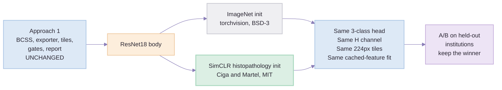
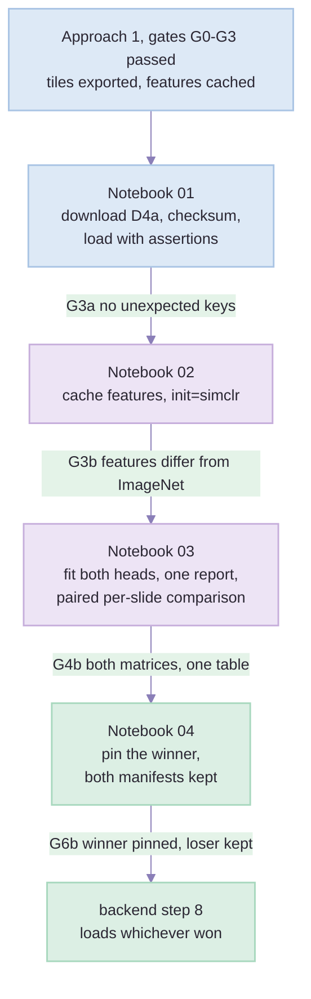

# Approach 3 — Build Plan: the same pipeline, histopathology-pretrained initialisation

> Created: 2 Sep 2026 | Audience: whoever writes the code.
> **Prerequisite: [`approach-1-training-plan.md`](approach-1-training-plan.md).** This document is the
> *delta*. Everything not contradicted here — the downloads, the exporter, the tile geometry, the
> gates, the reporting — is that plan's, unchanged and deliberately so.
> Decided by: [`segmentation-approaches-comparison.md`](segmentation-approaches-comparison.md) Part 7 —
> "train both initialisations and keep whichever wins on held-out BCSS."
> Sibling: [`approach-4a-training-plan.md`](approach-4a-training-plan.md) swaps the **label source**
> rather than the initialisation. The two are independent and compose: this plan's MoCo body can be
> trained on that plan's BEETLE-derived tiles.
>
> ⚠ **On "whichever wins on held-out BCSS":** held-out BCSS contains **no DCIS at all** (census in
> [`approach-1-training-plan.md`](approach-1-training-plan.md) Part 2), so that A/B decides the
> initialisation on the invasive-vs-*normal-duct* boundary, not the invasive-vs-DCIS one. Still a
> valid A/B — just not the one the phrase implies.

---

## Part 0 — What changes, in one sentence

**One box swaps.** The ResNet18 that Approach 1 initialises from ImageNet — photographs of cats, cars
and chairs — is initialised instead from weights self-supervised on **histopathology tiles**, which
already know what a nucleus and a gland look like. Same 3-class head, same haematoxylin channel, same
224 px tiles at 0.5 µm/px, same CPU cost, same licence position (MIT).



**Estimated Dice, invasive vs non-invasive: 0.73 – 0.83**, against Approach 1's 0.70 – 0.80 — roughly
+3 points. *An engineering estimate, not a measurement.* The point of this plan is to replace the
estimate with a number.

---

## Part 1 — Two corrections to the naming, before anything is downloaded

Both design documents call this "**MoCo** initialisation". Two things about that are worth fixing in
code and in the manifest, because a wrong name in a filename outlives every conversation about it.

1. **The released checkpoint is SimCLR, not MoCo.** Ciga, Xu & Martel, *Self supervised contrastive
   learning for digital histopathology* (Machine Learning with Applications 7, 2022), pretrain with
   **SimCLR** across 57 histopathology datasets. MoCo is a different contrastive method by different
   authors. The distinction changes nothing about how the weights are used — and everything about
   whether a reader can find the paper — so this plan names the artefact `simclr`, notes "referred to
   as MoCo in the comparison document", and moves on.
2. **The architecture is ResNet18, not ResNet50.** The comparison document already flags this as a
   commonly-cited error. Confirmed from the release assets below: both are ResNet18.

Neither correction alters the approach. The comparison document's verdict — *just do it* — stands.

---

## Part 2 — The one download

| # | Asset | Where from | Size | Licence | Lands in |
| --- | --- | --- | --- | --- | --- |
| **D4a** | `pytorchnative_tenpercent_resnet18.ckpt` — **use this one** | [`releases/download/nativetenpercent/`](https://github.com/ozanciga/self-supervised-histopathology/releases/download/nativetenpercent/pytorchnative_tenpercent_resnet18.ckpt) | **46,104,139 bytes** | MIT | `models/tissue_type/pretrained/` |
| D4b | `tenpercent_resnet18.ckpt` — the Lightning checkpoint | [`releases/download/tenpercent/`](https://github.com/ozanciga/self-supervised-histopathology/releases/download/tenpercent/tenpercent_resnet18.ckpt) | 92,148,628 bytes | MIT | fallback only |

Both are the same trained network — the newer model, trained on 400,000 images. Sizes are the release
assets' own, verified via the GitHub API, so they double as the first integrity check.

### Take the native one, and the reason is security, not convenience

`tenpercent_resnet18.ckpt` is a **PyTorch Lightning** checkpoint: unpickling it invokes code, needs
`torch.load(..., weights_only=False)`, and expects Lightning class names that have moved several times
since it was saved. `pytorchnative_tenpercent_resnet18.ckpt` is a plain `state_dict`, so it loads
under `torch.load(..., weights_only=True)` — nothing in the file is executed.

This codebase has been here before. `step02_quality_control/models.py` exists precisely because the
GrandQC checkpoints are pickled `nn.Module`s, and it goes to real trouble to lift tensors out without
executing anything. Choosing the native checkpoint means Approach 3 needs **none** of that machinery.

```powershell
# from the repo root
$dst = "Breast_Cancer_IHC_Tissue_Scoring_Demo\models\tissue_type\pretrained"
New-Item -ItemType Directory -Force $dst | Out-Null
Invoke-WebRequest -Uri "https://github.com/ozanciga/self-supervised-histopathology/releases/download/nativetenpercent/pytorchnative_tenpercent_resnet18.ckpt" `
                  -OutFile "$dst\pytorchnative_tenpercent_resnet18.ckpt"
Get-FileHash "$dst\pytorchnative_tenpercent_resnet18.ckpt" -Algorithm SHA256
```

Record that hash in `models/README.md` and in the model manifest. Nothing is fetched at runtime, here
or anywhere else in this project.

### Loading it into a torchvision ResNet18

The upstream keys carry `model.` and `resnet.` prefixes and the checkpoint has no `fc` for our three
classes. The whole adapter:

```python
# src/models.py  (approach 1's module — this is the branch it grows)
def resnet18_backbone(init: str, *, weights_dir: Path) -> torch.nn.Module:
    """A ResNet18 with a 3-class head, from one of two initialisations.

    `init` is recorded in the model manifest, because two checkpoints that differ only
    in their starting weights are two different models and must not share a filename.
    """
    net = torchvision.models.resnet18(weights=None)

    if init == "imagenet":
        state = torch.load(weights_dir / "resnet18-imagenet.pth", weights_only=True)
    elif init == "simclr":
        state = torch.load(
            weights_dir / "pytorchnative_tenpercent_resnet18.ckpt",
            map_location="cpu", weights_only=True,
        )
        state = state.get("state_dict", state)
        state = {k.replace("model.", "").replace("resnet.", ""): v for k, v in state.items()}
    else:
        raise ValueError(f"unknown initialisation {init!r}")

    # Strict=False for exactly two expected absences - fc.weight and fc.bias, which
    # belong to the task and not to the pretraining. Anything else missing or
    # unexpected is a checkpoint that is not this architecture, so it is asserted.
    missing, unexpected = net.load_state_dict(state, strict=False)
    assert set(missing) <= {"fc.weight", "fc.bias"}, f"missing tensors: {missing}"
    assert not [k for k in unexpected if not k.startswith("fc.")], f"unexpected: {unexpected}"

    net.fc = torch.nn.Linear(512, 3)
    return net
```

> **`strict=False` with an assertion, never `strict=False` alone.** A silent partial load is the
> failure mode of this whole approach: the network initialises half-randomly, trains without
> complaint, scores a couple of points *worse* than ImageNet, and the conclusion recorded in the
> report is "histopathology pretraining does not help here" — which would be false, and would be
> believed. The two lines above are the difference between an A/B and a rumour.

---

## Part 3 — What is *not* different, and must not become different

The A/B is only worth running if the initialisation is the only thing that moved. Everything in this
list is Approach 1's and is **imported**, not copied:

| Held fixed | Where it lives |
| --- | --- |
| BCSS download, the 22 → 3 code mapping, the ignore set | `bcss_bracs_hchannel_resnet18/src/bcss.py` |
| The H-channel transform, including ImageNet mean/std | `bcss_bracs_hchannel_resnet18/src/hchannel.py` |
| Tile geometry: 224 px, 0.5 µm/px, stride 224, majority vote | `bcss_bracs_hchannel_resnet18/src/export.py` |
| The exported tiles and `tiles_manifest.parquet` themselves | `bcss_bracs_hchannel_resnet18/data/tiles/` — **reused, not re-exported** |
| Splits: `GroupKFold` by slide, held-out institutions `OL LL E2 EW GM S3` | `bcss_bracs_hchannel_resnet18/src/report.py` |
| Class weights, stain jitter range, flips and rotations | `bcss_bracs_hchannel_resnet18/src/datasets.py` |
| The report: 3 × 3 matrix, invasive ↔ non-invasive alone, tumour-content bins | `bcss_bracs_hchannel_resnet18/src/report.py` |

Note the ImageNet normalisation row. It is arguably *wrong* for a SimCLR checkpoint — but Ciga's own
code normalises with ImageNet statistics too, and more importantly **changing two things at once
turns a measurement into a guess**. If someone wants to test SimCLR-specific normalisation, it is a
separate, later ablation with its own row in the results table.

### The folder

```
moco_init_resnet18/              ← NEW, beside grandqc/ and bcss_bracs_hchannel_resnet18/
├── README.md                  "this is Approach 1 with one line changed" + the licence trail
├── notebooks/
│   ├── 01_download_simclr_weights.ipynb      D4a, checksum, key inspection
│   ├── 02_cache_frozen_features_simclr.ipynb Approach 1's Notebook 03, init="simclr"
│   ├── 03_fit_head_and_ab_test.ipynb         both heads, one table, the paired test
│   └── 04_export_and_pin_winner.ipynb        the winner + both manifests
├── src/
│   └── approach1_path.py      puts bcss_bracs_hchannel_resnet18/src on sys.path. That is all.
└── tests/
    └── test_backbone_init.py  the two initialisations must not be the same network
```

`src/` holds **one file**, and that is the design working. If a second module appears here, something
that should have been shared has been forked — stop and move it into approach 1's `src/` instead.

---

## Part 4 — Development order and gates

Approach 1's gates G0–G3 are prerequisites, already passed. This plan adds four.



### Notebook 01 — download and load *(30 minutes)*

Fetch D4a, check the byte count against 46,104,139, record the SHA-256, and load it through
`resnet18_backbone("simclr", ...)`.

**Gate G3a — the gate this plan exists to enforce.**
- [ ] Byte count and SHA-256 recorded.
- [ ] `missing == {fc.weight, fc.bias}` and nothing else; `unexpected` empty apart from `fc.*`.
- [ ] Print the count of loaded tensors and the norm of `conv1.weight` for **both** initialisations.
      They must differ. Two identical norms means one checkpoint silently did not load.
- [ ] `torch.load(..., weights_only=True)` succeeds — i.e. this really is the native checkpoint and
      nothing in the file is executed.

### Notebook 02 — cache features with the new body *(~1.5 h CPU)*

Approach 1's Notebook 03, one argument changed, **the same tile manifest and the same row order**.
Write to `bcss_bracs_hchannel_resnet18/data/features/simclr.npy` beside `imagenet.npy` — same directory, because they
are two views of one tile set and separating them invites a mismatched pairing.

**Gate G3b:**
- [ ] Row count and order identical to the ImageNet features, asserted by the same path-column hash.
- [ ] Mean cosine similarity between the two feature sets is *not* ~1.0. If it is, both passes used
      the same weights.
- [ ] The sanity probe (logistic regression, random split) is at least as good as ImageNet's. It does
      not have to be better — that is what Notebook 03 measures properly.

### Notebook 03 — fit both heads and compare *(minutes — this is the payoff)*

The reason Approach 1 caches features is this notebook. Both heads fit on cached vectors in seconds,
so the comparison is not a two-day experiment; it is a table.

Fit **both** heads under identical conditions — same folds, same class weights, same seeds, same
epochs — and report:

| | ImageNet init | SimCLR init | Δ |
| --- | --- | --- | --- |
| Dice, invasive vs non-invasive *(held-out institutions)* | | | |
| Macro F1, 3 classes | | | |
| Confusion: invasive predicted as non-invasive | | | |
| Confusion: non-invasive predicted as invasive | | | |
| Accuracy by tumour-content bin (4 rows) | | | |
| GroupKFold mean ± sd across folds | | | |

**The comparison must be paired, per slide.** The expected gain is a few points, and fold-to-fold
scatter on 151 ROIs is of the same order — so a single number for each is not enough to choose. Score
**each held-out slide under both models**, take the per-slide differences, and report the mean
difference with its confidence interval (a paired test — Wilcoxon signed-rank is the honest default
with ~43 test ROIs and no normality assumption). Two unpaired averages three points apart on this
sample size is a coin toss wearing a decimal point.

**Gate G4b:**
- [ ] Both confusion matrices printed side by side, on **held-out institutions**.
- [ ] The invasive ↔ non-invasive cell reported on its own for each, never folded into an average.
- [ ] Paired per-slide difference reported with a confidence interval, and stated plainly as
      significant or not.
- [ ] Both stratifications (tumour content, and — once IHC slides are scored — antibody) present for
      the winner.

### Notebook 04 — pin the winner *(30 minutes)*

Write `models/tissue_type/invasive_tile_v1_simclr.pt` with its own `manifest.json`
(`"init": "simclr_ciga_tenpercent"`, plus the pretrained checkpoint's SHA-256 under `provenance`), and
**keep both checkpoints and both manifests**. The loser is not waste: it is the control that makes the
winner's number mean something, and the thing to re-run against when the tile geometry or the label
mapping next changes.

Then set `settings.tissue_model_name` to the winner. Step 8 loads a filename; it does not know or care
which initialisation won, and that is the correct amount of coupling.

**Gate G6b:**
- [ ] Winner pinned with SHA-256, in the manifest and in `models/README.md`.
- [ ] A fresh process reloads it and reproduces the manifest's recorded logits on 20 named tiles to
      1e-5 — Approach 1's G6 check, run again for this checkpoint.
- [ ] The A/B table is written into `models/README.md` — three lines, so the next person does not
      re-run the experiment to find out what happened.

---

## Part 5 — Test order

```
Approach 1: G0 → G1 → G2 → G3            (prerequisite, already green)
   └─ G3a checkpoint loads, no unexpected keys, conv1 norms differ
        └─ G3b features same rows, different values, probe holds up
             └─ G4b both matrices, paired per-slide difference with a CI
                  └─ G6b winner pinned, reloads in a fresh process, table in models/README.md
                       └─ G7 step 8 agrees with the notebook, tile for tile
```

One unit test to add beside Approach 1's three:

| Test | Asserts |
| --- | --- |
| `test_backbone_init.py` | `resnet18_backbone("simclr")` and `("imagenet")` both return 3-class heads; the assertion on `missing`/`unexpected` fires on a deliberately corrupted state dict; and the two bodies' `conv1.weight` are not equal. |

That last clause is the whole approach compressed into one assertion, which is a good sign for the
test and for the approach.

---

## Part 6 — Cost, risk, and the honest verdict

| | Approach 1 | Approach 3 |
| --- | --- | --- |
| Extra download | — | 46 MB |
| Extra compute | — | one feature-caching pass, ~1.5 h CPU |
| Extra code | — | one branch in one factory function, ~10 lines |
| Extra licence exposure | BCSS CC0, torchvision BSD-3 | **+ MIT.** Nothing changes about shippability |
| Per-slide inference cost | 5–8 min CPU | **identical** — same architecture, same parameter count |
| Estimated Dice | 0.70 – 0.80 | 0.73 – 0.83 *(estimate)* |

### Risks specific to this approach

| Risk | Why it matters | Mitigation |
| --- | --- | --- |
| **Silent partial load** | Half-random init trains quietly and *loses*; the recorded conclusion is then wrong and permanent | G3a's assertions on `missing`/`unexpected` and on the `conv1` norms |
| Choosing on fold noise | The expected gain is ~3 points; fold scatter is comparable | Paired per-slide comparison with a CI, G4b |
| Pretraining corpus is multi-organ, not breast | The gain may be smaller here than in the paper | Nothing to do but measure it — which is what this plan is |
| Both checkpoints named alike | The wrong model ships and nobody can tell | Initialisation in the filename *and* in the manifest; SHA-256 verified at load |
| Lightning checkpoint chosen by mistake | Needs `weights_only=False`, executes pickled code, and drags in moved class names | Part 2: take the native asset; G3a asserts `weights_only=True` worked |

### The verdict, unchanged from the comparison document

**Do it.** It costs one download, one feature pass and ten lines, it cannot make the licence position
worse, and it is the only item on the ablation list that might move the number without costing a day.
But keep it in proportion: this is the *last* row of the accuracy ranking —

```
pathologist outlines  >  your own clicked tiles  >  label hygiene
                      >  input representation    >  which backbone you picked
```

— and if Notebook 03 says the difference is inside the noise, the correct response is to write that
down, ship whichever is already pinned, and go spend the afternoon clicking tiles in QuPath instead.

**Sources:** [Ciga & Martel pretrained weights](https://github.com/ozanciga/self-supervised-histopathology)
(MIT; [release assets](https://github.com/ozanciga/self-supervised-histopathology/releases/tag/nativetenpercent)) ·
Ciga O, Xu T, Martel AL. *Self supervised contrastive learning for digital histopathology.* Machine
Learning with Applications 7 (2022), [arXiv:2011.13971](https://arxiv.org/abs/2011.13971) ·
Chen T et al. *A simple framework for contrastive learning of visual representations* (SimCLR), ICML 2020.
