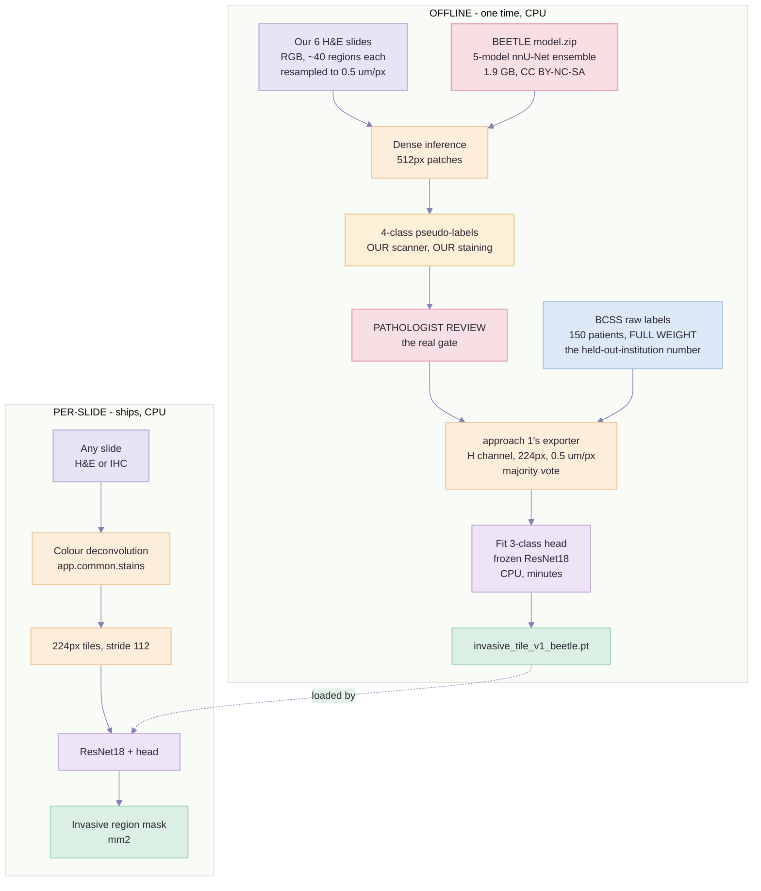

# Approach 4 — Build Plan: BEETLE teacher → H-channel ResNet18

> Created: 2 Sep 2026 | Audience: whoever writes the code.
> **Prerequisite: [`approach-1-training-plan.md`](approach-1-training-plan.md).** This document is the
> *delta*. Everything not contradicted here — the exporter, the tile geometry, the frozen-feature
> cache, the gates, the reporting rules — is that plan's, unchanged and deliberately so.
> Decided by: the class-1 census in
> [`approach-1-training-plan.md`](approach-1-training-plan.md) Part 2 — "BCSS contains almost no
> DCIS" — plus the removal of the licence constraint that previously ruled this approach out.
> Supersedes: **Phase 5 of approach 1** ("AICAN pseudo-labels, written now so it is ready"). Route A
> *is* that phase with BEETLE substituted for AICAN, and Phase 5's discipline carries over verbatim:
> pseudo-label rows get lower loss weight, and they survive only if an ablation says they help.
> Companion: [`segmentation-approaches-comparison.md`](segmentation-approaches-comparison.md) Approach 4.
> Feeds: guide step 9 = **code step 8**, `backend/app/pipeline/step08_tissue_type_segmentation/`.

---

## Part 0 — What changes, in one sentence

Approach 1 trains class `1` on BCSS, where class `1` is **0.129 % of pixels and its DCIS comes from
a single patient in a training institution**. Approach 4 keeps every other box in that pipeline and
replaces the class-`1` label source with **BEETLE**, whose four annotation classes map 1:1 onto ours
and whose non-invasive epithelium is ~225 mm² across 527 patients and seven scanners.

**The deliverable, in one line:** `models/tissue_type/invasive_tile_v1_beetle.pt` — the same 3-class
head on the same frozen ResNet18, reading the same 224 px haematoxylin tile at 0.5 µm/px, but with a
class `1` that was actually trained.

> **Licence status.** BEETLE's data and weights are **CC BY-NC-SA 4.0** (the Apache-2.0 on the
> GitHub repo covers only the inference code). ShareAlike is the clause that matters: a student model
> distilled from these weights is arguably an adaptation, which would have to be released
> CC BY-NC-SA too. **This has been deprioritised by decision — the constraint is recorded here, not
> argued.** It must be resolved before anything built by this plan ships commercially.

---

## Part 1 — Why BEETLE, and the numbers that decided it

### The three candidate sources, measured rather than described

| | BCSS *(measured, Part 2 of approach 1)* | BRACS | **BEETLE** |
| --- | --- | --- | --- |
| class `1` supply | 0.129 % of pixels | 3,890 ROIs | **≈ 225 mm²** |
| class `1` patient spread | **1 patient** (dcis), in a *training* institution | 151 patients | 527 patients / 587 slides |
| class `2` : class `1` | **237 : 1** | 1 : 6 | **≈ 3.1 : 1** |
| label form | pixel masks | ROI-level labels + polygons | pixel masks (dense in ROIs) + sparse |
| supplies class `0` as well? | yes | **no** | yes (`necrosis` + `other`) |
| scanners | one TCGA era | one (Aperio AT2) | **7** in dev, 3 more in eval |
| native spacing | 0.25 µm/px → downsample 2× | 0.25 µm/px → downsample 2× | **0.5 µm/px — our target, no resample** |
| pretrained weights released | no | no | **yes** — 5-model nnU-Net ensemble |
| maps onto our 3 classes | mapping table, judgement calls | mapping table, judgement calls | **1 : 1** |

237 : 1 is a class you cannot train. 3.1 : 1 is a `class_weight` argument.

### The ontology is our class definition, verbatim

BEETLE's own definition of its non-invasive class:

> "The non-invasive epithelium class primarily comprises healthy glands and DCIS but also includes
> other non-invasive epithelial morphologies such as lobular carcinoma in situ (LCIS), atypical
> ductal hyperplasia, and apocrine metaplasia."

| Our class | BEETLE class | Mapping risk |
| --- | --- | --- |
| `2` invasive epithelium | `invasive epithelium` | none |
| `1` non-invasive epithelium | `non-invasive epithelium` | none |
| `0` non-epithelium | `necrosis`, `other` | none |
| **ignore** (zero weight) | `unannotated` | must be honoured — see Part 2 |

No `dcis`-vs-`tumor` ambiguity, no decision about where `normal_acinus_or_duct` belongs, no
`angioinvasion` judgement call. This is the single largest reduction in label risk available to this
project.

### The nesting question, and why it does not sink this

BEETLE's development set **includes the TIGER training set**, and 151 of TIGER's 195 WSIs are the
TCGA-BRCA slides that *are* BCSS, relabelled (`mostly_tumor` → invasive, `mostly_dcis` → in-situ):

```
BCSS (151 TCGA)  ⊂  TIGER (195)  ⊂  BEETLE (587)
```

So BEETLE inherits our scarcity on that subset. Figure 3B of the BEETLE paper splits the annotated
area by subset, and the split is the answer:

| Dev-set subset | non-invasive epithelium |
| --- | --- |
| **non-TIGER** | **216 mm²** |
| TIGER-derived | 9.1 mm² |

**96 % of BEETLE's class-1 area is new annotation, independent of BCSS.** The dataset's own paper
states the development set "consists primarily of NST, ILC, and **DCIS cases**" — the gap was
designed out on purpose, and 39 further WSIs were added during hard-negative mining specifically for
under-represented morphologies.

> Corollary worth stating: this also means **adopting BEETLE's *dataset* loses nothing we already
> have.** BCSS is a subset of it, so under **Route B** BCSS's role drops to a sanity check and a cheap
> regression fixture. **This does not hold for Route A**, which downloads no BEETLE images at all and
> trains on 6 of our own patients — there BCSS keeps full weight. See Notebook 05.

### What the paper says about our exact downstream task

On its dominant residual error:

> "A frequent source of error is the misclassification of invasive epithelium as non-invasive,
> particularly in regions lacking sufficient tissue context, such as isolated fragments at biopsy
> borders or dense tumor regions resembling the core of a DCIS lesion. However, this
> misclassification typically affects only a subset of the tumor that is representative of the
> overall tumor tissue … and is therefore **unlikely to substantially impact the outcome of
> downstream tasks such as biomarker quantification**."

Two things follow, and both belong in the report:

1. **The error direction is conservative for us** — it under-calls invasive, which *shrinks* the
   scored region rather than contaminating it with in-situ. A shrunken denominator is a visible,
   checkable failure; a contaminated one is not.
2. **It is still an error, and it is a percentage-of-area error on the thing we report.** Quantify it
   on our own slides (Notebook 04) rather than inheriting the paper's reassurance.

Also relevant to our cohort: the paper reports the model "occasionally performs less on epithelium
segmentation in slides with markedly low tissue contrast" — that is slide `00267`, our near-blank
CD44 case (17.5 mm² of tissue against 84.8 on its siblings).

### ⚠ Gate G0b — the bridge, measured and closed

[Approach 1's Notebook 00](approach-1-training-plan.md) measured the H&E → IHC haematoxylin shift on
2 Sep 2026. It is a change of distribution **shape**, not of stain strength — the IHC/H&E ratio spans
23× across percentiles — and no `alpha`, and no per-slide normalisation, can close a shape gap,
because every such correction is monotone. The fix was a **`gamma`** shape term in
`to_model_input` plus per-tile `standardise`, which together take the served distribution's coverage
by the training envelope from **1 of 6 percentiles to 6 of 6**. G0b now passes.

**Route A inherits all of it**, because the student here is the same H-channel model served on the
same IHC slides. Two things follow for this plan:

- **Use the same `Jitter` and the same `standardise` setting** as approach 1, from the same
  `src/datasets.py`. Not a copy — an import. A second jitter definition is the same class of failure
  as a second exporter.
- **The pseudo-label rows are H&E**, exactly like BCSS's, so they sit on the same side of the bridge.
  Route A buys scanner and stain match on the *training* side; it does not shorten the H&E → IHC step,
  and nothing in this plan should be read as claiming it does.

None of it blocks Notebooks 00–04: the teacher runs on RGB H&E and never touches the H channel.

### ⚠ Gate zero — unchanged, and it still comes first

Nothing in this plan is worth starting before the check that
[`approach-1-training-plan.md`](approach-1-training-plan.md) Part 2 point 5 already argues for. Two
questions for a pathologist, one afternoon, six slides:

1. **How much DCIS is present in our 6 cases?** If it is absent or trace in all six, class `1` is a
   documented limitation rather than a blocker, and this entire plan is optional for the demo.
2. **Show them ~10 BCSS regions labelled `1 tumor` and ask whether any is actually DCIS.** BCSS is a
   TCGA resection cohort where DCIS is commonly present alongside invasive disease, yet only 1 of 150
   regions carries a `dcis` annotation. Either annotators steered ROIs away from it, or they labelled
   it `tumor`. **If it is the second, our class `2` is contaminated at source** — and a better class-1
   dataset does not fix a poisoned class 2. The images are already on disk.

Answer 1 sizes the problem. Answer 2 decides whether the problem is the one we think it is.

---

## Part 2 — What BEETLE actually is, stated precisely

### Composition

| | Development set | External evaluation set |
| --- | --- | --- |
| Slides | 587 biopsies + resections | 54 WSIs |
| Patients | 527 | 54 |
| Annotated area | 5,567 mm² | 45 mm² |
| Sources | 3 clinical centres + 2 public datasets (TIGER WSIROIS, TCGA-BRCA) | 3 clinical centres |
| Scanners | **7** | 3 |
| Form on disk | whole-slide TIFF at ~0.5 µm/px | 170 ROI PNGs (~500 × 500 µm) + WSIs |
| Annotations | TIFF pixel masks + XML/JSON polygons | **sequestered — not released** |

Annotated area by class, read from Figure 3B (mm²):

| Class | non-TIGER dev | TIGER dev | Our class |
| --- | --- | --- | --- |
| other | 3,598 | 127 | `0` |
| invasive epithelium | 629 | 76.5 | `2` |
| **non-invasive epithelium** | **216** | **9.1** | **`1`** |
| necrosis | 14.1 | 13.9 | `0` |

> *These are sunburst-chart readings and sum to ≈ 4,684 mm² against the 5,567 mm² the text states, so
> ~880 mm² is unattributed by this reading. Treat the **ratios** as sound (class `2` : class `1`
> ≈ 3.1 : 1) and the **percentage shares** as approximate (class `1` ≈ 4 %).* Re-derive both from
> `data_overview.csv` once downloaded, and replace this table with the exact figures.

### ⚠ The annotations are model-generated and human-corrected, not hand-drawn

This is not a defect, but it must be understood before the labels are trusted more than they deserve.
BEETLE's annotation workflow (Figures 1 and 2 of the paper):

- a **custom two-phase epithelium U-Net** (trained first on CK8-18 IHC, then transferred to
  co-registered H&E) produced the epithelium boundaries, which a resident pathologist or trained
  research assistant then selected and corrected;
- **HoVerNet** produced the dispersed-tumour-cell annotations for ILC cases, relabelled wholesale to
  invasive epithelium and then point-corrected by a pathologist;
- the whole thing was expanded by **iterative manual hard-negative mining** — train, predict, annotate
  what the model got wrong, repeat.

**So: the class *assignment* is human, the boundary *delineation* is largely machine.** For a tile
classifier taking majority-vote labels over 224 px, that split is fine — we consume the assignment and
discard the boundary precision anyway. Contrast BRACS, whose labels are three-pathologist consensus
per ROI but carry no boundaries at all. Neither is "pixel-perfect ground truth"; say so in the report.

### ⚠ Annotations are dense only inside ROIs — the exporter must honour `unannotated`

> "The development set includes both dense (i.e., all pixels are labeled) and sparse annotations
> (i.e., only a subset of pixels are labeled, with unlabeled pixels remaining undefined). Dense
> annotations are confined to predefined ROIs, whereas sparse annotations consist of scattered labels
> of individual structures across the WSI without ROI definitions."

Figure 3C's legend carries an explicit **`Unannotated`** class. This is exactly the
`0 outside_roi` situation from approach 1, and it gets exactly the same treatment:

> **`unannotated` is not "other".** It carries zero weight and is never a class. Folding it into
> class `0` would teach the model that unlabelled tissue is non-epithelium and inflate every accuracy
> number — the same trap, on a different dataset. The tile ambiguity filter from approach 1's
> Notebook 02 applies unchanged: a tile needs a minimum fraction of *labelled* pixels before it gets
> a label at all.

### Baseline performance — and the ceiling it implies

Model: **nnU-Net-for-Pathology**, an ensemble of five U-Nets, trained on 512 × 512 RGB patches at
0.5 µm/px with HED augmentation and Lovász loss.

| Class | 5-fold internal | External | Worst centre |
| --- | --- | --- | --- |
| other | 0.97 (0.00) | 0.94 | 0.92 |
| invasive epithelium | 0.78 (0.06) | 0.78 | 0.73 |
| **non-invasive epithelium** | **0.83 (0.07)** | **0.65** | **0.56** |
| necrosis | 0.75 (0.08) | 0.51 | 0.08 |
| **overall** | **0.92 (0.02)** | 0.87 | 0.85 |

> **The "0.92 Dice" figure in the comparison document is the internal aggregate, and it is inflated by
> `other` at 0.97 — which is most of the pixels.** The number that governs this project is
> **non-invasive epithelium: 0.83 internally, 0.65 across unseen scanners.** Our Morphle is not one of
> the seven. Do not set a class-1 target above 0.65, and do not quote 0.92 anywhere.

For calibration, the same model scores **0.79 / 0.77** invasive-tumour Dice on the TIGER challenge
experimental and final test sets, against **0.79 / 0.81** for the top leaderboard entries — i.e. the
released weights are competitive with the challenge winners on the one class TIGER can score.

Known weak spots to expect in our output: apocrine metaplasia, granulomatous inflammation, and
low-contrast slides. Necrosis at 0.51 external is largely a class-imbalance artefact (< 2 % of test
area) and does not concern us — necrosis maps to class `0` either way.

---

## Part 3 — Two routes, and which one to take

### Route A — teacher only *(take this first)*

Download **`model.zip` (1.9 GB)**. Do not download the images. Run the released ensemble on our six
H&E slides, take its output as dense pseudo-labels, and distil into the H-channel ResNet18 exactly as
approach 1 trains it.



*(Pink boxes = non-commercial licence.)*

**Why this is the right first move.** It costs 1.9 GB and one overnight run instead of 150.9 GB and a
training cycle. It produces labels **in our own domain** — our scanner, our staining, our tissue —
which is the one thing no public dataset can give us, and which BEETLE's own 0.83 → 0.65 drop across
scanners is the argument for. And the teacher is not merely adequate for the boundary we care about:
its class-1 supply is the whole reason we are here.

### Route B — train on BEETLE directly *(only if Route A fails its gate)*

Download `images.zip` (147.2 GB) and `annotations.zip` (1.8 GB), tile the development set, and train
the head on BEETLE tiles instead of pseudo-labels.

| | Route A *(+ BCSS, see Notebook 05)* | Route B |
| --- | --- | --- |
| Download | 1.9 GB | **150.9 GB** (≈ 300 GB peak with extraction) |
| Class `1` labels are in our domain | **yes** | no |
| Patients supplying class `1` | 6 | **527** |
| Scanner diversity in training data | BCSS's institutions only — class `1` from **one scanner** | **7 scanners** |
| Held-out-institution report possible | yes, **on the BCSS rows only** | yes, on both |
| Teacher error compounds into student | **yes** | no |
| Time to first number | ~1 day | ~1 week *(estimate)* |

**The decision rule:** Route A if the pathologist review in Notebook 04 accepts the teacher's output
on our slides. Route B if it does not, or if the A/B in Notebook 06 shows the student inheriting a
systematic teacher error. They are not exclusive — Route B's tiles can be added to Route A's as a
second source once the exporter handles both, and that combination is the highest-ceiling version of
this approach.

---

## Part 4 — Downloads

Zenodo record **`10.5281/zenodo.16812932`**, code repo `github.com/DIAGNijmegen/beetle`.

| What | Size | Route | Destination | Verified by |
| --- | --- | --- | --- | --- |
| `model.zip` | 1.9 GB | **A** | `beetle_teacher_resnet18/data/model/` | SHA-256 pinned in `data/model/CHECKSUMS`; ensemble loads and predicts on one 512² patch |
| `data_overview.csv` | 176 kB | **A** | `beetle_teacher_resnet18/data/meta/` | row count; re-derive the Part 2 area table from it |
| inference code | — | **A** | `beetle_teacher_resnet18/vendor/beetle/` | pinned git SHA, Apache-2.0 |
| `annotations.zip` | 1.8 GB | B | `beetle_teacher_resnet18/data/beetle/annotations/` | mask/slide name pairing, 100 % matched |
| `images.zip` | **147.2 GB** | B | external disk, **not the project drive** | per-slide checksums |

> ⚠ **Do not start Route B's download casually.** 147.2 GB compressed, roughly **300 GB peak** while
> extracting, against a project whose entire own cohort is 34 GB. Confirm free space *and* that Route
> A has actually failed its gate first. `images.zip` is also the only file here that cannot be
> re-fetched quickly.

> **Pin the model, not just the URL.** The same rule as approach 1's checkpoint: record the SHA-256 of
> `model.zip` and of each extracted fold's weights in `data/model/CHECKSUMS` at first download. A
> teacher that silently changes version invalidates every pseudo-label downstream of it, and nothing
> in the pipeline would notice.

### Disk budget, Route A

| What | Size | When it can be deleted |
| --- | --- | --- |
| `model.zip` + extracted folds | ~4 GB *(estimate)* | after Notebook 03 writes pseudo-labels **and their checksums pass** |
| Sampled H&E regions, 2048² at 0.5 µm/px, 6 slides × ~40 | ~3 GB *(estimate)* | after Notebook 05 exports tiles |
| Pseudo-label masks (uint8, same geometry) | ~1 GB *(estimate)* | keep — they are the training labels, and the pathologist review is against them |
| Exported H-channel tiles | ~250 MB | keep |
| Cached frozen features | ~30 MB | keep |

---

## Part 5 — Development order: notebooks, each with a gate

Folder: `beetle_teacher_resnet18/`, laid out exactly like `bcss_bracs_hchannel_resnet18/`
(`data/ notebooks/ reports/ scripts/ src/ tests/`). Anything that already exists in
`bcss_bracs_hchannel_resnet18/src/` is **imported, not copied** — see Part 6.

### Notebook 00 — smoke test: does the ensemble run on CPU at all? *(1–2 hours, write it first)*

**This is the gate the whole plan hangs on.** nnU-Net defaults to CUDA, and we have no GPU.

- load one fold, run it on a single synthetic 512 × 512 RGB patch, assert an output of shape
  `(4, 512, 512)` — or whatever the released head emits — with no CUDA call;
- if the vendored script forces `device='cuda'`, patch it in `vendor/` with the diff recorded, do not
  edit in place silently;
- if it cannot be made to run on CPU, try the repo's Docker image next, and **if that also fails,
  stop and re-open Route B or approach 1** rather than spending days on an installer. The same rule
  approach 1 applies to pyFAST applies here.

**Gate:** one patch in, four-class mask out, on CPU, reproducibly. Nothing below is worth writing
until this is green.

### Notebook 01 — fetch and pin the teacher *(1 hour, mostly network)*

Download `model.zip` and `data_overview.csv`, write `CHECKSUMS`, load all five folds, assert five
distinct parameter hashes (an ensemble that silently loaded the same fold five times is a real and
invisible failure).

**Gate:** five folds, five hashes, checksums recorded. Re-derive the Part 2 area table from
`data_overview.csv` and correct this document with the exact figures.

### Notebook 02 — sample regions from our six H&E slides *(1 hour, disk-bound)*

~40 regions of 2048 × 2048 per case, spread across the tissue, resampled to **0.5 µm/px** — the
teacher's native spacing.

**The six inputs, by name.** They are already on disk in
`Breast_Cancer_IHC_Tissue_Scoring_Demo/images/` — *not* in `data/slides/`, whose 16 uploads are all
the same IHC file:

```
images/CAN_00251_26_H&E.svs   images/CAN_00270_26_H&E.svs
images/CAN_00259_26_H&E.svs   images/CAN_00303_26_H&E.svs
images/CAN_00267_26_H&E.svs   images/CAN_00865_26-_H&E.svs   <- note the "-_"
```

> ⚠ **Read the spacing per slide, never from a constant.** These read 0.2222 µm/px, but approach 1
> found a BCSS slide with no recorded resolution at all, and its own cohort spans 0.1644–0.5005.
> Take `mpp` from each slide's own metadata, assert it, and **exclude rather than guess** — the same
> rule and the same `excluded.json`. Note also that `best_level_for_mpp(0.5)` returns **level 0** on
> these files, because they carry no pyramid level near 0.5: the downsample is ours to do, with BOX
> averaging on the RGB **before** any logarithm (step 5's rule, and gate G0b measured it mattering).

#### The sampling rule, as an algorithm rather than a wish

An earlier draft said "include duct-rich, stroma-rich and edge regions" — which is circular, because
finding duct-rich regions is the job of the model this plan is about to train. A stain-free proxy
does the same work:

1. **Candidates.** Grid the slide at 2048 px stride inside the step-3 tissue mask and outside the
   step-2 artefact mask, reusing those steps' cached output rather than re-deriving it.
2. **Score each candidate** on two numbers computed from the H channel at low resolution (2 µm/px,
   cheap):
   - `nuclear_density` — fraction of pixels above Macenko's β = 0.15, i.e. step 5's `stained` mask.
     Epithelium of either kind is nucleus-dense; fat and loose stroma are not.
   - `edge_score` — fraction of the window's neighbours that are *outside* the tissue mask. High at
     tissue borders, where the paper's documented failure mode lives.
3. **Take ~40 per case by strata**, so no stratum can be crowded out:

   | Stratum | Share | Why |
   | --- | --- | --- |
   | top tercile of `nuclear_density` | 15 | epithelium, invasive or in-situ |
   | middle tercile | 15 | the mixed regions where the boundary actually is |
   | bottom tercile | 5 | class `0` supply — fat, loose stroma |
   | `edge_score > 0` , sampled across all terciles | 5 | biopsy borders and fragments |

4. **Record the score and stratum per region** in the manifest. If class `1` comes back thin at
   Notebook 03's gate, the first question is whether the sampler found ducts at all, and that is
   only answerable if the strata were written down.

- **RGB, not H-channel.** The teacher was trained on RGB H&E. The H-channel conversion happens later,
  in the exporter, for the *student*.

**Gate:** 240 regions on disk, every one inside tissue, spacing read per slide and written per
region, stratum counts printed and matching the table above.

### Notebook 03 — run the teacher, write pseudo-labels *(overnight, CPU)*

Five-fold ensemble over 512 px patches with the sliding-window overlap the vendored script uses,
argmax across folds, one uint8 mask per region.

- **write the per-fold disagreement map alongside the argmax.** Ensemble variance is the only free
  uncertainty signal we get, and it is what tells the pathologist in Notebook 04 where to look;
- record wall-clock per region on the first three regions and extrapolate before launching all 240.

**Cost estimate:** 40 regions × 16 patches × 5 folds = 3,200 forward passes per slide. At 1–3 s per
512² CPU forward that is **~1–3 h per slide, so 6–18 h for all six** — an overnight run.
*This is an estimate and the notebook must print the measured figure from the first three regions
before committing to the rest.*

**Gate:** 240 masks, geometry identical to their regions, class histogram printed. **If class `1` is
under ~2 % of labelled area across all six cases, stop and go back to gate zero** — either our cohort
genuinely has almost no non-invasive epithelium (in which case this plan is unnecessary and that is a
finding worth reporting), or the teacher is failing on our scanner.

### Notebook 04 — pathologist review of the teacher *(the real gate, ~2 hours of someone else's time)*

Not a metric. A person looking at overlays. Sample ~30 regions weighted toward high ensemble
disagreement and ask, per region:

| Question | Why it is the question |
| --- | --- |
| Are DCIS lesions coloured as class `1`? | the entire purpose |
| Are normal ducts and lobules class `1`? | the majority of real class-1 area |
| Is invasive tumour being *under-called* as non-invasive? | the paper's documented dominant error; conservative for us but must be sized |
| Is stroma, fat or inflammation leaking into `2`? | inflates the scored region directly |
| On `00267` specifically — does low contrast break it? | the paper flags low-contrast slides; this is our low-contrast slide |

**Gate:** written sign-off, per case, recorded in `reports/`. Estimate the under-call as a percentage
of invasive area — that number is the honest error bar on every score this pipeline later produces,
and it belongs in the report next to the score, not in a footnote.

### Notebook 05 — export H-channel tiles *(~1 hour, disk-bound)*

**Approach 1's exporter, unmodified**, with one new reader for BEETLE 4-class masks. 224 px at
0.5 µm/px, majority vote, `unannotated` at zero weight, the same ambiguity filter and the same
manifest checksums.

**BCSS is a second training source, and its weight depends on the route.**

- **Route B** — BCSS earns no weight. It is a subset of BEETLE's development set, so its rows are
  duplicates; keep it as a regression fixture only, so the approach-1 numbers stay comparable.
- **Route A** — **BCSS keeps full weight, and this is not optional.** Route A downloads no BEETLE
  images: its 240 regions come from **6 patients on one scanner**. The "BCSS is a subset of BEETLE"
  argument in Part 1 is a fact about the *dataset* and does not transfer to the *teacher* route.
  Discarding BCSS here throws away 150 independent patients across multiple institutions, and with
  them the only held-out-institution number this project has. Class `1` still comes overwhelmingly
  from the BEETLE rows — 0.129 % against a required 500+ — but every class comes from both sources.
  See Part 6 rule 6 for why that last clause is load-bearing rather than tidy.

**Gate:** tile counts per class printed and asserted. **Class `1` must exceed 500 tiles.** Approach 1
produced tens; if this produces tens as well, the export is wrong, not the dataset. This assertion
should be added to approach 1's exporter too — that gap should have been caught by the exporter, not
by counting pixels by hand afterwards.

### Notebook 06 — fit the head and A/B against approach 1 *(minutes — the payoff)*

Cache frozen features, fit the 3-class head, and report the two models side by side on the *same*
held-out split:

| | approach 1 (BCSS) | approach 4 (BEETLE teacher) |
| --- | --- | --- |
| class `1` training tiles | tens | *this number* |
| class `1` recall | *near zero, expected* | *this number* |
| class `2` precision | | |
| invasive area per case, mm² | | |

**The last row is the one that matters to the product.** If the two models disagree by less than the
pathologist's Notebook-04 error estimate on all six cases, then this whole exercise has demonstrated
that the class-1 gap did not materially affect our scores — which is a legitimate and reportable
result, not a failure.

#### Pseudo-label rows carry lower loss weight

Approach 1's Phase 5 rule, and it applies here unchanged: a teacher's mask is not a pathologist's
outline, so the BEETLE-derived rows get **a lower per-sample loss weight than the BCSS rows** — start
at 0.5, and write the value into the manifest rather than leaving it implicit in a notebook cell. This
sits *on top of* the `class_weight` that handles the 3.1 : 1 imbalance; they are different knobs, and
both belong in the model card.

#### The ablation decides whether the teacher ships

Fit three heads on the same splits and report all three:

| Run | Training rows | What its number answers |
| --- | --- | --- |
| **A** | BCSS only | approach 1's baseline, unchanged |
| **B** | BCSS + BEETLE pseudo-labels, down-weighted | does the teacher actually help? |
| **C** | BEETLE pseudo-labels only | how much of B is the teacher alone carrying? |

**If B does not beat A on the invasive ↔ non-invasive cell, drop the pseudo-labels.** That is Phase 5's
instruction verbatim, and here it has a second payoff: run A is CC0/BSD-3/MIT throughout, so an
ablation that comes back flat hands us a clean-licence model and *closes* Part 0's licence question
rather than deferring it again.

#### Splits, stated because six patients cannot support the usual one

- **BCSS rows** — `GroupKFold` by `slide_id` for model selection, then one report on the held-out
  institutions `OL, LL, E2, EW, GM, S3`. Approach 1's policy, unchanged, and the only generalisation
  evidence either route produces.
- **BEETLE pseudo-label rows** — **leave-one-case-out over the six**, because six patients cannot be
  divided into train and test any other way. Never a random tile split: tiles from one slide are
  near-duplicates, and 240 regions from 6 patients is **6 independent observations sampled densely**,
  not 20,000 of them.
- **Report the two separately.** A single blended accuracy over both sources hides which one is
  carrying the number, and the two answer different questions — "will this hold on the next patient"
  versus "did it learn our scanner".

**Gate:** the comparison table and all three ablation runs exist, with tile counts and confidence
intervals on every cell, and the pseudo-label loss weight recorded in the manifest. Approach 1's rule
stands: a Dice figure ships with its tile count or it does not ship.

### Notebook 07 — pin *(30 minutes)*

Export, SHA-256, record the teacher's checksum and the vendored git SHA in the model card **as
provenance**, alongside the licence flag from Part 0.

---

## Part 6 — What must not become different

1. **The exporter does not own a colour-deconvolution implementation.** It imports
   `app.common.stains` and `app.pipeline.step06_colour_deconvolution.deconvolution.separate` — the
   same two things inference calls. This rule is copied here verbatim because it is the rule most
   likely to be broken by a new folder: a second exporter is exactly where a stray
   `skimage.color.rgb2hed` gets introduced, and the failure looks like a model problem for a week.
2. **Tile geometry is 224 px at 0.5 µm/px, stride 112.** Not the teacher's 512 at 0.5. The teacher's
   patch size is an implementation detail of the teacher.
3. **The teacher never sees an IHC slide.** It runs on the six H&E slides only. The H-channel student
   is what generalises to IHC — that is the whole architecture, and feeding a blue-and-brown slide to
   an RGB-H&E model would produce confident nonsense.
4. **`unannotated` and `outside_roi` carry zero weight, always.** One rule, two datasets.
5. **The report says "distilled from BEETLE" wherever it says a number.** A pseudo-label is not a
   pathologist outline. Approach 1's honesty rules about what class `1` actually contains apply here
   too, with a different caveat: there, class `1` was mostly normal ducts; here, class `1` is a
   model's opinion, reviewed by a pathologist on 30 regions out of 240.
6. **No class may come from a single source.** If class `1` tiles were drawn only from our six slides
   while classes `0` and `2` came mostly from BCSS, then label and dataset origin would be perfectly
   correlated, and the model could score well by learning **"this looks like the Morphle scanner →
   class 1"** instead of duct architecture. It would pass cross-validation and fail on the next slide,
   and nothing in the confusion matrix would say so. The teacher labels all four classes densely on
   every region it sees, so the fix costs nothing: take **all three classes from both sources**, and
   have the exporter assert that every class has rows from every source before training starts.

---

## Part 7 — Cost, risk, and the honest verdict

### Timing, Route A

| Task | CPU |
| --- | --- |
| Notebook 00 smoke test | 1–2 h |
| Download + pin `model.zip` | 1 h |
| Sample 240 regions | 1 h |
| Teacher inference, 6 slides | **6–18 h, overnight** *(estimate — measure on 3 regions first)* |
| Pathologist review | 2 h of a pathologist |
| Export tiles | 1 h |
| Fit head + A/B | minutes |
| **Total** | **~2 working days plus one overnight run** |

Against Route B at roughly a week, and against approach 2's dense-inference route at 60–70 h per
slide, which is why that one was never viable.

### Risks specific to this approach

| Risk | Severity | Mitigation |
| --- | --- | --- |
| nnU-Net cannot be made to run on CPU | **blocks Route A entirely** | Notebook 00 is first and is a hard gate; Docker as fallback; then stop |
| Teacher errors become silent training labels | high | ensemble disagreement maps + pathologist review on 30 regions; the under-call is quantified, not assumed |
| Student inherits the invasive → non-invasive under-call | high | it is measured in Notebook 04 and reported as an error bar on mm² |
| 0.65 external Dice on class `1` is the ceiling | medium | do not promise above it; the student is a coarser task, so it is an order-of-magnitude guide, not a bound |
| Pseudo-labels come from 6 slides / 6 patients | medium | no scanner or cohort diversity at all — this is precisely what Route B adds, and why the two are complementary rather than alternatives |
| **CC BY-NC-SA contaminates the shipped student** | **blocks commercial release** | deprioritised by decision (Part 0); must be resolved before shipping |
| BEETLE is 4 months old (paper Oct 2025) | low | little third-party validation; the TIGER leaderboard comparison is the best independent signal we have |

### The verdict

**With licence set aside, BEETLE is the correct source and this is the correct route into it.** It is
the only candidate that supplies all three of our classes under an ontology that needs no mapping,
its class-1 area is ~225 mm² across 527 patients against BCSS's single patient, it ships at our target
spacing, and it releases weights that let us skip training entirely on the first pass.

Two honest qualifications:

- **This buys a trained class `1`, not a validated one.** Route A's labels are one model's opinion of
  six slides, reviewed on a sample. That is a large improvement over a class with tens of tiles from
  one patient, and it is still not a pathologist's outline. Approach 1's ranking has not changed:
  *pathologist outlines > our own clicked tiles > label hygiene > input representation > backbone.* A
  few hundred DCIS tiles clicked on our own slides in QuPath would still beat everything in this
  document, and would carry no licence flag at all.
- **Gate zero may make all of this unnecessary.** If the pathologist reports no meaningful DCIS in the
  six cases, the right output of this plan is a documented limitation and a one-paragraph finding —
  not a model. Find that out before Notebook 00.

**BRACS stays in reserve — but as a benchmark, not a shippable augmentation.** ⚠️ **Corrected
3 Sep 2026: BRACS is non-commercial.** Its download page states "The BRACS dataset may be used only
for non-commercial research", overriding the CC0 the paper claims — so it cannot be the clean-licence
fallback this section originally called it, and it lands in `benchmarks/` beside TIGER. BEETLE lumps
all non-invasive epithelium into one class; BRACS subtypes it
six ways (Normal, PB, UDH, FEA, ADH, DCIS — 3,890 consensus ROIs) from a centre and scanner
independent of all seven of BEETLE's. If Notebook 06 shows class `1` is still the weak
cell — and 0.65 suggests it will be — it is the best available *measurement* of the ceiling. It fits our tile classifier
without a new pipeline, but it needs an epithelium filter first, because an ROI-level label applied to
every tile inside a lesion region teaches the model that stroma is DCIS. Not before Notebook 06 says
it is needed.

---

## Appendix — sources

| Claim | Source |
| --- | --- |
| BEETLE composition, class areas, annotation methods, Dice tables | Lems et al., *A Multicentric Dataset for Training and Benchmarking Breast Cancer Segmentation in H&E Slides*, arXiv:2510.02037 (2025) — Figures 1–4, Tables |
| File sizes, formats, spacing, weights | Zenodo `10.5281/zenodo.16812932` |
| Inference code, Apache-2.0 | `github.com/DIAGNijmegen/beetle` |
| TIGER label scheme, sources, CC BY-NC 4.0 | `tiger.grand-challenge.org/Data/` |
| BCSS raw codes | `PathologyDataScience/BCSS`, `meta/gtruth_codes.tsv` |
| BCSS class census (0.050 % dcis, 1 of 150 regions) | measured — [`approach-1-training-plan.md`](approach-1-training-plan.md) Part 2 |
| BRACS ROI counts and ROI-level annotation | Brancati et al., *BRACS*, **Database** 2022, baac093 |
| BRACS licence: **non-commercial**, overriding the paper's CC0 | the BRACS download page, read 3 Sep 2026 |
