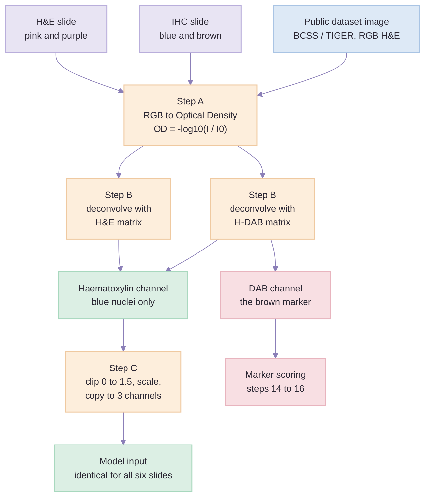
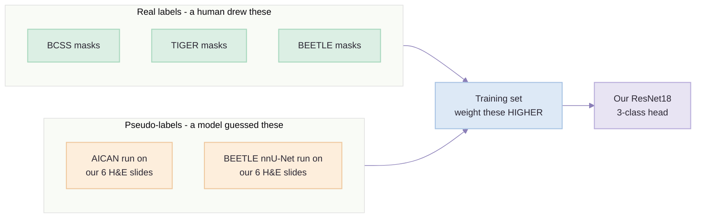
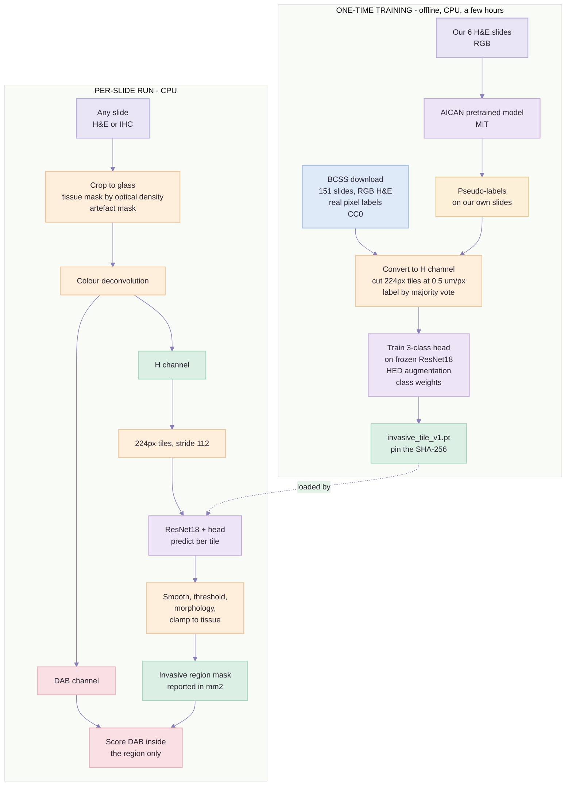
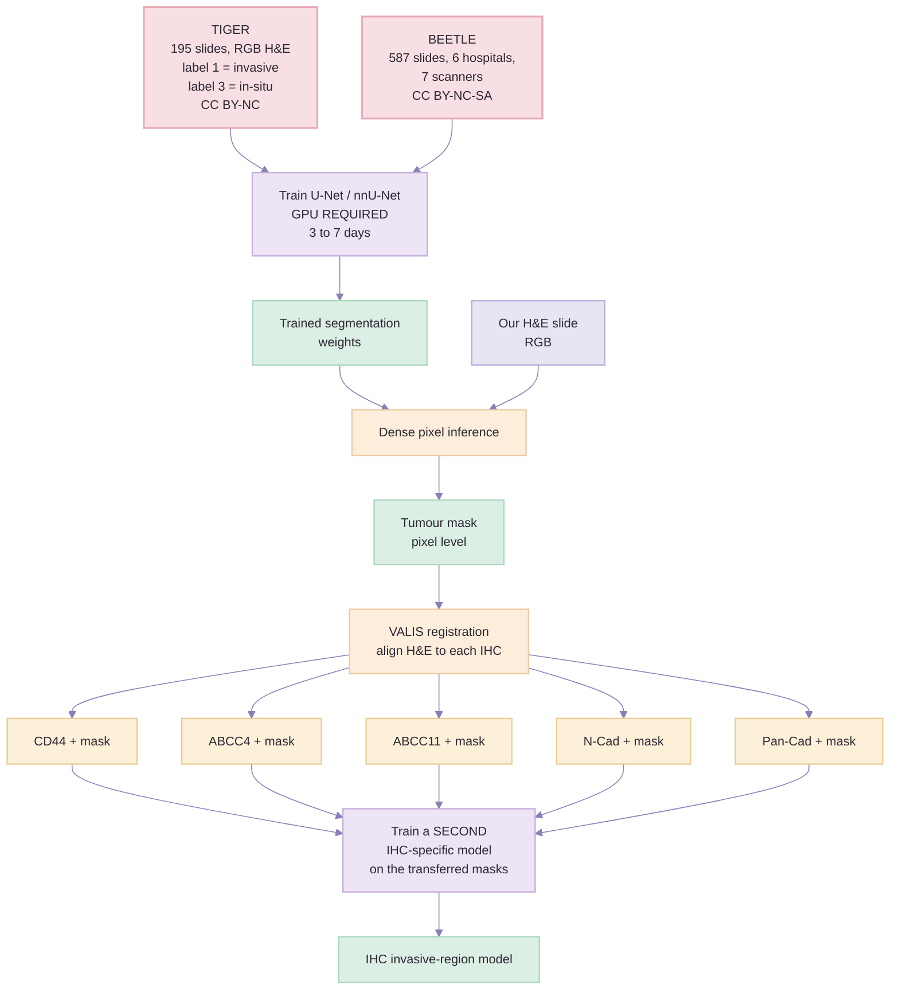
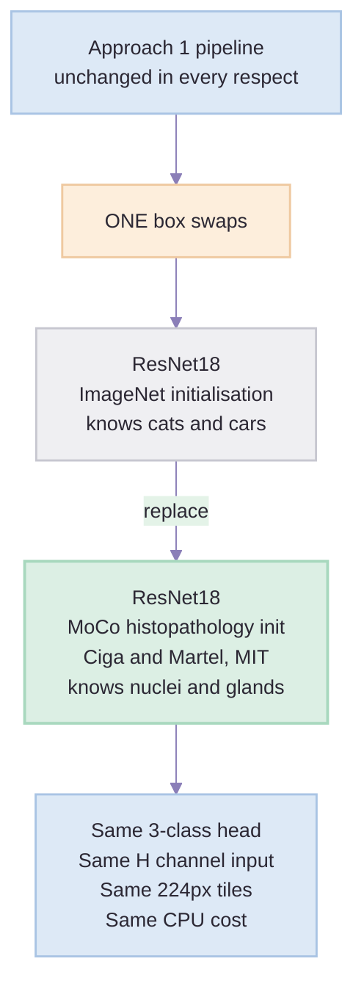
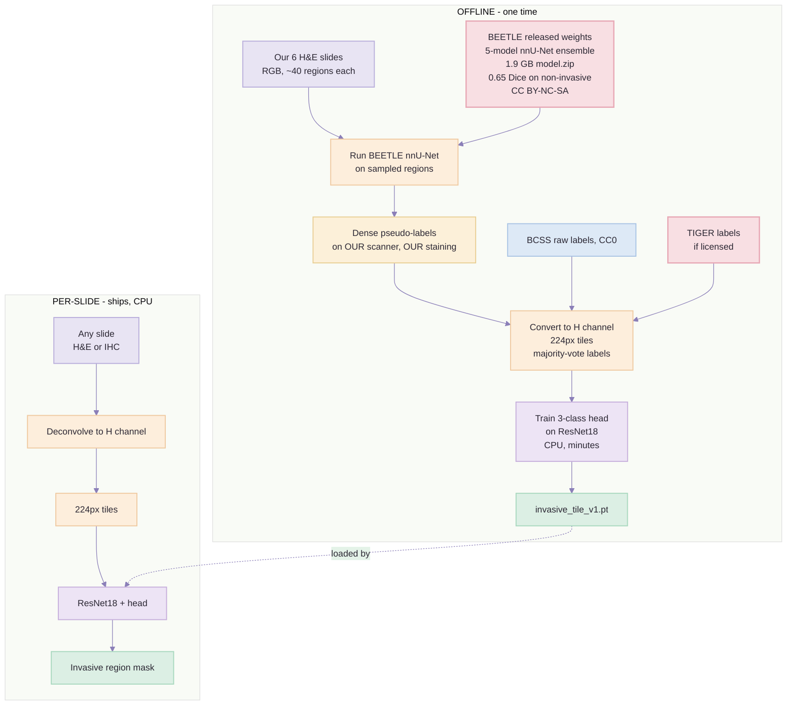

# Four Ways to Segment Invasive Tumour — A Complete Comparison

> Created: 2 Sep 2026 | Audience: anyone with basic ML knowledge, no pathology background needed
> Companion to: [`approach-1-training-plan.md`](approach-1-training-plan.md),
> [`approach-3-training-plan.md`](approach-3-training-plan.md),
> [`approach-4a-training-plan.md`](approach-4a-training-plan.md) (the build plans) and
> [`demo-pipeline-guide.md`](demo-pipeline-guide.md) (the 17-step demo)
>
>
> **Extended 2 Sep 2026** by [`segmentation-approaches-ranked.md`](segmentation-approaches-ranked.md),
> which adds **approach 5** (label ~900 of our own tiles), **approach 6** (register the H&E mask onto
> the five IHC serial sections) and **approach 7** (annotate it ourselves, then request annotated cases
> from OncoStem) — then ranks all seven. Its Part 0 makes a point this document does not: **none of the
> four approaches below can be measured on an OncoStem slide.**
> **Time and storage for all seven** are in
> [`segmentation-approaches-all-seven.md`](segmentation-approaches-all-seven.md).

> **Revised 2 Sep 2026**, after the BCSS class census and a re-read of the BEETLE paper. Four things
> changed, and one of them was simply wrong:
> **(a)** BCSS, TIGER and BEETLE are **nested**, not three independent options — Part 2;
> **(b)** BEETLE's headline "0.92 Dice" is an *overall* figure inflated by its easiest class, and the
> number that governs this project is **0.65** on non-invasive epithelium across unseen scanners —
> Parts 4 and 6;
> **(c)** Part 6 now separates *"does the ontology contain the class"* from *"is there enough data to
> train it"* — different questions, previously conflated, and the conflation is what made BCSS look
> adequate;
> **(d)** Approach 4 has its own build plan, [`approach-4a-training-plan.md`](approach-4a-training-plan.md),
> and BRACS is added as the permissive fallback for class `1`. ⚠️ **That last clause is wrong and is
> corrected in Part 3 and Part 7: BRACS is non-commercial** (verified at its download page,
> 3 Sep 2026).

---

## Part 0 — Five minutes of background, so the rest makes sense

### What we are trying to do

A pathologist looks at a slide and mentally circles the **invasive tumour** — the cancer that has
broken out of the milk ducts and started growing into the surrounding tissue. Then they count how
many of *those* cells are stained brown. Everything outside the circle is ignored.

We are automating the circle.

### Why this is hard, in one picture

Breast tissue on a slide contains several things that all look "cancerous" to a naive algorithm:

| What it is | Looks like | Do we score it? |
| --- | --- | --- |
| **Invasive tumour** | Dense, disorganised cells growing into the surroundings | **YES** |
| **DCIS** (cancer still inside the duct) | Dense, disorganised cells — but *inside a tube* | **No** |
| Normal ducts and glands | Organised cells, also inside tubes | No |
| Stroma (connective tissue) | Stringy, few cells | No |
| Fat | Big empty bubbles | No |
| Necrosis (dead tissue) | Dark mush | No |

The difficult line is the first two. **Both are dense, both are cancer, and the only difference is
whether the cells are still contained inside a duct.** That is not a colour difference or a density
difference — it is a *shape and arrangement* difference. This is why simple thresholding never
worked here, and it is the single reason this project needs machine learning at all.

### The vocabulary you need

| Term | Meaning |
| --- | --- |
| **WSI** | Whole Slide Image. A scanned glass slide, typically 100,000 × 100,000 pixels |
| **H&E** | The standard pink-and-purple stain. Shows tissue structure. No specific protein |
| **IHC** | Immunohistochemistry. Stains one specific protein **brown** |
| **DAB** | The chemical that makes the brown. Same brown for every marker |
| **Haematoxylin (H)** | The blue-purple dye that stains cell nuclei. Present on **both** H&E and IHC slides |
| **Eosin (E)** | The pink dye on H&E slides. Stains cytoplasm and connective tissue. **Not** on IHC slides |
| **mpp / µm per pixel** | Resolution. Our slides are 0.2222 µm/px — very high magnification |
| **Tile / patch** | A small square cut out of the giant slide, e.g. 224 × 224 pixels |
| **Dice score** | How well two masks overlap. 0 = no overlap, 1 = perfect. As a rule of thumb 0.80 is good and 0.92 is excellent — but **only ever compare Dice within one class.** An *overall* Dice averaged across classes is dominated by whichever class holds most of the pixels, and that is how BEETLE reports a 0.92 while scoring 0.65 on the class we care about |
| **Pseudo-label** | A label produced by another model rather than by a human |

### Our data

- **6 breast cancer cases.** Each case = **6 slides** cut from one tissue block: 1 H&E + 5 IHC.
- The 5 IHC markers: CD44, ABCC4, ABCC11, N-Cadherin, Pan-Cadherin.
- **36 slides total**, 34 GB, one scanner (Morphle), 0.2222 µm/px.
- **We have no hand-drawn tumour outlines.** That is the whole difficulty.
- **We have no GPU.**

---

## Part 1 — The stain problem, and the channel trick that solves it

**This section is the most important one in the document.** Everything else follows from it.

### The problem

Every public breast-cancer dataset and every public model is built on **RGB H&E images**. We have
one H&E slide per case and **five IHC slides**. IHC slides look completely different — they are
blue and brown, not pink and purple.

Worse, our five IHC markers do not even look like *each other*. N-Cadherin and Pan-Cadherin sit at
75–85 % positive, meaning brown floods the whole tile and drowns everything else. CD44 ranges from
5 % to 85 %. A model that learns "invasive tumour looks like this" on one of them will fail on the
others.

So we appear to need six different models. We do not.

### The insight

Look at what dyes are actually on each slide:

| Slide type | Dye 1 | Dye 2 |
| --- | --- | --- |
| H&E | **Haematoxylin** (blue nuclei) | Eosin (pink) |
| CD44 IHC | **Haematoxylin** (blue nuclei) | DAB (brown) |
| ABCC4 IHC | **Haematoxylin** (blue nuclei) | DAB (brown) |
| ...all five IHC | **Haematoxylin** (blue nuclei) | DAB (brown) |

**Haematoxylin is on all six slides.** It is the common language. And haematoxylin is exactly the
dye that shows nuclei — which is where all the shape-and-arrangement information lives.

So: throw away the second dye, keep haematoxylin, and all six slides become the same kind of image.

### How the conversion actually works

Three steps. All classical maths, no training, milliseconds per tile.

**Step A — RGB to Optical Density (Beer–Lambert law)**

Light passing through a stained slide gets absorbed. The relationship between "how much dye" and
"how dark the pixel" is logarithmic, not linear, so we take a log:

```
OD = -log10( I / I₀ )
```

- `I` = the pixel's RGB value
- `I₀` = what "no stain at all" looks like on **this slide** — measured by sampling the empty glass
- `OD` = optical density, which **is** linearly proportional to dye concentration

Why this matters: you cannot add or subtract dyes in RGB space, but you *can* in OD space. This
step is what makes the next one legal.

**Step B — Colour deconvolution (Ruifrok & Johnston)**

Every pixel is a *mixture* of two dyes. A dark blue nucleus under faint brown looks, in RGB, a lot
like a medium-brown nucleus. You cannot threshold a mixture — you must un-mix it first.

Each dye has a known, fixed colour direction in OD space (a 3-element vector). Stack them into a
3 × 3 matrix, invert it, multiply each OD pixel by it, and you get one number per dye:

```
[ H concentration  ]                    [ OD_red   ]
[ Dye2 concentration ]  =  M⁻¹   ×      [ OD_green ]
[ residual         ]                    [ OD_blue  ]
```

**Use a different matrix for each slide type**, because the second dye is different:

| Slide type | Matrix | Take which channel |
| --- | --- | --- |
| H&E | H&E stain matrix | **Channel 0 = Haematoxylin** |
| Any IHC | H-DAB stain matrix | **Channel 0 = Haematoxylin** |

You know which slide is which from the filename letter code (A/F/R/U/W = IHC, HE = H&E), so this is
a lookup, not a guess.

> **Use FIXED reference vectors, never per-image estimated ones.** If every slide gets its own
> stain vectors, "0.4 haematoxylin" means something different on every slide and nothing is
> comparable. Fixed vectors keep one scale across the whole cohort.

**Step C — Normalise into a model-friendly range**

```
clip OD to [0, 1.5]  →  divide by 1.5  →  now in [0, 1]  →  copy into 3 identical channels
```

Why three identical channels? Because ResNet expects a 3-channel input. We hand it the same
grayscale image three times. It works fine.

### The pipeline for channel conversion



### One rule that is easy to get wrong

**Training and inference must call the exact same conversion function.** Put it in
`backend/app/scoring/stains.py` and have both the tile exporter and the runtime import it. If a
training script quietly calls `skimage.color.rgb2hed` on its own while the runtime uses a calibrated
matrix, the two drift apart and your IHC slides will score nothing like your H&E — and it will look
like a model problem when it is a plumbing problem.

### Why we do NOT fake an eosin channel

A tempting alternative: instead of retraining on H-only, invent a fake pink eosin layer so the IHC
slide looks like an H&E, and feed that to an off-the-shelf H&E model.

**Do not do this.** The eosin information does not exist on an IHC slide. You would be *inventing*
tissue structure and then letting a model treat the invention as evidence. Training on the H channel
from the start is strictly better: nothing is fabricated, and the model becomes stain-agnostic by
construction rather than by disguise.

---

## Part 2 — What each public asset actually gives you

People say "use BCSS" or "use AICAN" as if these were the same kind of thing. They are not. Some are
**data**, some are **weights**, and the difference decides how you use them.

| Asset | Type | What you actually download | What you do with it |
| --- | --- | --- | --- |
| **BCSS** | **Annotated data** | ~5–10 GB: RGB H&E image regions from 151 TCGA breast slides, plus a matching PNG mask where every pixel carries a tissue-class number | Cut into tiles, read the label per tile, **train on it** |
| **TIGER** | **Annotated data** | 2.6 GB: pre-cut RGB H&E regions at 0.5 µm/px from 195 slides, plus masks with 7 tissue classes. **151 of the 195 are the BCSS slides relabelled** — see the nesting note below | Same — train on it. No WSI handling needed, it is already tiled |
| **BEETLE** | **Data + weights** | 150.9 GB on Zenodo (587 slides, 527 patients, 3 clinical centres + 2 public datasets, 7 scanners) **and** a 5-model nnU-Net ensemble in a *separate* 1.9 GB `model.zip` | Either train on the data, or **download only `model.zip` and run their model** |
| **BRACS** | **Annotated data** | 4,539 ROI crops from 547 WSIs, three-pathologist consensus, 7 lesion types. **ROI-level labels only — no tissue masks** | Tile the crops, take the ROI's label per tile. Supplies classes `1` and `2` only, never `0` |
| **AICAN** | **Weights only** | A trained model, delivered through the FastPathology / pyFAST tool | **Run it** on your slides to get predictions. No training data included |
| **MoCo (Ciga & Martel)** | **Weights only** | A ResNet18 `.ckpt` file, self-supervised on histopathology | Use as the **starting point** for your own training. It has no classes — it just has good features |
| **ImageNet ResNet18** | **Weights only** | Standard torchvision checkpoint, trained on photos of cats, cars and chairs | Same — a starting point. Surprisingly good, but not tissue-aware |

### ⚠ The three big datasets are nested, not independent

Easy to miss, and it changes how they should be compared. BEETLE's development set **includes the
TIGER training set**, and 151 of TIGER's 195 WSIs are the TCGA-BRCA slides that *are* BCSS,
relabelled (`mostly_tumor` → invasive tumour, `mostly_dcis` → in-situ tumour):

```
BCSS (151 TCGA)  ⊂  TIGER (195)  ⊂  BEETLE (587)
```

Three consequences:

1. **"TIGER separates invasive from in-situ, therefore BCSS is fine" is circular.** On the TCGA half,
   TIGER annotated nothing new — it renamed BCSS's annotations, including the `dcis` class the census
   measures at 0.050 % of pixels from a single patient. TIGER inherits that scarcity exactly.
2. **Adopting BEETLE loses nothing we already have**, because BCSS is a subset of it.
3. **BEETLE's value is precisely the part that is not TIGER.** Its non-TIGER subset carries 216 mm² of
   non-invasive epithelium against 9.1 mm² in the TIGER-derived subset — **96 % of the class-`1` area
   is new annotation.**

The three are a ladder, not a menu. Of the four datasets on this page, only **BRACS** is genuinely
independent of the TCGA core.

### The critical distinction: real labels vs pseudo-labels



> ⚠ **"A human drew these" is only approximately true of BEETLE.** Its masks were produced by a
> custom epithelium U-Net and by HoVerNet, then *corrected* by pathologists and trained research
> assistants: the class **assignment** is human, the boundary **delineation** is largely machine. BCSS
> and TIGER masks are human-drawn; BRACS gives three-pathologist consensus per ROI but no boundaries
> at all. None of the four is pixel-perfect ground truth, and no report should imply otherwise.
> Detail: [`approach-4a-training-plan.md`](approach-4a-training-plan.md) Part 2.

**Why we use pseudo-labels at all.** BCSS teaches the model what breast cancer looks like *in
general*. It cannot teach it what **our Morphle scanner** and **OncoStem's staining** look like,
because no public dataset contains our slides. Running a pretrained model on our own slides fills
that gap without anyone drawing anything.

**Why they are risky.** AICAN's output is a guess. If AICAN is wrong in some systematic way, our
model learns that mistake and repeats it confidently. Three guards, all cheap:

1. **Weight real labels higher** than pseudo-labels in the loss function.
2. **Tag pseudo-label tiles** so they can be separated or removed later.
3. **Run the ablation** — train with and without them, compare on held-out BCSS. If they do not
   help, drop them. Never assume the teacher was right.

### A subtlety that is easy to miss

The teacher model (AICAN or BEETLE) is run on **RGB H&E** — its native input, exactly what it was
trained on. The student we train runs on the **H channel**.

```
Teacher:  our RGB H&E slide  →  AICAN  →  predicted class map
                                              ↓
Student:  same slide → H channel → tiles → labelled by the teacher's map
```

**The teacher never sees an IHC slide.** It works in the domain it understands, and its knowledge
is transferred into a student that works in a stain-agnostic domain. That is the whole design in one
sentence.

---

## Part 3 — Licences: which, why, and what breaks if you get it wrong

Coditas is building this for OncoStem, a paying client, and the product ships. That makes this
**commercial use**, regardless of who owns the final code.

### The rule

A licence that says "non-commercial" means you cannot use that asset in something you sell. Whether
a *trained model* counts as a derivative work of non-commercial *training data* is legally
unsettled — many companies argue it does not. But this feeds a test that helps decide whether
someone receives chemotherapy. That is not an argument you want to have with a regulatory reviewer.

### What each licence means in practice

| Licence | Plain meaning | Commercial use |
| --- | --- | --- |
| **CC0** | Public domain. Do anything | ✅ Yes |
| **MIT** | Do anything, keep the copyright notice | ✅ Yes |
| **BSD-3** | Same as MIT, plus don't use their name to endorse your product | ✅ Yes |
| **Apache-2.0** | Same as MIT, plus an explicit patent grant | ✅ Yes |
| **CC BY-NC** | Attribution required, **non-commercial only** | ❌ No |
| **CC BY-NC-SA** | Non-commercial, **and** derivatives must carry the same licence (this "ShareAlike" clause is why it is worse than plain NC — it tries to follow your weights) | ❌ No |
| **CC BY-NC-ND** | Non-commercial **and** no derivatives at all | ❌ No |
| **Commons Clause** | Looks like Apache-2.0 but adds "you may not sell it" | ❌ No |

### The asset-by-asset verdict

| Asset | Licence | Ships? | Why it matters here |
| --- | --- | --- | --- |
| **BCSS** | **CC0** | ✅ | Our primary label source. Public domain, zero risk |
| **AICAN breast-epithelium** | **MIT** | ✅ | Our teacher model. ⚠️ Verify the *weights* licence, not just the repo badge |
| **torchvision ResNet18** | **BSD-3** | ✅ | Encoder starting point |
| **MoCo (Ciga & Martel)** | **MIT** | ✅ | Better encoder starting point, same cost |
| **InstanSeg** | **Apache-2.0** | ✅ | Nuclei segmentation |
| **Cellpose** | **BSD-3** | ✅ | Nuclei, alternative |
| **VALIS** | **MIT** | ✅ | Aligning the serial sections |
| **Hibou-B** | **Apache-2.0** | ✅ | The only foundation encoder that is both permissive and CPU-sized |
| **TIGER** | **CC BY-NC 4.0** + TCGA terms | ❌ | Best label scheme, cannot ship |
| **BRACS** | **Non-commercial** — *verified 3 Sep 2026*. The paper says CC0; **the download page says "The BRACS dataset may be used only for non-commercial research"**, and the download page governs | ❌ | 3,890 non-invasive-epithelium ROIs across 151 patients. **Was** the permissive fallback for class `1`; it is not permissive. `benchmarks/` only |
| **BEETLE** | **CC BY-NC-SA 4.0** | ❌ *(deprioritised by decision — see [`approach-4a-training-plan.md`](approach-4a-training-plan.md) Part 0)* | Best dataset in existence for this problem. **ShareAlike is the clause that matters** — it follows a distilled student model, so it would contaminate our own weights, not merely block redistribution |
| **GrandQC** | **CC BY-NC-SA** | ❌ | Would save us writing artefact detection ourselves |
| **HoVer-Net + PanNuke** | **CC BY-NC-SA** | ❌ | Would give free cell typing |
| **DeepLIIF** | **Commons Clause** | ❌ | Also trained on nuclear markers; our panel is membrane/cytoplasmic. Fails twice |
| **UNI, CONCH** | **CC-BY-NC-ND** | ❌ | Strongest encoders, unusable |
| **Virchow2** | restricted | ❌ | Same |
| **Phikon-v2** | Owkin non-commercial | ❌ | Same |

### How to enforce it so it does not drift

Two directories, and a CI check:

```
backend/app/        ← shipped. May only import CC0 / MIT / BSD / Apache assets
benchmarks/         ← research. TIGER, BEETLE, GrandQC live here
                       CI fails the build if backend/ imports anything from here
```

Licence discipline that lives in a document drifts. Discipline that fails a build does not.

---

## Part 4 — The four approaches in detail

---

## Approach 1 — BCSS + AICAN → H-channel ResNet18 *(the approved one)*

### In plain words

Strip the brown out of every slide, cut the leftover blue nuclear image into small squares, and
train a small network to sort each square into one of three buckets. Learn what cancer looks like
from a free public dataset; learn what *our scanner* looks like by borrowing a pretrained model's
opinion on our own slides.

### The three classes

| Class | Contains | Fate |
| --- | --- | --- |
| `2` **invasive epithelium** | Cancer outside the ducts | **Scored** |
| `1` **non-invasive epithelium** | DCIS, LCIS, normal ducts and glands | Excluded |
| `0` **non-epithelium** | Stroma, fat, inflammation, necrosis | Excluded |

Three, not eight. Fat and stroma do not need telling apart from each other — they are all excluded.
Collapsing them puts **every training example behind the one boundary that matters**.

### The pipeline



### The training approach, step by step

**Step 1 — Download BCSS.** Clone `PathologyDataScience/BCSS`, run its download script. You get RGB
H&E image regions and matching mask PNGs where each pixel is a class number.

**Step 2 — Read the label codes.** Open `meta/gtruth_codes.tsv`.

> ⚠️ **The trap that would sink this approach.** There is a widely-used "5-class" version of BCSS —
> tumour / stroma / inflammatory / necrosis / other — and it **merges DCIS into tumour**. That is
> the one merge this project cannot accept, and it is the default in most tutorials and in
> TIAToolbox's `fcn_resnet50_unet-bcss` model. Use the **raw** codes, where `dcis` is separate.

Mapping (confirm each name against the TSV before coding it):

| Our class | BCSS raw labels |
| --- | --- |
| `2` invasive | `tumor`, `angioinvasion` |
| `1` non-invasive | `dcis`, `normal_acinus_or_duct` |
| `0` non-epithelium | `stroma`, `lymphocytic_infiltrate`, `necrosis_or_debris`, `fat`, `blood`, `plasma_cells`, `other_immune_infiltrate`, `mucoid_material`, `blood_vessel`, `lymphatics`, `nerve`, `skin_adnexa`, `glandular_secretions`, `metaplasia_NOS`, `other` |
| ignore | `exclude`, `undetermined` |

**Step 3 — Run AICAN on our own H&E slides.**

```powershell
pip install pyfast
runPipeline --datahub breast-epithelium-segmentation --file <our H&E slide>
```

Sample ~40 regions of 2048 × 2048 per case, spread across the tissue. Treat AICAN's output as
labels. *Judge it on whether it correctly leaves DCIS out, not on whether it finds tumour* — its
published weak spot is exactly in-situ classification.

> **If pyFAST will not run on CPU** (FAST needs an OpenCL runtime): try Intel's CPU OpenCL, then
> stop. **This input is optional.** Train on BCSS alone. You lose scanner adaptation, not the
> pipeline. Do not spend three days on an installer.

**Step 4 — Export tiles.** Both sources go through the *identical* exporter:

1. Resample to **0.5 µm/px** (BCSS ships at 0.25, so downsample 2×).
2. Convert to the **H channel** via `stains.py` — the same function inference calls.
3. Clip OD to `[0, 1.5]`, divide by 1.5, replicate to 3 channels.
4. Cut **224 × 224** tiles, stride 224.
5. Label by majority vote, discarding ambiguous tiles:

```
usable = fraction of pixels with a non-ignored label
if   usable < 0.70:              drop
elif invasive_frac    >= 0.50:   label = 2
elif noninvasive_frac >= 0.50:   label = 1
elif nonepi_frac      >= 0.80:   label = 0
else:                            drop      # too mixed to learn from
```

**Why 224 px at 0.5 µm/px?** That is 112 µm — about nine cells across. Big enough to see whether
epithelium sits inside a duct or is infiltrating. Smaller tiles literally cannot contain that
information, which is why nuclear-density heuristics never worked.

**Step 5 — Train.**

```python
import torch, torchvision
m = torchvision.models.resnet18(weights="IMAGENET1K_V1")   # BSD-3, safe to ship
m.fc = torch.nn.Linear(512, 3)
for p in m.parameters():    p.requires_grad = False
for p in m.fc.parameters(): p.requires_grad = True
```

- **Class weights** in the cross-entropy loss, inversely proportional to frequency. Without them the
  model answers "non-epithelium" every time, looks 80 % accurate, and is useless.
- **HED colour augmentation** plus flips and rotations. The HED jitter is what buys stain tolerance
  and lets you skip stain normalisation entirely.
- **Leave-one-source-slide-out**, never a random tile split. Tiles from one slide are highly
  correlated; a random split reports a beautiful number that means nothing.

**Step 6 — Report.** A 3 × 3 confusion matrix, with the **invasive ↔ non-invasive cell reported on
its own**, never folded into an average. That one number is the project.

### Timing

| Task | CPU (8-core desktop) | GPU (one RTX-class card) |
| --- | --- | --- |
| BCSS download | 30–60 min (network-bound) | same |
| AICAN on 6 H&E slides | ~2.5 h | ~15 min |
| Tile export, both sources | ~1 h | same (disk-bound) |
| Feature extraction (frozen body, once) | ~1.5 h | ~3 min |
| Fit the head on cached features | **seconds to 2 min** | seconds |
| *Optional* fine-tune last block, 10 epochs | ~15 h (overnight) | ~20 min |
| **Total to first model** | **~5–6 hours** | ~30 min |
| Inference, 6 H&E, stride 224 | **~30–45 min** | ~1 min |
| Inference, 6 H&E, stride 112 (smoother) | ~2–3 h | ~4 min |
| Inference, all 36 slides, stride 112 | ~12–14 h (overnight) | ~25 min |

**Can we do it on CPU? Yes, comfortably.** This approach was designed around that constraint.

### Pros and cons

| Pros | Cons |
| --- | --- |
| Every dependency CC0/MIT/BSD — **shippable today** | Lowest raw ceiling of the four |
| Trains in minutes; you can iterate on class definitions all week | BCSS is 151 slides, one scanner era — thin diversity |
| One model serves H&E and all five IHC | AICAN gives predictions, not truth — needs the ablation |
| No client data leaves your machine | Tile output is blocky at 112 µm until refined |
| Genuinely runs on the hardware you have | Generic ImageNet backbone (see Approach 3) |

**Estimated Dice, invasive vs non-invasive: 0.70 – 0.80.** *This is an estimate, not a measurement.*

---

## Approach 2 — TIGER + BEETLE → U-Net → register onto IHC

### In plain words

Train a proper pixel-level segmentation network on the two biggest public breast datasets, run it on
the H&E slide, then physically align the H&E to each IHC slide and copy the tumour outline across.

### What U-Net does differently

Approach 1 says *"this 112 µm square is invasive."* U-Net says *"this individual pixel is invasive."*
Much finer, much more expensive.

### The pipeline



*(Pink boxes = non-commercial licence.)*

### Why these two datasets

**TIGER** — 195 WSIs, and crucially its label scheme keeps invasive and in-situ as *separate*
classes (`1` and `3`), which is exactly our distinction. Already pre-cut into ROI PNGs at 0.5 µm/px,
so no WSI handling needed.

> ⚠ **But 151 of those 195 slides are BCSS relabelled**, so on that subset TIGER's `3 in-situ` class
> *is* BCSS's `20 dcis` — 0.050 % of pixels, one patient. The separate class is real; the data behind
> it on the TCGA half is not. Only TIGER's 26 RUMC and 18 Jules Bordet slides add new in-situ
> annotation. See the nesting note in Part 2.

**BEETLE** — 587 slides from 6 hospitals in 3 countries on **7 different scanners**. Its four
classes are literally invasive epithelium / non-invasive epithelium (DCIS, LCIS, healthy glands) /
necrosis / other. Multi-scanner coverage is the thing no other dataset gives you, and it is the
failure mode you cannot detect from your own single-scanner cohort.

### Why registration is needed

Our six slides per case are **serial sections** — consecutive shavings from one tissue block. Same
tumour, but different physical slices, so they are shifted, rotated and slightly deformed relative
to each other. Registration finds the transform that lines them up.

### Timing

| Task | CPU | GPU |
| --- | --- | --- |
| Download TIGER + BEETLE | 2–4 h (network) | same |
| Train nnU-Net, 5-fold | **months — not viable** | 3–7 days on one card |
| Dense inference, largest slide | **~60–70 h — not viable** | ~40–80 min |
| Dense inference, 6 H&E | ~200 h | ~4 h |
| VALIS registration, per case | 5–20 min | same (CPU-bound) |
| Train the second IHC model | not viable | 1–2 days |

**Can we do it on CPU? No.** Both the training and the dense inference are out of reach. This is
GPU-only.

### Pros and cons

| Pros | Cons |
| --- | --- |
| **Highest ceiling of the four training routes** — 782 slides vs 151 | **Non-commercial licences. Cannot ship.** Decisive |
| 7 scanners → real robustness to our Morphle | Needs a GPU; Colab means client slides on a cloud we don't control |
| Dense pixel output, not blocky tiles | Two models to build and maintain instead of one |
| TIGER's ontology natively separates invasive from in-situ | Registration is load-bearing, and **will fail** on our near-blank CD44 slides (00267: 17.5 mm² vs 84.8 on its siblings) |
| BEETLE ships baseline weights — 0.87 external Dice overall, but **0.65 on non-invasive epithelium** | Registration errors become **silent** training-label noise |
| | Weeks of work vs days |

**Estimated Dice: 0.80 – 0.88** if we train it ourselves. *Estimate.*

**Verdict:** benchmark tree only. Keep it to learn what the ceiling looks like.

---

## Approach 3 — MoCo initialisation *(Approach 1 with better starting weights)*

### In plain words

Identical to Approach 1, except the ResNet18 starts from weights pretrained on **tissue images**
instead of on photographs of cats and cars.

### What "pretrained" means, briefly

Before you train on your task, you start from weights someone else learned on a different task. The
network already knows edges, textures and shapes, so it needs far less of your data. **Where those
weights came from matters:** ImageNet weights know about fur and wheels; MoCo histopathology weights
know about nuclei and glands.

**MoCo** (Momentum Contrast) is a *self-supervised* method — it learns from unlabelled images by
being asked "are these two crops from the same image?" No annotations needed, which is why it can
be trained on enormous quantities of tissue.

### The pipeline



### Timing

**Identical to Approach 1.** Same architecture, same parameter count, same forward-pass cost. The
only extra work is downloading one `.ckpt` file and changing one line.

### Pros and cons

| Pros | Cons |
| --- | --- |
| **MIT licensed** — shippable | Not really a separate approach; it's a one-line change |
| **Zero extra compute** — same ResNet18 | Gain is real but modest: a few points, not a transformation |
| Features pretrained on tissue, not photographs | Pretraining corpus is multi-organ, not breast-specific |
| Trivial to A/B against Approach 1 on held-out BCSS | The commonly-cited "ResNet50" is wrong — the released checkpoint is ResNet18 |

**Estimated Dice: 0.73 – 0.83** (roughly +3 points over Approach 1). *Estimate.*

**Verdict:** just do it. Train both initialisations, keep whichever wins. There is no reason not to.

---

## Approach 4 — BEETLE released weights as teacher, distilled

### In plain words

Don't train a segmentation network — **download one that already exists**. BEETLE published a
5-model nnU-Net ensemble: 0.87 overall Dice on its external multi-centre test set, and **0.65 on
non-invasive epithelium** — the class this project exists for. Run it on our own H&E slides to
generate labels, then use those labels to train our cheap tile classifier. The expensive model is
used *once, offline*; the cheap model is what ships.

**This is Approach 1 with the teacher slot upgraded from AICAN to BEETLE.** Nothing else changes.

### Why this beats "train a U-Net on BEETLE" (Approach 2)

Because the work is already done. Their 5-fold nnU-Net was trained on all 587 slides across 7
scanners, scores 0.87 overall on unseen centres, and matches the TIGER challenge leaderboard on
invasive tumour (0.79 / 0.77 against the winners' 0.79 / 0.81). Nothing we train in ten days will
beat that. Downloading is both less work *and* better — and it is 1.9 GB (`model.zip`) rather than
the 150.9 GB the full dataset costs.

### What "distillation" means

A big, slow, accurate model teaches a small, fast one:

```
Big model (BEETLE nnU-Net)  →  runs ONCE, offline, on sampled regions  →  labels
                                                                            ↓
Small model (our ResNet18)  ←  trained on those labels  ←  ships and runs per slide
```

You pay the big model's cost once at build time instead of every time a slide is scored.

### The pipeline



### Timing

| Task | CPU | GPU |
| --- | --- | --- |
| Download BEETLE weights | minutes | same |
| **Training the teacher** | **none — already done** | none |
| Teacher inference on ~40 ROIs × 6 cases | ~14 h (overnight) | ~15 min |
| Tile export + train the head | ~2 h | ~10 min |
| **Total to first model** | **~16 h, one overnight run** | ~30 min |
| Per-slide inference (the student) | ~30–45 min for 6 H&E | ~1 min |

**Can we do it on CPU? Yes** — the teacher runs overnight, once. After that the student is exactly
as cheap as Approach 1.

### Pros and cons

| Pros | Cons |
| --- | --- |
| **Best available teacher** — 7 scanners, 527 patients, **~225 mm² of annotated non-invasive epithelium** against BCSS's 0.129 % of pixels from one patient | **CC BY-NC-SA, and ShareAlike follows the student.** Deprioritised by decision, *not* resolved |
| Its 4 classes **are** the OncoStem distinction, no remapping | The teacher is still a guess on *our* slides — same pseudo-label caution applies |
| **Nothing to train** — the hard work is already published | Teacher inference is an overnight job on CPU |
| Slots into Approach 1 without changing anything downstream | BEETLE's evaluation labels are sequestered on Grand Challenge, so you benchmark by submission, not locally |
| Multi-scanner coverage is the one thing our cohort cannot give us | |

**Estimated Dice: 0.80 – 0.88.** *Estimate.*

**Verdict:** best of the four, and **now the primary route to a class `1` that was actually trained.**
It has its own build plan: [`approach-4a-training-plan.md`](approach-4a-training-plan.md).

Two caveats that belong next to that verdict. First, the licence has been **deprioritised by
decision rather than resolved** — the flag is recorded in that plan's Part 0 and must be closed
before commercial release; one email to the BEETLE authors about commercial terms is still worth
sending. Second, **gate zero comes first**: a pathologist looking at our six H&E slides may report
that DCIS is absent or trace in all six, in which case the right output of this approach is a
documented limitation rather than a model.

---

## Part 5 — Hardware reality: can we really do this on CPU?

### The short answer

**Yes for Approaches 1, 3 and 4. No for Approach 2.**

### Why, in one number

Our largest slide (case 00259) has 315 mm² of tissue. At 0.25 µm/px that is **5 billion pixels**.

| Method | Work per slide | CPU time |
| --- | --- | --- |
| **Dense pixel segmentation** (U-Net) | ~25,000 forward passes on 1024 × 1024 inputs | **~60–70 hours** |
| **Tile classification** (our approach) | ~25,000 forward passes on 224 × 224 inputs | **~10–40 minutes** |

Same number of passes; the inputs are **20 times smaller in area** and the network is far lighter.
That single design choice is what makes the whole project CPU-viable.

### When a GPU actually helps

| Situation | Worth a GPU? |
| --- | --- |
| Fitting the 3-class head | No — it takes seconds either way |
| Fine-tuning the ResNet18 body | Maybe — 15 h → 20 min |
| Running a dense U-Net across whole slides | **Yes, mandatory** |
| Training nnU-Net from scratch | **Yes, mandatory** |
| Everyday per-slide inference | No |

### If you do rent a GPU

Rent one for a few hours rather than fighting Google Colab. Colab's 12-hour session limits and Drive
I/O for 100,000 small PNGs are genuinely painful, and — more importantly — **client slides must
never go to a cloud service we do not control.** Public datasets on Colab, fine. OncoStem's tissue,
never. See [`../handbook/admin-guide/de-identification.md`](../handbook/admin-guide/de-identification.md).

---

## Part 6 — The comparison table

> **On the accuracy column.** These are **engineering estimates, not measurements.** Nobody has run
> any of these on an OncoStem slide. They are anchored on one published number — **BEETLE's nnU-Net
> reaching 0.65 Dice on non-invasive epithelium across unseen scanners** (0.83 on its own data, 0.56
> at its worst centre) — and discounted for smaller training data, cross-scanner transfer, and the
> H-channel domain shift. Treat them as a ranking, not a forecast.
>
> ⚠ **An earlier draft anchored these on 0.92, which was that model's *overall* Dice — inflated by
> its `other` class at 0.97, which is most of the pixels. The estimates below were revised down
> accordingly.** And the last sentence of this note used to read "the real number arrives after the
> held-out BCSS evaluation in week 3": that evaluation **cannot** produce the number, because
> held-out BCSS contains no DCIS at all. See [`approach-1-training-plan.md`](approach-1-training-plan.md)
> Part 2.

| | **1. BCSS + AICAN** *(approved)* | **2. TIGER + BEETLE U-Net** | **3. MoCo init** | **4. BEETLE teacher** |
| --- | --- | --- | --- | --- |
| **What it is** | Tile classifier on the H channel | Dense U-Net + registration | Approach 1, better weights | Approach 1, better teacher |
| **Can it ship today?** | ✅ **Yes** | ❌ No | ✅ **Yes** | ⚠️ Only with a licence |
| **Licence needed** | none — all permissive | commercial from RUMC, Jules Bordet, BEETLE authors | none | commercial from BEETLE authors |
| **Licences used** | BCSS CC0, AICAN MIT, torchvision BSD-3 | TIGER CC BY-NC, BEETLE CC BY-NC-SA | + Ciga MoCo MIT | BEETLE CC BY-NC-SA, BCSS CC0 |
| **Provides weights or data?** | BCSS = data, AICAN = weights | both = data (BEETLE also weights) | MoCo = weights | BEETLE = weights, BCSS = data |
| **CPU possible?** | ✅ **Yes, comfortably** | ❌ **No** | ✅ **Yes** | ✅ Yes, one overnight run |
| **GPU needed?** | No | **Mandatory** | No | No (helps) |
| **Time to first model, CPU** | **~5–6 hours** | not viable | ~5–6 hours | ~16 h (overnight) |
| **Time to first model, GPU** | ~30 min | 3–7 days | ~30 min | ~30 min |
| **Per-slide inference, CPU** | 5–8 min | 60–70 h | 5–8 min | 5–8 min |
| **Whole cohort (36 slides), CPU** | ~12–14 h | not viable | ~12–14 h | ~12–14 h |
| **Training data volume** | 151 slides | 782 slides *(but BCSS ⊂ TIGER ⊂ BEETLE — Part 2)* | 151 slides | 587 slides *(BCSS is a subset of these)* |
| **Scanners represented** | ~1 era (TCGA) | **7** | ~1 | **7** |
| **Separates DCIS in its *ontology*?** | Yes, via BCSS raw codes | Yes, both datasets | Yes | Yes, BEETLE's own ontology |
| ⚠ **Has enough class-`1` data to *train* it?** | **No — 0.129 % of pixels, DCIS from 1 patient in a *training* institution** *(measured)* | Partly — TIGER's TCGA half inherits BCSS's gap; only its 44 non-TCGA slides add in-situ | **No — identical data to Approach 1** | **Yes — ~225 mm², 527 patients, 96 % of it non-TIGER** |
| **Which stain the source models expect** | RGB H&E | RGB H&E | RGB H&E (multi-organ) | RGB H&E |
| **Which channel we feed our model** | **Haematoxylin** | RGB then registered | **Haematoxylin** | **Haematoxylin** |
| **Works on IHC slides?** | ✅ via H channel | ⚠️ via registration | ✅ via H channel | ✅ via H channel |
| **Build effort** | **10 days** | 4–8 weeks | 10 days + 1 line | 10 days + overnight |
| **Estimated Dice** *(invasive vs non-invasive)* | **0.70 – 0.80** on the boundary it can measure — but class `1` is **untrainable** at 0.129 % | 0.65 – 0.85 | 0.73 – 0.83 | **0.65 – 0.80**, re-anchored on BEETLE's own 0.65 external non-invasive score |
| **Main risk** | Thin training diversity | Licence, then GPU, then registration failure on pale slides | Same as 1 | Licence |
| **Verdict** | **Build this now** | Benchmark tree only | **Add to 1 — free upgrade** | **Best if the licence lands** |

---

## Part 7 — What to actually do

0. **Ask a pathologist two questions, before anything else.** (a) *How much DCIS is in our six
   cases?* (b) *Are any BCSS regions labelled `1 tumor` actually DCIS?* Question (a) sizes the
   problem — if DCIS is absent or trace in all six, class `1` is a documented limitation and not a
   blocker. Question (b) matters more: BCSS is a TCGA resection cohort where DCIS is commonly present,
   yet only 1 of 150 regions carries a `dcis` annotation, so either annotators avoided it or they
   labelled it `tumor`. **If it is the second, class `2` is contaminated at source and no better
   class-`1` dataset fixes that.** Six slides, one afternoon, and it can make items 1–4 unnecessary.
   See [`approach-4a-training-plan.md`](approach-4a-training-plan.md) Part 1, "Gate zero".
1. **Build Approach 1 with Approach 3's initialisation.** One pipeline, all-permissive, CPU-only,
   ten days. Train both ImageNet and MoCo inits and keep whichever wins on held-out BCSS — while
   reporting plainly that held-out BCSS **cannot** measure the DCIS boundary, because it contains no
   DCIS. What it measures is invasive versus *normal ducts*.
2. **Approach 4 is the primary route to a trained class `1`**, and it now has its own build plan:
   [`approach-4a-training-plan.md`](approach-4a-training-plan.md). Route A costs 1.9 GB and one
   overnight run. The licence is deprioritised by decision, not resolved — one email to the BEETLE
   authors about commercial terms is still worth sending, and the flag must be closed before
   commercial release.
3. **Keep TIGER in `benchmarks/`** to learn the ceiling. Never imported by shipped code. BEETLE now
   lives in the Approach 4 build tree under the same rule: nothing in `backend/` imports it.
4. ⚠️ **BRACS is NOT permissive — corrected 3 Sep 2026.** Its download page states "The BRACS
   dataset may be used only for non-commercial research", which overrides the CC0 the paper claims.
   It therefore joins TIGER and BEETLE in `benchmarks/`, never imported by `backend/`.

   **The consequence is larger than one dataset.** A scoping review of public breast H&E WSI datasets
   finds BRACS is the *only* one that annotates DCIS as its own class — and it is non-commercial, as
   are BEETLE (CC BY-NC-SA), TIGER (CC BY-NC) and BACH (CC BY-NC-ND). **No commercially-usable public
   source of DCIS annotation exists.** That makes client annotation (approach 7) not the
   highest-ceiling route to a trained class `1` but the *only* one. See
   [`segmentation-approaches-ranked.md`](segmentation-approaches-ranked.md) Part 3.

   BRACS keeps one benchmark-only role: its three-pathologist consensus makes it the best available
   measure of what class-`1` accuracy is achievable at all. It still needs an epithelium filter first,
   because an ROI-level label applied to every tile inside a lesion region teaches the model that
   stroma is DCIS.
5. **Spend the leftover effort on labels, not architecture.** Two hours clicking ~300 tiles on your
   own slides in QuPath will do more for accuracy than any backbone on this page — most tiles (fat,
   stroma, glass, obvious tumour) are unambiguous enough for a non-expert, and only the DCIS
   boundary needs a specialist.
6. **Keep pushing for pathologist outlines** on cases 00267, 00251 and 00270. No approach here
   removes that need, and it is the only thing that turns "the model behaves as designed" into
   "the region is clinically correct."

### The honest ranking of what improves accuracy

```
pathologist outlines  >  your own clicked tiles  >  label hygiene
                      >  input representation    >  which backbone you picked
```

All four approaches on this page argue about the last item.
