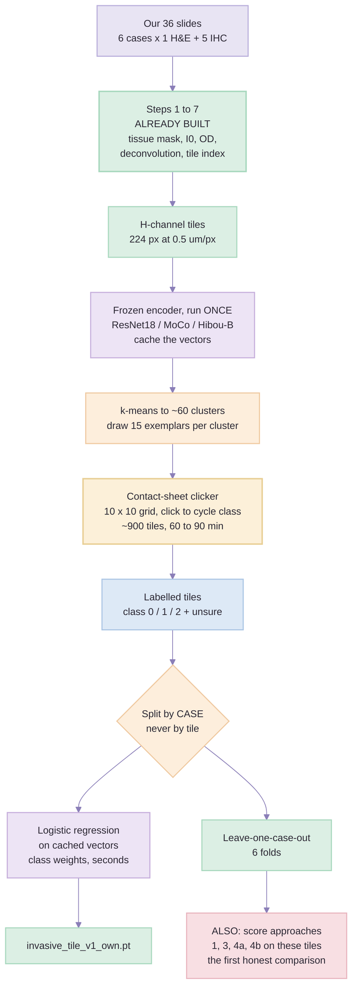
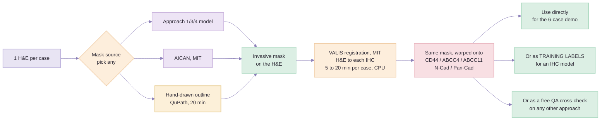

# Seven Ways to Segment Invasive Tumour — the three that were missing, and the ranking

> Created: 2 Sep 2026 | Audience: same as the comparison doc — basic ML, no pathology background.
> Companion to: [`segmentation-approaches-comparison.md`](segmentation-approaches-comparison.md),
> which covers approaches **1, 2, 3 and 4**. This document adds **5, 6 and 7**, then ranks all seven.
> Build plans referenced: [`approach-1-training-plan.md`](approach-1-training-plan.md),
> [`approach-3-training-plan.md`](approach-3-training-plan.md),
> [`approach-4a-training-plan.md`](approach-4a-training-plan.md),
> [`approach-4b-training-plan.md`](approach-4b-training-plan.md).
> **Time and storage for all seven, computed the same way from one set of measured constants, are in
> [`segmentation-approaches-all-seven.md`](segmentation-approaches-all-seven.md)** — the single-file
> reference. It also records the current disk position, which is tighter than the build plans assume.
> **Step-by-step implementation for all seven, with code against the real `backend/app/` APIs, is in
> [`segmentation-approaches-implementation.md`](segmentation-approaches-implementation.md).**
> Feeds: guide step 9 = **code step 8**, `backend/app/pipeline/step08_tissue_type_segmentation/`
> — which is still `StepNotImplemented`, so nothing here is a rewrite of shipped code.

---

## Part 0 — The question, and the one column that decides the answer

The comparison doc asks *"which training route gives the best invasive-tumour mask?"* and answers it
by arguing about training data and backbones. That argument is sound, but it quietly skips a
question that turns out to matter more:

> **How would we know if it worked?**

Look at what each of the four existing approaches can actually be measured on:

| Approach | Trained on | Evaluated on | Is that an OncoStem slide? |
| --- | --- | --- | --- |
| **1** BCSS + AICAN | Public RGB H&E | Held-out BCSS | ❌ No |
| **2** TIGER + BEETLE U-Net | Public RGB H&E | TIGER / BEETLE test sets | ❌ No |
| **3** MoCo init | Public RGB H&E | Held-out BCSS | ❌ No |
| **4a / 4b** BEETLE | Public RGB H&E | Held-out BEETLE, by challenge submission | ❌ No |

**All four ship with an estimated accuracy and no measured one.** The comparison doc says this
plainly in Part 6 — the estimates are "engineering estimates, not measurements" — and says something
sharper in Part 2: held-out BCSS *cannot* measure the invasive-vs-DCIS boundary, because held-out
BCSS contains no DCIS. So the primary route's own evaluation is structurally unable to produce the
number the project exists for.

Every approach below fixes that, because every approach below creates labels **on our own slides**.
That is the whole reason they rank where they do.

### And the second thing the four share

All four learn from **RGB H&E** and reach IHC through the haematoxylin channel. That bridge is real
and it works, but it is a bridge — the training distribution is not the deployment distribution, and
the failure mode is silent. Approaches 5 and 7 remove the bridge entirely by training on the tiles we
actually score. Approach 6 removes the need for an IHC model at all.

---

## Part 1 — Approach 5: label ~900 of our own tiles *(the easy one that was missing)*

### In plain words

Skip every public dataset. Cut our own 36 slides into tiles using the pipeline that is **already
built** (steps 1–7), look at about 900 of them on screen, click each into one of three buckets, and
fit a logistic regression on frozen features. No download, no pseudo-labels, no licence question,
no teacher model, no GPU. One day of work.

The comparison doc already contains this idea — Part 7, item 5:

> *"Two hours clicking ~300 tiles on your own slides in QuPath will do more for accuracy than any
> backbone on this page."*

It is listed there as a **tip**. It should be listed as an **approach**, because it is the only one
of the seven that produces a test set.

### Why it is more valuable as a test set than as a training set

This is the point worth keeping. 900 tiles from 6 tumours is a thin training set — it will learn
these six cancers well and generalise unpredictably. But 900 tiles from 6 tumours is a **perfectly
adequate test set**, and we currently have none at all.

```
900 clicked tiles as TRAINING data  →  a mediocre model with a real number
900 clicked tiles as TEST data      →  a real number for approaches 1, 3, 4a and 4b
```

The second is worth more. Do both — the same 900 tiles serve as a leave-one-case-out training set
*and* as the held-out benchmark that finally lets us compare BCSS-trained against BEETLE-trained
against MoCo-init **on OncoStem tissue** instead of on TCGA.

### The pipeline



### The step that saves the day: cluster first, then click

Clicking 900 random tiles is 900 decisions. Clicking 900 tiles **sorted by visual similarity** is
closer to 60 decisions, because whole screens turn out to be all-fat or all-stroma and take one
keystroke.

1. Sample **~1,000 tiles per slide** and embed those with the frozen encoder (cached, paid once).
   **Subsample — do not embed everything.** At the measured 0.39 s/tile, all ~287,000 tiles across
   the 36 slides would cost **~31 h**; 36,000 sampled tiles cost **~3.9 h**. See
   [`segmentation-approaches-all-seven.md`](segmentation-approaches-all-seven.md) Part 6.
2. `KMeans(n_clusters=60)` on the cached vectors.
3. Draw 15 tiles from each cluster into a 10 × 10 contact sheet.
4. Click. Visually uniform screens get a *whole-screen* class; mixed screens get per-tile clicks.

Expect roughly **60–90 minutes** for the whole 900, most of it spent on the two or three screens that
contain the epithelium boundary. Those are the screens to send to the pathologist.

> ⚠ **Balance the sampling across markers, not across slides.** N-Cadherin and Pan-Cadherin sit at
> 75–85 % positive; if they dominate the sample the classifier learns "lots of brown ⇒ tumour" and
> collapses on CD44. Draw an equal number of tiles per *marker*, and keep 00267's near-blank CD44
> slide (17.5 mm² against 84.8 mm² on its siblings) in the sample rather than dropping it as an
> outlier — it is the hardest case we own and the one most likely to break in production.

### Why the input is still the H channel

Tempting to feed raw RGB IHC, since we are training in-domain now. Don't. The H channel is what makes
**one** model serve all six slide types, and — more importantly — it is what stops the classifier
reading the answer off the DAB. A model trained on RGB N-Cadherin tiles would score beautifully on
N-Cadherin by learning brown, and would be worthless everywhere else. Same `stains.py`, same
exporter, same `separate(od, matrix).haematoxylin` that steps 5 and 6 already call.

### What it does not fix

**Gate zero still governs class `1`.** If our six cases contain little or no DCIS, then no amount of
clicking creates class-`1` examples, and approach 5 learns a two-class problem wearing a three-class
head. In that case the class-`1` prior has to come from BCSS, BEETLE or BRACS — which is exactly what
approaches 1, 4a and 4b are for. **Approach 5 does not replace them; it measures them.**

### Timing

| Task | CPU | Notes |
| --- | --- | --- |
| Sample + embed 1,000 tiles × 36 slides (36,000) | **~4 h** | 36,000 × 0.39 s/tile *(measured rate)*; embedding *all* 287,000 tiles would be ~31 h |
| k-means + build contact sheets | ~5 min | |
| **Clicking** | **60–90 min** | the only human cost |
| Pathologist review of the ~40 boundary tiles | ~30 min of their time | the one thing we cannot self-serve |
| Fit logistic regression on cached vectors | **seconds** | |
| Leave-one-case-out, 6 folds | ~1 min | |
| **Total to first measured number** | **~1 working day** | |

### Pros and cons

| Pros | Cons |
| --- | --- |
| **The only approach that yields a number measured on OncoStem tissue** | 6 tumours is a thin training set — expect wide error bars, roughly ±0.08 |
| Zero licence exposure — ResNet18 BSD-3, MoCo MIT, Hibou-B Apache-2.0, and *our own data* | Cannot invent class `1` if the cohort has no DCIS |
| Training domain **is** the deployment domain — no H&E→IHC bridge to trust | Our clicks are not a pathologist's; the boundary tiles need review |
| Reuses steps 1–7 verbatim; almost no new code | Blocky at 112 µm, same as approaches 1/3/4 |
| It is **approach 7's first increment** — nothing is thrown away when client data arrives | Leave-one-case-out on 6 folds is a small-sample estimate |

**Estimated accuracy.** Invasive vs non-epithelium: **0.85 – 0.92** — in-domain, and an easy
boundary. Invasive vs non-invasive: **unmeasurable until gate zero answers**, and possibly
untrainable from our cohort alone. *Estimates, as everywhere in these docs.*

---

## Part 2 — Approach 6: register once, propagate the mask *(no IHC model at all)*

### In plain words

Our six slides per case are serial sections — consecutive shavings off one block. So segment the
**one H&E** per case, then physically align it to each of the five IHC slides and copy the outline
across. Five of the six slides never need a model.

This is the second half of approach 2 without the first half. Approach 2 pairs registration with a
GPU-trained U-Net and so inherits "not viable on CPU". Registration on its own is MIT-licensed, CPU,
and about 5–20 minutes per case.

### The pipeline



### Why the "serial sections are different tissue" objection is weaker than it looks

The standard objection: consecutive sections are physically different slices, so cells do not
correspond one-to-one. True — and irrelevant at our scale. We are not matching cells; we are matching
a **region**. Our tile is 112 µm across; typical VALIS residual error on breast serial sections is
tens of microns. The error is on the order of one tile, and a region boundary that is one tile wrong
sits inside the blockiness every tile-classifier approach already has.

Where it genuinely breaks is not scale but **content**: sections cut far enough apart can lose or
gain a whole tumour focus, and registration cannot invent what is not on the slide.

### The three honest failure modes

1. **The near-blank slide.** 00267's CD44 has 17.5 mm² of tissue against 84.8 mm² on its siblings.
   Registration has almost nothing to match on, and VALIS will return a transform anyway. It will be
   wrong, and it will be wrong *silently*.
2. **It is not a product.** It requires a matched H&E in the same block. The moment OncoStem sends a
   standalone IHC slide, this approach has nothing to register to.
3. **Errors become invisible label noise** if the warped masks are used to train an IHC model — this
   is exactly the objection the comparison doc raises against approach 2, and it carries over intact.

Guard for (1): compute a registration confidence per pair — matched-keypoint count, residual error,
and the tissue-area ratio between the two slides. Below threshold, **refuse and say so** rather than
emitting a mask. That check is maybe 30 lines, and it converts the worst failure mode into a visible
one.

### Where this approach genuinely earns its place

Not as the shipped route — as a **free cross-check on whichever route does ship**. Run the tissue
model independently on the H&E and on the five IHC slides of the same case, register them, and
measure how much the masks agree. That is a consistency metric requiring **zero annotation**, and it
directly measures the thing the whole H-channel design is betting on: *does one model really behave
the same on H&E and on IHC?* We have six cases' worth of that test available today, for free.

### Timing

| Task | CPU |
| --- | --- |
| VALIS registration, per case (5 pairs) | 5–20 min |
| All 6 cases | **~1–2 h** |
| Hand-outline the 6 H&E slides in QuPath, if used as the mask source | ~2 h total |
| **Total to a mask on all 36 slides** | **half a day** |

### Pros and cons

| Pros | Cons |
| --- | --- |
| **Fastest possible route to a mask on all 36 slides** — half a day | Needs a matched H&E per case; not a standalone-IHC product |
| VALIS is MIT, CPU-only | Fails silently on 00267's near-blank CD44 without a confidence gate |
| No IHC model to train, validate or maintain | Inherits every error of whatever produced the H&E mask |
| Excellent as a **QA cross-check** requiring no annotation | Serial-section content drift is unfixable, not merely unmodelled |
| Turns 1 annotated slide into 6 labelled slides — a **6× multiplier on approach 7's annotation budget** | One more heavy dependency if it ever enters the runtime path |

**Estimated accuracy:** not a Dice — a *transfer* error. Region agreement of **0.88 – 0.94** against
the source H&E mask on the five well-behaved cases, and **unreliable on 00267**. It cannot be better
than its source mask, only worse.

---

## Part 3 — Approach 7: annotate it ourselves, then ask OncoStem for real data

### In plain words

Stop borrowing labels. Draw invasive-tumour outlines directly on IHC slides — ourselves for the first
pass, then a pathologist's for the real thing — and train a supervised model on them. Then ask the
client for annotated cases, because six tumours is not a dataset and no amount of public H&E fixes
that.

This is last in build order and **first in ceiling**. It is also the one with the longest lead time,
which is why it should be *started* first: the email goes today, the model arrives in a quarter.

### Phase A — what we can do without the client (this month)

1. **Outline the 6 H&E slides ourselves** in QuPath. Non-experts can confidently draw the obvious
   calls: tumour bulk, fat, stroma, glass. Leave the epithelium boundary loose and flag it.
2. **Propagate to the 30 IHC slides via approach 6.** One drawn slide labels six. This multiplier is
   what makes a manual approach affordable at all.
3. **Have a pathologist review, not draw.** Reviewing an existing outline takes a fraction of the
   time of drawing one, and it is the difference between "our best guess" and "clinically checked".
4. **Train the same 3-class head** on these labels. Same exporter, same frozen features, same
   leave-one-case-out. The only thing that changed is where the labels came from.

Phase A costs about **3 days of our time plus 2 hours of a pathologist's**, and it produces the first
model in this project trained on labels that are correct *about our own slides*.

### Phase B — the client annotation request (the part with the real ceiling)

Six cases cannot support a shipped model, whatever the training route. The ask to OncoStem is the
highest-leverage item in this entire document, and how it is *phrased* changes its cost to them by an
order of magnitude.

> ⚠ **Do not ask for whole-slide outlines.** Exhaustively outlining a WSI takes a pathologist hours
> per slide; they will decline, or do three and stop. Ask instead for **sparse, fully-labelled
> boxes** — 10–20 regions of ~2048 × 2048 px per slide, with every pixel inside labelled. For
> tile-classifier training that is worth as much as a whole-slide outline and costs perhaps 20
> minutes a slide. This single framing change is the difference between a request that gets
> fulfilled and one that does not.

**The spec to send them:**

| Item | Ask | Why this specifically |
| --- | --- | --- |
| **Cases** | 30 minimum, 50–100 ideal | Below ~30 the leave-one-case-out error bars stay too wide to act on |
| **Case mix** | Grade 1/2/3 represented; **at least 10 cases with known DCIS**; a few lobular | The DCIS cases are non-negotiable — that boundary is the entire project, and our 6 cases may contain none |
| **Slides per case** | The H&E at minimum; one IHC too if affordable | H&E is where pathologists read fastest. IHC annotation is the luxury item |
| **Annotation form** | 10–20 fully-labelled ~2048² boxes per slide, **not** whole-slide outlines | 20 min/slide instead of 3 h/slide |
| **Classes** | `invasive carcinoma`, **`in-situ / DCIS` as its own class**, `normal epithelium`, `stroma`, `other` | If DCIS is not a separate class we have bought nothing — this is the exact failure that makes BCSS unusable for class `1` |
| **Format** | QuPath project + GeoJSON export in **level-0 coordinates**; or Aperio ImageScope XML | Both import cleanly, and level-0 coordinates are how every tile in our pipeline is addressed |
| **Double-read** | 10 cases annotated independently by 2 pathologists | Gives the **human agreement ceiling**. Without it nobody can say whether 0.82 is good or bad |
| **Scanner** | Same Morphle, same staining protocol; record both in the metadata | Cross-scanner drift is the failure mode our single-site cohort cannot otherwise detect |
| **De-identification** | Confirm before any transfer | See [`../handbook/admin-guide/de-identification.md`](../handbook/admin-guide/de-identification.md) |

### Why the double-read line matters more than the case count

Every accuracy number in every document in this folder is implicitly compared against "1.0 would be
perfect". It would not be. Two pathologists outlining the same invasive tumour typically agree at
around 0.85 Dice, and the invasive-versus-in-situ call is precisely where they disagree most. **A
model at 0.82 against a single reader may already be at human level, and we currently have no way to
know.** Ten double-read cases settles that permanently, and it is the cheapest item on the list.

### Timing

| Phase | Task | Elapsed |
| --- | --- | --- |
| A | Outline 6 H&E ourselves + propagate + train | **~3 days** |
| A | Pathologist review | 2 h of their time, ~1 week of calendar |
| B | Draft and send the annotation spec | **half a day** |
| B | Client turnaround | **4–12 weeks — the real cost** |
| B | Ingest, QC, retrain | ~1 week once the data lands |

### Pros and cons

| Pros | Cons |
| --- | --- |
| **Highest ceiling of all seven, by a wide margin** | Longest lead time — a quarter, mostly spent waiting |
| **Zero licence exposure.** Client data, our code, nothing borrowed | Depends on a third party doing work for us |
| Labels are correct about **our** scanner, staining and cohort | Costs real pathologist hours, which the client may not fund |
| The double-read gives the human ceiling — the only way to interpret every other number in these docs | Annotation quality varies between readers; needs its own QC pass |
| Phase A is useful on its own even if Phase B never lands | Six cases in Phase A still cannot support a shipped model |

**Estimated accuracy:** **0.85 – 0.92** with 50+ annotated cases — and, uniquely on this page,
**measured rather than estimated**.

---

## Part 4 — Considered and parked

Four options that come up in every discussion of this problem. Recording why each is off the list is
cheaper than re-litigating them in three weeks.

| Option | Verdict | Why |
| --- | --- | --- |
| **SAM / MedSAM prompted segmentation** | ❌ Parked | Apache-2.0 and genuinely good at *finding boundaries*, but it has no concept of "invasive tumour". It needs a prompt saying where to look, and producing that prompt automatically **is** the problem we are trying to solve. Circular. |
| **Pure unsupervised clustering** (k-means on embeddings, no labels) | ❌ Parked as a standalone | The clusters split on stain intensity and tissue density, not on the invasive/in-situ boundary — which is architectural, not chromatic. Still valuable **inside approach 5** as the thing that makes clicking fast. |
| **Nuclei morphometry + gradient-boosted trees** | ⚠️ Parked, but the strongest of the four | Segment nuclei with InstanSeg (Apache-2.0) or Cellpose (BSD-3), compute per-tile features — density, size variance, nearest-neighbour graph regularity, lumen detection — and fit a small tree model. Fully interpretable, tiny, CPU, permissive, and graph features *do* capture duct architecture, which is the objection that kills plain thresholding. Costs more code than approach 5 for an uncertain gain. **Worth one day if approach 5 underperforms**, and step 10 already needs a nuclei segmenter, so the dependency is not new. |
| **Fake an eosin channel so IHC looks like H&E** | ❌ Rejected | Already rejected in the comparison doc, Part 1, and correctly: it fabricates tissue structure and then lets a model treat the fabrication as evidence. |

---

## Part 5 — The ranking

Ranked by **fastest route to a trustworthy invasive-region mask on IHC**, under the project's actual
constraints: no GPU, must ship commercially, six cases in hand today.

| Rank | Approach | Ships? | CPU? | Time to first number | Measured on **our** slides? | Ceiling | Verdict |
| --- | --- | --- | --- | --- | --- | --- | --- |
| **1** | **5 — click ~900 of our own tiles** | ✅ | ✅ | **~1 day** | ✅ **Yes — the only one** | 0.85–0.92 on the easy boundary | **Do this first.** It is also the test set every other row is missing |
| **2** | **1 + 3 — BCSS with MoCo init** | ✅ | ✅ | ~5–6 h | ❌ No | 0.73–0.83 | **The committed route.** Supplies the general-cancer prior 6 cases cannot. Pair it with 5 |
| **3** | **4a — BEETLE teacher** | ⚠️ Licence | ✅ (1 overnight) | ~16 h | ❌ No | 0.65–0.80 | Best class-`1` supply that exists. Held back **only** by CC BY-NC-SA and its ShareAlike clause |
| **4** | **6 — register and propagate** | ✅ | ✅ | **~half a day** | ⚠️ Partly | capped by its source mask | Not the product. **Adopt it as the free QA cross-check**, and as approach 7's 6× annotation multiplier |
| **5** | **4b — BEETLE direct, no BCSS** | ❌ | ✅ | days (400 GB first) | ❌ No | ~0.80 | Written, not scheduled. Needs 400 GB we do not have, and leaves **no clean-licence fallback model at all** |
| **6** | **2 — TIGER + BEETLE U-Net** | ❌ | ❌ | weeks | ❌ No | 0.80–0.88 | Benchmark tree only. GPU-mandatory, non-commercial, and ~60–70 h per slide of dense inference on CPU |
| **7** | **7 — manual + client annotation** | ✅ | ✅ | **4–12 weeks** | ✅ **Yes** | **0.85–0.92, measured** | **Last to finish, first to start.** Highest ceiling of all seven; the lead time is the bottleneck, not the work |

### Reading the ranking correctly

**Rank ≠ quality.** Approach 7 is the best approach on this page and it is ranked seventh, because the
ranking is *time to a trustworthy number* and its clock is controlled by someone else. The right
reading is:

```
Start today:          7 (send the annotation request), 5 (start clicking)
Finish this week:     5, 6
Running in parallel:  1 + 3
Decide later:         4a (on the licence), 4b (on disk), 2 (never)
```

**Approaches 5 and 1/3 are complements, not rivals.** Public data supplies the class-`1` prior our
six cases probably cannot; our clicked tiles supply the domain calibration and the only honest test
set. The strongest cheap model available here is *approach 1/3 trained on BCSS, fine-tuned on our 900
clicked tiles, and evaluated leave-one-case-out on the same* — which costs one day more than approach
1 alone.

### The honest ranking of what improves accuracy, updated

The comparison doc's Part 7 closes with this, and adding three approaches does not change it — it
just means the list now has entries above the line instead of only below it:

```
pathologist outlines  >  your own clicked tiles  >  label hygiene
                      >  input representation    >  which backbone you picked
     (approach 7)          (approach 5)                 (approaches 1-4 argue here)
```

Approaches 1, 2, 3, 4a and 4b all argue about the last two items. Approaches 5, 6 and 7 are the first
three.

---

## Part 6 — What to actually do, in order

0. **Gate zero, unchanged and still first.** Ask a pathologist how much DCIS is in our six cases. If
   the answer is "none or trace", class `1` becomes a documented limitation, approaches 4a and 4b
   lose most of their reason to exist, and approach 5 becomes sufficient on its own. One afternoon,
   and it can retire two build plans. See
   [`approach-4a-training-plan.md`](approach-4a-training-plan.md), "Gate zero".
1. **Send the OncoStem annotation request today** (Part 3, Phase B). It has the longest lead time of
   anything in this project and costs half a day to write. Sending it late is the only mistake here
   that cannot be recovered by working harder afterwards.
2. **Build approach 5 this week.** Roughly: extend `step07_tiling` with a sampler, add an embedding
   cache, write the contact-sheet clicker, fit the head. Most of the work is already sitting in
   `backend/app/pipeline/step01..07` — `step08_tissue_type_segmentation/` is still
   `StepNotImplemented`, so there is nothing to unpick.
3. **Run approach 6 as a cross-check**, not as a product, and put a registration-confidence gate on it
   before anyone trusts a warped mask.
4. **Continue approach 1 + 3 in parallel**, and re-evaluate it on approach 5's clicked tiles rather
   than only on held-out BCSS. That re-evaluation is the first number in this project that means
   anything about OncoStem tissue.
5. **Hold 4a** pending the licence email; **hold 4b** pending a 400 GB disk; **leave 2** in
   `benchmarks/`.
6. **When client annotations land, retrain and re-measure everything.** Every estimate in every
   document in this folder becomes a measurement on that day, and some of them will turn out to be
   wrong.

---

## Part 7 — What changes in the codebase

Nothing here rewrites shipped code. Steps 1–7 are the input contract and stay exactly as they are.

| Approach | New code | Lands in |
| --- | --- | --- |
| **5** | tile sampler, embedding cache, contact-sheet clicker, head fit | `step08_tissue_type_segmentation/` (currently empty), plus a `scripts/` entry for the clicker |
| **6** | VALIS wrapper + registration-confidence gate | a new `app/registration/` module; used offline, not in the per-slide path |
| **7** | GeoJSON / ImageScope-XML annotation importer, mask rasteriser | `app/annotations/`; shares the exporter with approach 5 |

The rule from [`approach-1-training-plan.md`](approach-1-training-plan.md) applies unchanged to all
three: **the exporter does not own a colour-deconvolution implementation.** Everything imports
`app.common.stains` and `step06_colour_deconvolution.deconvolution.separate`, the same two functions
inference calls. A notebook that reaches for `skimage.color.rgb2hed` on its own has silently created
a second definition of "the H channel", and that failure looks like a model problem for a week before
anyone finds the plumbing.
