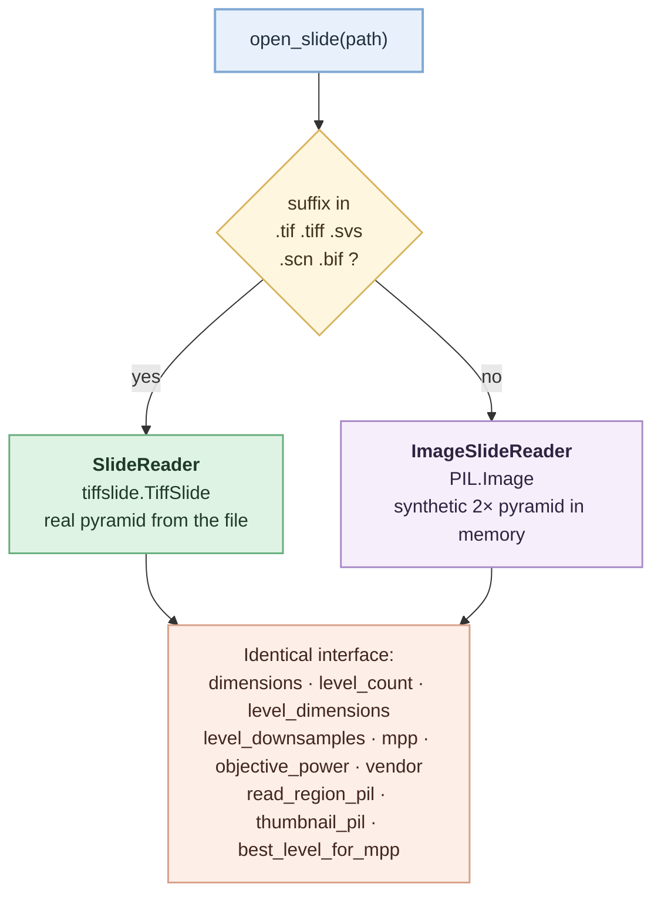
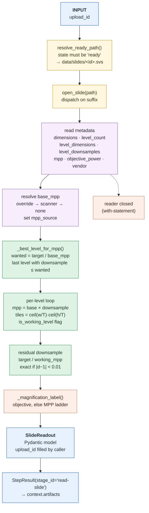
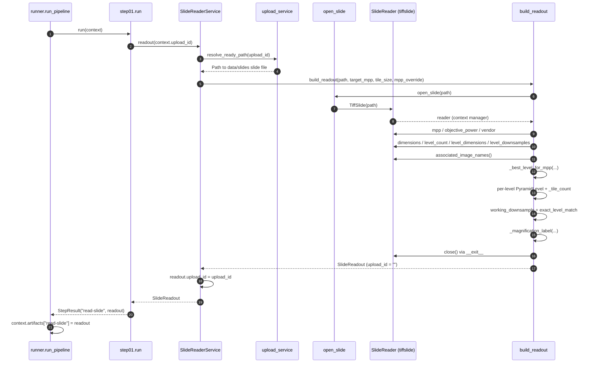
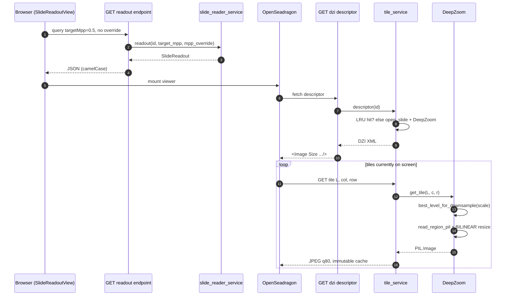
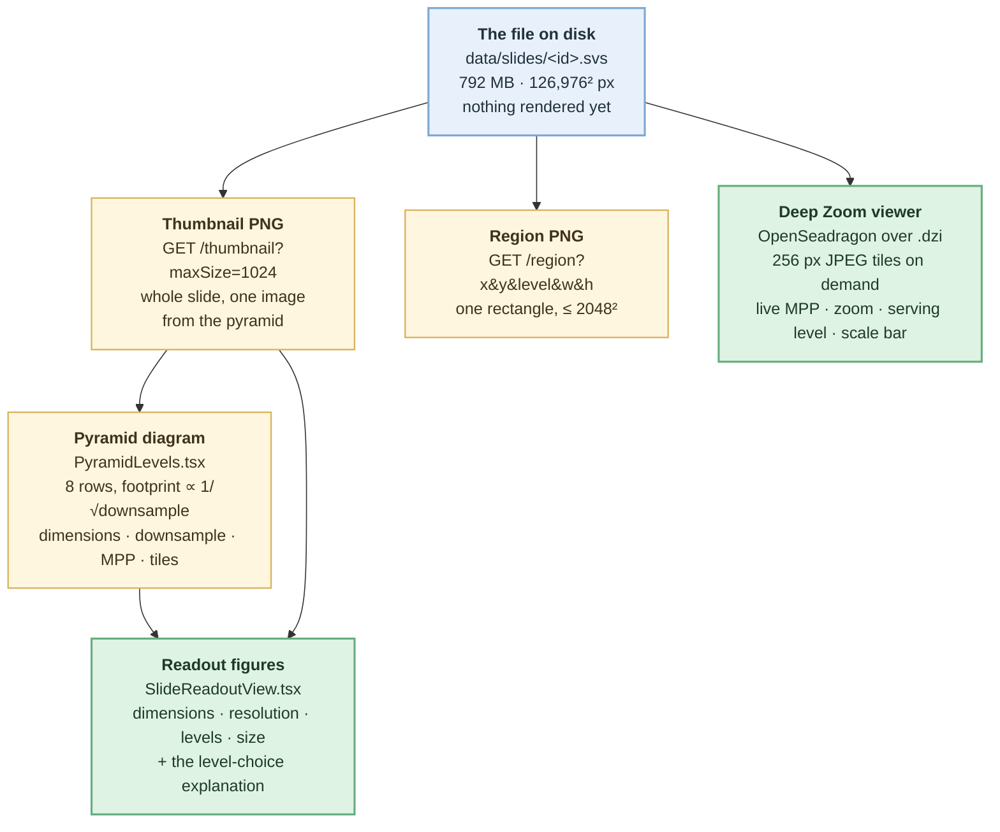
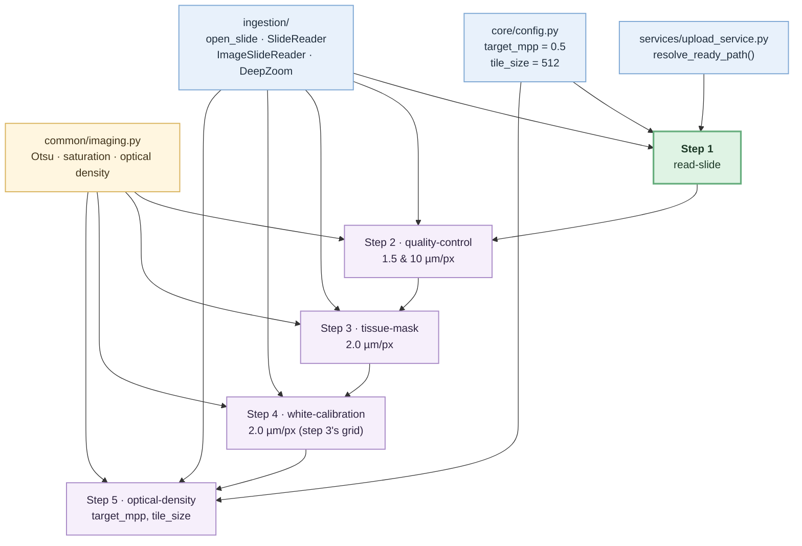

# Step 1 — Read the Slide

> **Written from the code, not from theory.** Every number, file name, threshold and
> behaviour below was read out of this repository. Where the repository does *not*
> do something, it says so explicitly instead of guessing.
>
> Implementation lives in
> [pipeline.py](../../backend/app/pipeline/step01_read_slide/pipeline.py),
> [slide_reader.py](../../backend/app/ingestion/slide_reader.py),
> [image_reader.py](../../backend/app/ingestion/image_reader.py) and
> [deepzoom.py](../../backend/app/ingestion/deepzoom.py).

---

## 1. At a glance

| Item | Description |
|---|---|
| **Step** | Step 1 — "Read the slide" (stage id `read-slide`, index 1, `implemented=True`) |
| **Purpose** | Open the uploaded whole-slide image, describe its pyramid, and decide **which pyramid level the whole pipeline will work at** — chosen by physical resolution, never by level number |
| **Input** | An **upload id** (an opaque token like `5lqtTXIytbzeCmUOiO5Miw`) that resolves to a file on disk under `data/slides/` |
| **File formats accepted** | `.svs`, `.tif`, `.tiff` (real pyramids, via `tiffslide`) and `.jpg`, `.jpeg`, `.png` (plain images, via a synthetic in-memory pyramid). Set in `settings.allowed_slide_ext` |
| **Output** | A `SlideReadout` Pydantic object (JSON over the API). Plus, on request, a PNG thumbnail, a PNG region, and Deep Zoom tiles |
| **Typical MPP** | **Read from the file, not assumed.** On the demo slide `CAN_00251_26_A.svs`: level-0 MPP = **0.2222 µm/px** (40× Aperio scan). The *target* the pipeline wants is `settings.target_mpp = 0.5` µm/px — **configurable** |
| **Main libraries** | `tiffslide` (WSI reading), `Pillow` (PIL — resizing, PNG/JPEG encoding), `numpy` (array conversion), `pydantic` (the readout schema), `FastAPI` (HTTP layer) |
| **Main model** | **None.** This step is pure library + arithmetic. No machine learning, no checkpoints |
| **Processing type** | **Library / metadata + rule-based arithmetic.** Fully deterministic |
| **CPU/GPU** | **CPU only.** No GPU code anywhere in this step |
| **Downstream consumer** | Every later step. Directly: Step 2 (Quality control), Step 3 (Tissue mask), Step 4 (White calibration), Step 5 (Optical density) — all of them call the same `open_slide()` reader and the same `best_level_for_mpp()` rule this step establishes |

> **On MPP:** this step never invents an MPP. It reads it from the file. If the file
> records none (a plain PNG always does), `mpp` comes back as `null`, `mppSource` as
> `"unknown"`, and the working level falls back to `0`. A caller may *assert* a scale
> via `mppOverride`, and the readout then labels it `mppSource="override"` so the UI
> can say "set by you, not measured".

---

## 2. What is this step?

### The easy version

**Imagine a paper map of the whole world that is 130,000 pixels wide.** You cannot
put it on a screen, and you cannot load it into memory. So instead of one giant
picture, the file stores the *same* map several times over: once at full detail,
once at a quarter size, once at an eighth, and so on down to a postage stamp. Each
copy is also chopped into small square tiles. That stack of copies is called an
**image pyramid**, and software reads only the tiles it actually needs.

A whole-slide image (WSI) — a digitised glass microscope slide — is exactly that.
The demo's slide is **126,976 × 126,976 pixels ≈ 16,123 megapixels** in an
**830 MB `.svs`** file, with **8 pyramid levels**.

Step 1 is the step that opens that file and answers three questions:

1. **How big is it?** (width, height, megapixels, file size)
2. **What copies are inside it?** (how many levels, how big each one is, how coarse)
3. **How big is one pixel in the real world?** — and therefore, **which copy should
   the rest of the pipeline read from?**

Question 3 is the whole point. The answer is expressed in **microns per pixel (µm/px,
"MPP")** — a physical unit — never as "level 2", because level 2 means a different
physical scale on a different scanner.

### The technical version

Step 1 is a **metadata read plus a level-selection decision**. `build_readout()`
opens the slide with `open_slide()`, reads geometry and scale properties, and
computes a `SlideReadout`:

- It enumerates **every pyramid level** with its pixel dimensions, its downsample
  factor relative to level 0, its derived MPP, its tile count at the configured tile
  size, and a boolean flag saying whether it is *the* working level.
- It resolves the **base MPP** from one of three sources, in priority order:
  caller `mpp_override` → scanner metadata → nothing.
- It picks the **working level** with `_best_level_for_mpp()`: the coarsest level
  whose MPP is still **at or finer than** the target.
- It computes the **residual software downsample** needed to land exactly on the
  target, and flags whether the pyramid happened to sit on the target exactly.

`SlideReaderService` then wraps that with two pixel-serving helpers
(`thumbnail_png`, `region_png`), and `DeepZoom` (in `app.ingestion`) serves the
pan-and-zoom tiles the browser viewer consumes.

### What it does **not** do

- **It does not read pixels for the readout.** `build_readout()`'s docstring is
  explicit: *"Reads metadata only, no pixels."* Pixels are read only by the separate
  thumbnail / region / Deep Zoom paths.
- **It does not detect tissue.** That is Step 3.
- **It does not detect artefacts, blur, folds or pen marks.** That is Step 2.
- **It does not convert colour, normalise stain, or compute density.** Steps 4–7.
- **It does not write the readout to disk.** There is no `data/readout/` cache. The
  `SlideReadout` is computed fresh each call (see §10 "Load").
- **It does not decode the file's `label` or `macro` images.** Those are photographs
  of the physical glass slide bearing case identifiers, and the reader actively
  refuses them (see §19 and §28).
- **It does not measure MPP from the image.** If the metadata is absent, the answer
  is `null` — an honest "not recorded", not an estimate.

### The problem it solves

A WSI is too big to load and too variable to assume anything about. Step 1 turns
"an opaque 830 MB file" into "a known geometry with a known physical scale and a
chosen working level", so that every later step can say *"give me a region at
0.5 µm/px"* and get the same physical thing regardless of which scanner produced
the file.

---

## 3. Why is this step needed?

### Why this step exists

Because **the same level index is a different resolution on different scanners.**
This repository states that rule in five separate places, including the step
catalogue itself:

> `rule="Convert between levels using mpp, never using a hard-coded level index."`
> — [pipeline_steps.py](../../backend/app/data/pipeline_steps.py)

The demo's Aperio slide has downsamples `(1, 4, 8, 16, 32, 64, 128, 256)` — note
that level 1 is **4×**, not 2×. A pipeline that hard-coded "read level 1 for 20×"
would be reading 0.89 µm/px on this scanner and something completely different on
another. Every measurement downstream — nucleus size, membrane ring thickness,
stain density per cell — would be silently wrong.

### Why it is performed here (first)

Nothing can happen before the file is open and its scale known:

- Step 2 needs to read patches at 1.5 µm/px and 10 µm/px → it needs the reader and
  the base MPP.
- Step 3 needs a thumbnail at 2.0 µm/px → same.
- Step 5 explicitly calls `reader.best_level_for_mpp(target_mpp)` and comments that
  *"this is step 1's rule and it holds here"*
  ([tiles.py:306-312](../../backend/app/pipeline/step05_optical_density/tiles.py#L306-L312)).

There is no earlier step. Step 1 is the entry point of `run_pipeline()`, and it is
the only step whose `run()` does **not** call `context.require(...)` — it has no
precondition beyond a `ready` upload.

### What would happen if we skipped it?

| Skipped consequence | Effect |
|---|---|
| No level selection by MPP | Later steps hard-code level indices → physically wrong scale on any other scanner |
| No geometry readout | No way to plan tiling, no way to bound a run's cost, no way to reject an absurd request |
| No `mpp is None` signal | The pipeline would silently score a plain photograph as if it were a calibrated scan |
| No reader abstraction | Every step would open the file its own way, and would each need its own format handling |

### What downstream steps depend on it?

- **Step 2 (Quality control)** — `qc_service` calls `open_slide()` and stores
  `base_mpp` in its `internals.json`; the QC grid geometry (`cellMpp`,
  `cellExtentPx`, `cellExtentUm`) is derived from it.
- **Step 3 (Tissue mask)** — reads a thumbnail at `tissue_mask_mpp = 2.0`, and its
  morphology parameters are specified in **microns** (`tissue_close_um = 30.0`)
  precisely so a change of scanner cannot change what they mean.
- **Step 4 (White calibration)** — works on step 3's grid at `calibration_mpp = 2.0`;
  its exclusion zones are in microns (`calibration_border_um = 500.0`).
- **Step 5 (Optical density)** — reads one tile at `settings.target_mpp` and
  `settings.tile_size`, and the config comments say plainly that these are *"step 1's
  … and deliberately not step 5's own. The working magnification is one decision for
  the whole pipeline, made and reported at step 1."*
- **Steps 6–17** — documented stubs; they raise `StepNotImplementedError`.

### What errors can this step prevent?

- **Physically wrong measurements** from level-index assumptions.
- **Upsampling artefacts.** `_best_level_for_mpp` will never choose a level *coarser*
  than the target, so the software resample can only ever shrink. Upsampling would
  invent detail that was never scanned.
- **Serving patient identifiers.** `read_associated()` refuses `label` and `macro`.
- **A memory blow-up from an "innocent" thumbnail.** `MAX_ASSOCIATED_PIXELS`
  (64,000,000) guards the case where a file's `"thumbnail"` series is actually a
  half-resolution copy of the whole slide.
- **Unreadable uploads reaching the pipeline.** `finalize_upload()` calls
  `open_slide(final).close()` and marks the upload `failed` if it cannot open —
  so Step 1's reader is used as the upload's own validity test.

### What assumptions does this step make?

| Assumption | Where | Consequence if false |
|---|---|---|
| Pixels are square (`mpp-x` alone is read; `mpp-y` is ignored) | `SlideReader.mpp` | Anisotropic pixels would be reported as isotropic. **Not handled.** |
| The pyramid's downsamples increase monotonically | `_best_level_for_mpp` takes the *last* qualifying index | An out-of-order pyramid would select oddly. Asserted in tests, not in code |
| `level_dimensions` and `level_downsamples` are the same length | `zip(..., strict=True)` | Raises `ValueError` → HTTP 422 |
| The extension tells the truth about the format | `open_slide()` dispatches on suffix | A mislabelled file fails at open, and is caught at upload finalize |
| The upload is in state `ready` | `resolve_ready_path()` | Raises `UploadError` → HTTP 409 |

### Digital-pathology framing

A glass slide is a physical object roughly 25 × 50 mm, with a tissue section a few
microns thick, stained and covered with a coverslip. A scanner images it under an
objective lens and writes a pyramidal file. **The only invariant that survives
across scanners, objectives and vendors is the physical size of a pixel.** A
biological structure has a physical size too — a breast tumour nucleus is roughly
7–15 µm across, a cell membrane is sub-micron. So "how many microns is one pixel"
is the bridge between the file and the biology. That bridge is Step 1.

---

## 4. Where this step fits in the pipeline

```mermaid
flowchart LR
    U["Chunked upload<br/>init → chunks → complete<br/>state = ready"]:::pre
    S1["<b>Step 1</b><br/>Read the slide<br/>pyramid + MPP + working level"]:::cur
    S2["Step 2<br/>Quality control<br/>GrandQC artefact map"]:::next
    S3["Step 3<br/>Tissue mask<br/>Otsu on saturation"]:::next
    S4["Step 4<br/>White calibration<br/>measure I₀"]:::next
    S5["Step 5<br/>Optical density<br/>Beer–Lambert"]:::next
    S6["Steps 6–17<br/>documented stubs<br/>not implemented"]:::stub

    U --> S1 --> S2 --> S3 --> S4 --> S5 --> S6

    classDef pre fill:#E8F1FB,stroke:#7FA8D4,stroke-width:1.5px,color:#22303F
    classDef cur fill:#DFF3E4,stroke:#67AE7E,stroke-width:2.5px,color:#1E3A28
    classDef next fill:#F6EFFB,stroke:#A98BC7,stroke-width:1.5px,color:#2E2440
    classDef stub fill:#F3F4F6,stroke:#B8BEC7,stroke-width:1.5px,color:#4A5260,stroke-dasharray: 4 3
```



**Reading the diagram.** The chunked upload service (`app/services/upload_service.py`)
is *not* a pipeline step — it is the transport that gets an 830 MB file onto disk and
proves it opens. Step 1 begins the pipeline proper. Its output is what makes steps 2–5
possible; steps 6–17 exist as documented modules that raise
`StepNotImplementedError` when invoked, which the test suite pins:

```python
assert [s["id"] for s in items if s["implemented"]] == [
    "read-slide", "quality-control", "tissue-mask",
    "white-calibration", "optical-density",
]
```

---

## 5. INPUT — exactly what enters this step

### 5.1 The primary input: an upload id

`run(context)` receives a `PipelineContext` whose only populated field for step 1 is
`context.upload_id`. The API path is `GET /api/v1/slides/{upload_id}/readout`.

```python
def run(context: PipelineContext) -> StepResult:
    readout = slide_reader_service.readout(context.upload_id)
    return StepResult(stage_id=STAGE_ID, output=readout)
```

`SlideReaderService.readout()` turns that id into a path:

```python
path = resolve_ready_path(upload_id=upload_id)
```

`resolve_ready_path()` (in `upload_service.py`) loads the upload's JSON sidecar,
refuses anything not in state `ready`, and returns
`data/slides/<upload_id><ext>` — e.g.
`data/slides/5lqtTXIytbzeCmUOiO5Miw.svs`.

> **Slides are addressed by opaque id, never by client filename** — the filename may
> carry patient identifiers. The id is `secrets.token_urlsafe(16)`.

### 5.2 File formats actually supported

Two independent lists, and they differ — this matters:

| List | Value | Purpose |
|---|---|---|
| `settings.allowed_slide_ext` | `.tif .tiff .svs .jpg .jpeg .png` | What **upload** accepts, checked in `init_upload()` *before any bytes move* |
| `_PYRAMIDAL_EXTS` in `slide_reader.py` | `.tif .tiff .svs .scn .bif` | Which reader class `open_slide()` dispatches to |

So `.scn` and `.bif` would route to `SlideReader`, but **cannot be uploaded** — the
config comment explains why:

> *NOT allowed: `.ndpi`, `.mrxs`, `.scn`, `.bif` — tiffslide cannot open them and there
> is no native OpenSlide backend here yet, so they would upload then fail validation.*

**`.ndpi` and `.mrxs` are not supported in this build**, despite the step catalogue's
`how` string mentioning `openslide-python`. That string is aspirational; the code uses
`tiffslide`.

### 5.3 Dispatch: two readers, one interface



The plain-image reader exists *"so the demo can be driven with a small sample image
without needing a multi-gigabyte scan to hand."* It builds its pyramid by halving
with `Image.BILINEAR` until the longest edge is ≤ `min_level_dim = 512`.

### 5.4 WSI dimensions — how they are obtained

All of it is **read from the file at runtime**, nothing is assumed:

| Property | Source (`SlideReader`) | Real value on `CAN_00251_26_A.svs` |
|---|---|---|
| Level-0 width × height | `self._slide.dimensions` | **126,976 × 126,976 px** |
| Number of levels | `self._slide.level_count` | **8** |
| Per-level dimensions | `self._slide.level_dimensions` | 126976², 31744², 15872², 7936², 3968², 1984², 992², 496² |
| Per-level downsample | `self._slide.level_downsamples` | **1, 4, 8, 16, 32, 64, 128, 256** |
| Tile size | `settings.tile_size` (**not** from the file) | **512** |
| Associated image names | `self._slide.associated_images` keys | `label`, `macro`, `thumbnail` |
| File size | `path.stat().st_size` | **792.3 MB** (830,790,030 bytes) |

Note the pyramid is **not powers of two**: level 1 is 4×. This is exactly why level
indices are untrustworthy.

### 5.5 MPP — what it means and how the code gets it

**MPP = microns per pixel.** One micron (µm) is a thousandth of a millimetre. If
MPP = 0.25, one pixel covers a quarter of a micron of real tissue; a 10 µm nucleus is
40 pixels across. If MPP = 2.0, that same nucleus is 5 pixels across — you can see
*where* tissue is, but not individual cells.

**Why it matters:** a threshold, a kernel size, a minimum-object-area — all of these
mean a *physical* thing. Expressed in pixels they change meaning with the scanner;
expressed in microns they do not. That is why `settings` states step 3's morphology in
`tissue_close_um` / `tissue_open_um` and step 4's exclusions in
`calibration_border_um`.

**How `SlideReader.mpp` finds it** — first non-empty, parseable value wins:

```python
for key in ("tiffslide.mpp-x", "openslide.mpp-x", "aperio.MPP"):
    value = self._slide.properties.get(key)
    if value:
        try:    return float(value)
        except (TypeError, ValueError): continue
return None
```

On the demo slide `tiffslide.mpp-x = "0.2222"` → **0.2222 µm/px**.

**`objective_power`** is found the same way from
`tiffslide.objective-power` / `openslide.objective-power` / `aperio.AppMag` → **40.0**.
**`vendor`** from `tiffslide.vendor` / `openslide.vendor` → **`"aperio"`**.

**Three possible MPP sources**, resolved in `build_readout()`:

```python
if mpp_override and mpp_override > 0:
    base_mpp, mpp_source = mpp_override, "override"
elif scanner_mpp:
    base_mpp, mpp_source = scanner_mpp, "scanner"
else:
    base_mpp, mpp_source = None, "unknown"
```

| `mppSource` | Meaning | UI badge (`ResolutionControls.tsx`) |
|---|---|---|
| `"scanner"` | The file recorded it. A measurement | green "from scanner" |
| `"override"` | The caller asserted it. **Not** a measurement | amber "set by you" |
| `"unknown"` | Nobody knows. `mpp` is `null` | red "not recorded" |

**If MPP metadata is missing** (`ImageSlideReader.mpp` always returns `None`; a real
scan may too):

- `mpp = null`, `scannerMpp = null`, `mppSource = "unknown"`
- `magnification = "unknown"`
- every level's `mpp = null`
- `_best_level_for_mpp` returns **0** — *"With no physical scale there is nothing to
  convert against, so fall back to level 0 rather than guessing."*
- `workingDownsample = 1.0`, `exactLevelMatch = false`

Pinned by test:

```python
def test_readout_has_no_mpp_for_a_plain_image(...):
    assert body["mpp"] is None
    assert body["magnification"] == "unknown"
    assert body["workingLevel"] == 0
```

### 5.6 The resolutions this step reports — all 8 levels of the demo slide

Derived MPP for level *i* is `base_mpp × downsample[i]`, rounded to 4 dp; tiles are
computed at `tile_size = 512`.

| Level | Dimensions (px) | Downsample | MPP (µm/px) | Approx. objective | Tiles @512 | Working level? |
|---:|---|---:|---:|---|---:|:--:|
| **0** | 126,976 × 126,976 | 1.0 | **0.2222** | 40× | **61,504** | ✅ (for target 0.5) |
| 1 | 31,744 × 31,744 | 4.0 | 0.8888 | ~10× | 3,844 | |
| 2 | 15,872 × 15,872 | 8.0 | 1.7776 | ~5× | 961 | |
| 3 | 7,936 × 7,936 | 16.0 | 3.5552 | <5× | 256 | |
| 4 | 3,968 × 3,968 | 32.0 | 7.1104 | <5× | 64 | |
| 5 | 1,984 × 1,984 | 64.0 | 14.2208 | <5× | 16 | |
| 6 | 992 × 992 | 128.0 | 28.4416 | <5× | 4 | |
| 7 | 496 × 496 | 256.0 | 56.8832 | <5× | 1 | |

**Level used by this step for `target_mpp = 0.5`:**

- `working_level = 0`
- `working_mpp = 0.2222 µm/px`
- `working_downsample = 2.2502` (software shrink applied *after* reading)
- `exact_level_match = false`

Why level 0 and not level 1? `wanted = 0.5 / 0.2222 = 2.2502`. Level 1's downsample is
`4.0 > 2.2502`, so it is **coarser than the target** and therefore ineligible. Only
level 0 qualifies. See §20 for the performance consequence.

### 5.7 The two adjustable inputs — and they are not the same thing

The module docstring is emphatic about this distinction:

| Parameter | Query alias | What it changes | Nature |
|---|---|---|---|
| `target_mpp` | `?targetMpp=` | *What the pipeline wants to work at.* Changes which level is read | A **choice** |
| `mpp_override` | `?mppOverride=` | *What this file claims a pixel measures.* Changes every derived MPP | An **assertion** by whoever set it |

Both are validated by FastAPI as `gt=0, le=64`. In the UI, `target_mpp` has presets:

| Preset | Label in `ResolutionControls.tsx` |
|---|---|
| 0.25 | 40× · nuclei, membranes |
| 0.5 | 20× · tissue-type models |
| 1.0 | 10× · region context |
| 2.0 | 5× · tissue mask, QC |

---

## 6. OUTPUT — exactly what the step produces

### 6.1 The primary output: `SlideReadout`

A Pydantic model (`app/schemas/slide.py`) serialised to **camelCase JSON** by
`APIModel`. It is an **in-memory object**, not a file (see §10).

| Field | Type | Meaning | Demo value |
|---|---|---|---|
| `uploadId` | str | Which slide. Filled by the caller, not `build_readout` | `5lqtTXIytbzeCmUOiO5Miw` |
| `filename` | str | `path.name` — the **stored** name, i.e. the id + ext | `5lqtTXIytbzeCmUOiO5Miw.svs` |
| `widthPx`, `heightPx` | int | Level-0 dimensions | 126976, 126976 |
| `megapixels` | float | `w × h / 1e6`, 1 dp | 16122.9 |
| `mpp` | float \| **null** | Level-0 µm/px, from `mppSource` | 0.2222 |
| `mppSource` | str | `"scanner"` \| `"override"` \| `"unknown"` | `scanner` |
| `scannerMpp` | float \| null | What the **file** recorded, kept even when overridden | 0.2222 |
| `magnification` | str | Human label — see §12 | `40x` |
| `objectivePower` | float \| null | Nominal objective from metadata | 40.0 |
| `vendor` | str \| null | Scanner vendor from metadata | `aperio` |
| `levelCount` | int | Number of pyramid levels | 8 |
| `levels` | `PyramidLevel[]` | One entry per level (see below) | 8 entries |
| `tileSize` | int | `settings.tile_size` | 512 |
| `tilesAtLevel0` | int | `levels[0].tiles` | 61504 |
| `targetMpp` | float | The resolution the pipeline wants | 0.5 |
| `workingLevel` | int | The level chosen for `targetMpp` | 0 |
| `workingMpp` | float \| null | `levels[workingLevel].mpp` | 0.2222 |
| `workingDownsample` | float | Extra **software** shrink after the read | 2.2502 |
| `exactLevelMatch` | bool | Whether a level sits on target (no resample) | false |
| `fileSizeMb` | float | `st_size / 1024²`, 1 dp | 792.3 |
| `associatedImages` | str[] | **Names only**, sorted. Never pixels | `["label","macro","thumbnail"]` |

Each `PyramidLevel`:

| Field | Meaning |
|---|---|
| `level` | Index |
| `width`, `height` | Pixel dimensions at this level |
| `downsample` | Level-0 pixels per pixel here, 4 dp |
| `mpp` | `base_mpp × downsample`, or `null` if no base MPP |
| `tiles` | `ceil(w/tile) × ceil(h/tile)` at `settings.tile_size` |
| `isWorkingLevel` | `index == working_level`. Exactly one is true |

**Coordinate system.** All `(x, y)` in this step and in the API are **level-0
coordinates** — the convention OpenSlide and tiffslide use — while `width`/`height`
of a requested region are in **pixels at the requested level**. The endpoint
docstring states this explicitly. `ImageSlideReader.read_region_pil` implements the
same convention for plain images by dividing the location by the level's downsample.

### 6.2 The secondary outputs (pixel-serving, on request)

| Output | Producer | Format | Dimensions | Notes |
|---|---|---|---|---|
| Thumbnail | `SlideReaderService.thumbnail_png` | **PNG**, `optimize=True` | longest edge ≤ `max_size`, clamped to `[64, 4096]` (default 1024) | Read from the **pyramid** via `get_thumbnail`, never from associated images |
| Region | `SlideReaderService.region_png` | **PNG**, `optimize=True` | exactly `width × height`, each clamped to `[1, 2048]` | `(x, y)` level-0; level validated against `level_count` |
| DZI descriptor | `DeepZoom.descriptor` | **XML** (`application/xml`) | — | `Overlap="0"`, `TileSize="256"`, `Format="jpeg"` |
| DZI tile | `DeepZoom.get_tile` → `tile_service.tile_jpeg` | **JPEG**, quality **80** | ≤ 256 × 256 | Rendered on the fly; nothing pre-generated |

**Naming convention / storage location.** The readout is not stored. The tiles follow
the DZI convention OpenSeadragon expects and are served, not saved:

```
GET /api/v1/slides/{upload_id}/readout
GET /api/v1/slides/{upload_id}/thumbnail?maxSize=1024
GET /api/v1/slides/{upload_id}/region?x=&y=&level=&width=&height=
GET /api/v1/slides/{upload_id}.dzi
GET /api/v1/slides/{upload_id}_files/{level}/{col}_{row}.jpeg
```

The only thing on disk that belongs to this step's neighbourhood is the published
slide plus its record, both written by the upload service:

```
data/slides/<upload_id>.svs      the reassembled slide
data/slides/<upload_id>.json     the UploadRecord sidecar
```

**Cache headers** are part of the output contract: thumbnail and region get
`public, max-age=3600`; tiles get `public, max-age=86400, immutable` — because a tile
is immutable for a given upload id.

### 6.3 How the next step consumes it

Step 2 does **not** read the `SlideReadout` object. It re-opens the slide with the
same `open_slide()` and reads `reader.mpp` itself, storing it as `base_mpp` in
`data/qc/<id>/internals.json`. In other words, **what steps 2–5 inherit from step 1 is
the reader abstraction and the MPP rule, not a serialised artefact.** The
`PipelineContext.artifacts["read-slide"]` entry exists for the runner's benefit and is
available to any step that wants it; none of the implemented steps currently call
`context.require("read-slide")`.

---

## 7. END-TO-END FLOW



### Every box explained

| Box | What happens | Code |
|---|---|---|
| **INPUT: upload_id** | The opaque token. Path-traversal characters (`/`, `\`, `..`) are rejected by `_read_record` before the id is used to build a path | `upload_service._read_record` |
| **resolve_ready_path** | Loads the sidecar, refuses non-`ready` states, checks the file still exists. Raises `UploadError` → HTTP 409/404 | `upload_service.py` |
| **open_slide** | Suffix in `_PYRAMIDAL_EXTS` → `SlideReader` (tiffslide); otherwise `ImageSlideReader` (PIL + synthetic pyramid). `FileNotFoundError` if the path is gone | `slide_reader.py:28` |
| **read metadata** | Property reads only. **Zero pixels decoded.** `associated_image_names()` lists keys without decoding | `slide_reader.py` properties |
| **resolve base_mpp** | Three-way priority. Records `mpp_source` so the UI can distinguish measured from asserted | `pipeline.py` in `build_readout` |
| **_best_level_for_mpp** | The core decision. Returns 0 when `base_mpp` is falsy or `target ≤ 0` | `pipeline.py:_best_level_for_mpp` |
| **per-level loop** | `zip(level_dimensions, level_downsamples, strict=True)`. Builds one `PyramidLevel` per level | `pipeline.py` |
| **residual downsample** | `target_mpp / working_mpp`, 4 dp. `exact` when within 0.01 of 1.0 | `pipeline.py` |
| **_magnification_label** | Prefers the scanner's objective; falls back to an MPP ladder. When `mpp_source == "override"` the objective is deliberately **suppressed** — an overridden scale makes the file's own objective meaningless | `pipeline.py:_magnification_label` |
| **SlideReadout** | Assembled, `upload_id=""` inside `build_readout`, filled by `SlideReaderService.readout` — *"filled in by the caller, which knows the id"* | `pipeline.py` |
| **StepResult** | `stage_id="read-slide"`, `output=readout`. The runner stores it in `context.artifacts` | `contract.py` |
| **reader closed** | `with open_slide(path) as reader:` → `__exit__` → `close()`. No handle leak per readout | both readers |

---

## 8. ETL EXPLANATION

### Extract

| Question | Answer |
|---|---|
| **What is extracted?** | Geometry (`dimensions`, `level_count`, `level_dimensions`, `level_downsamples`), physical scale (`mpp`, `objective_power`), provenance (`vendor`), the **names** of associated images, and the file's size on disk |
| **From where?** | The uploaded slide file at `data/slides/<upload_id><ext>`, via `tiffslide.TiffSlide.properties` and the TIFF/SVS directory structure |
| **How?** | Property lookups behind `SlideReader`; no decoding. `path.stat().st_size` for the file size |
| **At what resolution?** | **None** — for the readout this is a pure metadata pass. Resolution is *described*, not *read* |
| **Which metadata?** | Keys tried in order: `tiffslide.mpp-x` → `openslide.mpp-x` → `aperio.MPP`; `tiffslide.objective-power` → `openslide.objective-power` → `aperio.AppMag`; `tiffslide.vendor` → `openslide.vendor` |
| **Which tiles/regions?** | **None for the readout.** Pixel extraction happens only in the separate paths: `thumbnail_pil` (whole slide, downsampled from the pyramid), `read_region_pil` (one region at one level), `DeepZoom.get_tile` (one 256 px tile) |

### Transform

In chronological order, exactly as the code runs:

1. **Resolve id → path** (`resolve_ready_path`), refusing non-`ready` uploads.
2. **Dispatch on file suffix** to the pyramidal or the plain-image reader.
3. **Read `mpp` from the scanner properties** (first parseable of three keys).
4. **Resolve `base_mpp` and `mpp_source`** by the three-way priority.
5. **Compute `wanted = target_mpp / base_mpp`** — a pure downsample ratio.
6. **Select the working level**: the *highest index* whose `downsample ≤ wanted + 1e-6`.
7. **For each level**: derive `mpp = base_mpp × downsample`; compute
   `tiles = ceil(w/512) × ceil(h/512)`; set `is_working_level`.
8. **Compute the residual software downsample** `target_mpp / working_mpp` and the
   `exact_level_match` flag.
9. **Derive the magnification label** from the objective, or from the MPP ladder,
   suppressing the objective when the scale was overridden.
10. **Round for presentation**: MPP to 4 dp, downsample to 4 dp, megapixels and
    file size to 1 dp.
11. **Assemble the `SlideReadout`** and stamp the `upload_id`.
12. **Close the reader.**

Transformations that do **not** happen here: no colour-space conversion, no
normalisation, no thresholding, no mask generation, no model inference, no
post-processing of predictions. Steps 3–7 do those.

### Load

| Question | Answer |
|---|---|
| **What is saved?** | **Nothing by this step.** There is no `readout.json` and no `settings.readout_dir`. Compare steps 2, 3 and 4, which each have an explicit cache directory (`qc_dir`, `tissue_dir`, `calibration_dir`) |
| **Where does the result go instead?** | Two places, depending on the caller: the API returns it as JSON to the browser (`GET /slides/{id}/readout`); the runner stores it as `context.artifacts["read-slide"]` for the rest of the run |
| **Why no cache?** | The readout is a metadata read plus arithmetic — cheap. It is also *parameterised* by `targetMpp` and `mppOverride`, which the UI changes interactively, so a cache would have to be keyed on both |
| **What metadata is stored elsewhere?** | The upload service persists the `UploadRecord` sidecar (`data/slides/<id>.json`: upload_id, filename, ext, total_size, chunk_size, num_chunks, state, sha256, final_path, error, received). Step 2 persists `base_mpp` into `data/qc/<id>/internals.json` |
| **Who consumes it later?** | The frontend (`SlideReadoutView`, `PyramidLevels`, `SlideViewer`, `ResolutionControls`) and, via the reader + MPP rule rather than the object, steps 2–5 |

---

## 9. TRANSFORMATION DETAILS

### Transformation 1 — Upload id → verified file path

- **Input:** `upload_id: str`
- **Operation:** `resolve_ready_path()` → `_load()` → `_read_record()` /
  `_finished_record()`. Rejects ids containing `/`, `\` or `..`. Requires
  `state == "ready"` and `final_path` present and existing on disk.
- **Why required:** the id becomes part of a filesystem path, and reading a
  half-assembled file would produce a confidently wrong readout.
- **Maths:** none.
- **Output:** `pathlib.Path` to the published slide.
- **Why useful:** everything after this can assume a complete, openable file.

### Transformation 2 — Path → reader (format abstraction)

- **Input:** `Path`
- **Operation:** `open_slide()` branches on `Path(path).suffix.lower()`.
- **Why required:** a `.svs` has a real pyramid; a `.png` has none. Callers must not
  care which.
- **Maths:** for `ImageSlideReader`, the synthetic pyramid is built by repeated
  halving:

  $$w_{k+1} = \max(1, \lfloor w_k / 2 \rfloor), \qquad h_{k+1} = \max(1, \lfloor h_k / 2 \rfloor)$$

  repeated while $\max(w_k, h_k) > 512$, each level produced with `Image.BILINEAR`
  from the level above.
- **Output:** an object exposing the shared interface.
- **Why useful:** one code path for two very different inputs. The test suite drives
  the whole of step 1 through a generated 1400 × 1100 PNG precisely because the
  interfaces match.

### Transformation 3 — Scanner properties → base MPP + provenance

- **Input:** the reader's `properties` dict, plus an optional `mpp_override`.
- **Operation:** try three metadata keys in order; then apply the three-way priority.
- **Why required:** vendors disagree on key names, and a value may be present but
  unparseable (`float()` raising is caught and the loop continues to the next key).
- **Maths:** none, but note the **provenance is carried separately** from the value:
  `scanner_mpp` is retained even when an override wins, so nothing is lost.
- **Output:** `(base_mpp: float | None, mpp_source: str)`.
- **Why useful:** it makes "we do not know" a first-class, reportable answer instead of
  a silent default.

### Transformation 4 — Target MPP → working level *(the core decision)*

- **Input:** `level_downsamples: tuple[float, ...]`, `base_mpp: float | None`,
  `target: float`
- **Operation:**

```python
if not base_mpp or target <= 0:
    return 0
wanted = target / base_mpp
best = 0
for index, factor in enumerate(downsamples):
    if factor <= wanted + 1e-6:
        best = index
return best
```

- **Why required:** this is the one decision the whole step exists to make. It also
  enforces the direction: **never choose a level coarser than the target**, because
  the only way back would be upsampling.
- **Maths:** the conversion and the selection rule —

  $$d_{\text{wanted}} = \frac{\text{MPP}_{\text{target}}}{\text{MPP}_{\text{base}}}, \qquad \ell^{*} = \max\{\, i : d_i \le d_{\text{wanted}} + \varepsilon \,\}, \quad \varepsilon = 10^{-6}$$

- **Output:** an integer level index.
- **Why useful:** downstream code asks in microns and gets the cheapest level that can
  honestly serve it. Worked example on the demo slide, `target = 0.5`:
  `wanted = 0.5/0.2222 = 2.2502`; downsamples `1.0 ✓`, `4.0 ✗`, … → `ℓ* = 0`.

> Note this function **duplicates** `SlideReader.best_level_for_mpp` on purpose — its
> docstring says so — because it must accept a *caller-supplied* `base_mpp` (the
> override), which the reader's own property cannot provide.

### Transformation 5 — Per-level derivation

- **Input:** `zip(level_dimensions, level_downsamples, strict=True)`, `base_mpp`,
  `tile_size`
- **Operation:** build one `PyramidLevel` per level.
- **Why required:** the readout has to describe the whole pyramid, not just the chosen
  level — that is what makes the UI's pyramid diagram and the "is this slide worth
  processing" judgement possible.
- **Maths:**

  $$\text{MPP}_i = \text{MPP}_{\text{base}} \times d_i \qquad\text{(or null if base is null)}$$
  $$N_{\text{tiles}}(i) = \left\lceil \frac{W_i}{T} \right\rceil \times \left\lceil \frac{H_i}{T} \right\rceil, \qquad T = 512$$

- **Output:** `list[PyramidLevel]`, exactly one flagged `is_working_level`.
- **Why useful:** the tile count is the honest measure of cost. 61,504 tiles at level 0
  versus 1 at level 7 is the difference between an hour and an instant.

### Transformation 6 — Residual software downsample

- **Input:** `target_mpp`, `working_mpp`
- **Operation:**

```python
working_downsample = round(target_mpp / working_mpp, 4) if working_mpp and target_mpp > 0 else 1.0
exact = working_mpp is not None and abs(working_downsample - 1.0) < 0.01
```

- **Why required:** a pyramid rarely has a level at the resolution you want. The gap
  has to be closed *in software*, and the readout must say by how much — otherwise a
  consumer cannot tell a native read from a resampled one.
- **Maths:**

  $$d_{\text{sw}} = \frac{\text{MPP}_{\text{target}}}{\text{MPP}_{\ell^*}} \;\ge\; 1$$

  The inequality is guaranteed by Transformation 4 and pinned by a test
  (`assert body["workingDownsample"] >= 1.0, "software resample must only ever shrink"`).
- **Output:** `(working_downsample: float, exact_level_match: bool)`.
- **Why useful:** it tells the reader "you will get 2.25× more pixels off disk than you
  asked for, and they will be shrunk". On the demo slide that is a real cost.

### Transformation 7 — Magnification label

- **Input:** `base_mpp`, `objective_power`, `mpp_source`
- **Operation:** `_magnification_label(base_mpp, None if mpp_source == "override" else objective)`
- **Why required:** pathologists think in "40×", not "0.2222 µm/px". But when the
  caller has overridden the scale, the file's own objective power contradicts it, so it
  is suppressed and the label is derived from the asserted MPP instead.
- **Maths:** a lookup ladder (see §10).
- **Output:** e.g. `"40x"`, `"20x"`, `"<5x"`, `"unknown"`.
- **Why useful:** a human-readable anchor that never contradicts the numeric fields.

### Transformation 8 — Rounding for presentation

- **Input:** the raw floats.
- **Operation:** MPP → 4 dp, downsample → 4 dp, megapixels → 1 dp, file size → 1 dp.
- **Why required:** the readout is a report. `16122.906976` megapixels is noise.
- **Maths:** `round(x, n)`; `bytes / (1024 × 1024)` for MB (binary MB); `w × h / 1e6`
  for megapixels (decimal).
- **Output:** display-ready numbers.
- **Why useful:** rounding happens **only in the readout**. Downstream steps re-read
  `reader.mpp` unrounded, so no precision is lost where it matters.

### Transformation 9 *(pixel path only)* — Region read at a chosen level

- **Input:** `(x, y)` in level-0 coordinates, a level index, `(width, height)` at that
  level.
- **Operation:** clamp `width`/`height` to `[1, 2048]`; validate
  `0 ≤ level < level_count`; `read_region_pil` → `.convert("RGB")`; encode PNG.
- **Why required:** the tile viewer and the "read one region" demo need real pixels
  without ever loading the slide whole.
- **Maths:** for `ImageSlideReader`, the level-0 location is mapped down:
  $\text{left} = \lfloor x_0 / d_\ell \rfloor$, $\text{top} = \lfloor y_0 / d_\ell \rfloor$.
- **Output:** PNG bytes.
- **Why useful:** it demonstrates, on screen, that a 16-gigapixel image is
  random-access.

### Transformation 10 *(pixel path only)* — DZI level → slide level → tile

- **Input:** a DZI `(level, col, row)`.
- **Operation:** see §10 for the maths and §11 for the algorithm. In short: map the DZI
  power-of-two ladder onto the file's arbitrary pyramid, read from the cheapest
  adequate slide level, then finish the shrink with `Image.BILINEAR`.
- **Why required:** DZI mandates a strict power-of-two ladder; the file's pyramid is
  whatever the scanner chose (`1, 4, 8, 16, …`). Something must reconcile them.
- **Output:** a ≤ 256 × 256 `PIL.Image`, encoded JPEG q80.
- **Why useful:** *"Panning a 63,488 px slide costs a few kilobytes."*

---

## 10. MATHEMATICS

All of it is elementary — this step is arithmetic, not modelling. That is a feature:
it is fully auditable.

### 10.1 Downsample ↔ MPP conversion

$$\text{MPP}_\ell = \text{MPP}_0 \times d_\ell$$

| Symbol | Meaning |
|---|---|
| $\text{MPP}_\ell$ | microns per pixel at pyramid level $\ell$ |
| $\text{MPP}_0$ | microns per pixel at level 0 (the base scale) |
| $d_\ell$ | downsample factor of level $\ell$ (level-0 pixels per pixel here) |

**In plain English:** each step down the pyramid throws away pixels, so each remaining
pixel has to cover more physical tissue. If level 0 is 0.2222 µm/px and level 2 is 8×
coarser, level 2 is $0.2222 \times 8 = 1.7776$ µm/px.

**Why used:** it is the bridge between "level" (a file concept) and "microns" (a
physical concept). **Implemented at:**
`pipeline.py`, inside the per-level loop of `build_readout`.

### 10.2 The level-selection rule

$$d_{\text{wanted}} = \frac{\text{MPP}_{\text{target}}}{\text{MPP}_0}, \qquad \ell^{*} = \max\{\, i \;:\; d_i \le d_{\text{wanted}} + \varepsilon \,\}, \quad \varepsilon = 10^{-6}$$

| Symbol | Meaning |
|---|---|
| $\text{MPP}_{\text{target}}$ | the resolution the pipeline wants (`settings.target_mpp`, default 0.5) |
| $d_{\text{wanted}}$ | how much coarser than level 0 the target is |
| $\ell^{*}$ | the chosen working level |
| $\varepsilon$ | float-comparison tolerance, so an exactly-equal downsample is not rejected by rounding |

**In plain English:** "how many times coarser than full resolution do I want to be?
Now take the coarsest stored copy that is still *at least* that sharp." Because the
loop keeps overwriting `best` and never breaks, it naturally lands on the **highest**
qualifying index.

**Why used:** taking the coarsest adequate level minimises pixels read off disk, while
"at-or-finer" guarantees the remaining gap can be closed by shrinking. **Implemented
at:** `pipeline.py:_best_level_for_mpp` and, for the reader-driven variant,
`slide_reader.py:best_level_for_downsample` / `best_level_for_mpp`.

### 10.3 Residual software downsample

$$d_{\text{sw}} = \frac{\text{MPP}_{\text{target}}}{\text{MPP}_{\ell^{*}}}, \qquad \text{exact} \iff \left| d_{\text{sw}} - 1 \right| < 0.01$$

**In plain English:** after reading the working level you are still sharper than you
asked for. This is the extra shrink needed to land on target. It is always ≥ 1 — you
only ever shrink.

**Why used:** so a consumer knows whether it received native pixels or resampled ones.
**Implemented at:** `pipeline.py`, just after the per-level loop.

> **Why never upsample?** Because interpolation between scanned pixels produces values
> no sensor ever recorded. In a measurement pipeline that ends in a clinical-style
> score, invented detail is worse than coarse detail. `SlideReadout.working_downsample`
> says this in its own field description.

### 10.4 Tile count

$$N_{\text{tiles}} = \left\lceil \frac{W}{T} \right\rceil \times \left\lceil \frac{H}{T} \right\rceil$$

| Symbol | Meaning |
|---|---|
| $W, H$ | level dimensions in pixels |
| $T$ | `settings.tile_size` = 512 |
| $\lceil \cdot \rceil$ | ceiling — a partial tile at the edge still counts as a tile |

**In plain English:** lay a 512-pixel grid over the level and count the squares,
rounding up at the right and bottom edges.

**Why used:** it is the honest cost estimate for any tile-based step. Level 0 of the
demo slide is 61,504 tiles; level 3 is 256. **Implemented at:** `pipeline.py:_tile_count`,
using `math.ceil`. Verified by test: 1400 × 1100 at 512 → 3 × 3 = 9.

### 10.5 Magnification ladder

$$\text{label}(\text{MPP}) = \begin{cases}
\text{"}80\times\text{"} & \text{MPP} \le 0.15 \\
\text{"}40\times\text{"} & 0.15 < \text{MPP} \le 0.30 \\
\text{"}20\times\text{"} & 0.30 < \text{MPP} \le 0.60 \\
\text{"}10\times\text{"} & 0.60 < \text{MPP} \le 1.20 \\
\text{"}5\times\text{"}  & 1.20 < \text{MPP} \le 2.50 \\
\text{"}{<}5\times\text{"} & \text{MPP} > 2.50
\end{cases}$$

with two overrides: if `objective_power` is present **and** the scale was not
overridden, the label is `f"{objective:g}x"`; if MPP is unknown, the label is
`"unknown"`.

**In plain English:** finer pixels mean higher magnification. These bands are the usual
correspondence, and the code says so: *"Fall back to the usual correspondence between
resolution and objective."*

**Why used:** it is a *presentation* convenience only — nothing downstream branches on
the label. **Implemented at:** `pipeline.py:_magnification_label`.

### 10.6 Megapixels and file size

$$\text{MP} = \frac{W \times H}{10^6}, \qquad \text{MB} = \frac{\text{bytes}}{1024^2}$$

Note the mixed conventions — decimal for megapixels, binary for megabytes. Both are
rounded to 1 dp. Demo slide: 16,122.9 MP and 792.3 MB. **Implemented at:**
`pipeline.py`, in the `SlideReadout(...)` construction.

### 10.7 Deep Zoom level mapping *(pixel path)*

$$L_{\max} = \left\lceil \log_2\!\bigl(\max(W_0, H_0, 1)\bigr) \right\rceil, \qquad s(L) = 2^{\,L_{\max} - L}$$

$$W(L) = \max\!\left(1, \left\lceil \tfrac{W_0}{s(L)} \right\rceil\right), \qquad H(L) = \max\!\left(1, \left\lceil \tfrac{H_0}{s(L)} \right\rceil\right)$$

For tile $(L, c, r)$ the level-0 region is

$$x_0 = \lfloor c \cdot T_{dz} \cdot s(L) \rfloor, \quad y_0 = \lfloor r \cdot T_{dz} \cdot s(L) \rfloor$$
$$w_0 = \min\!\bigl(\lfloor T_{dz} \cdot s(L) \rfloor,\; W_0 - x_0\bigr), \quad h_0 = \min\!\bigl(\lfloor T_{dz} \cdot s(L) \rfloor,\; H_0 - y_0\bigr)$$

and it is read from slide level $b = \texttt{best\_level\_for\_downsample}(s(L))$ with
factor $f = d_b$, at size $\bigl(\max(1, \text{round}(w_0/f)),\, \max(1, \text{round}(h_0/f))\bigr)$,
then resized to $\bigl(\text{round}(w_0/s(L)),\, \text{round}(h_0/s(L))\bigr)$.

| Symbol | Meaning |
|---|---|
| $L_{\max}$ | the deepest DZI level (full resolution). For the demo slide, $\lceil \log_2 126976 \rceil = 17$ |
| $s(L)$ | DZI downsample from full resolution — always a power of two |
| $T_{dz}$ | `TILE_SIZE = 256` in `tile_service.py` |
| $b$ | the slide's own pyramid level actually read |

**In plain English:** DZI insists on a neat halving ladder from 1 × 1 up to full size.
The file has whatever ladder the scanner chose. So: work out which level-0 rectangle
the requested tile covers, read it from the cheapest stored copy that is still sharp
enough, and shrink the last little bit in memory.

**Why used:** *"Reading level 0 for a zoomed-out tile would pull megabytes to produce
256 px."* **Implemented at:** `deepzoom.py` — `max_level`, `level_scale`,
`level_dimensions`, `tile_count`, `get_tile`.

### 10.8 Scale bar *(frontend, `SlideViewer.tsx`)*

$$m = 10^{\lfloor \log_{10}(\text{MPP}_{\text{eff}} \cdot p_{\text{target}}) \rfloor}, \qquad \text{microns} = \min\{\, k\,m \;:\; k \in \{1,2,5,10\},\; k\,m \ge \text{MPP}_{\text{eff}} \cdot p_{\text{target}} \,\}$$

Chooses a round number of microns whose on-screen width lands near the requested pixel
width — so the bar reads "100 µm", not "137.4 µm". This is presentation only, computed
in the browser.

---

## 11. ALGORITHM EXPLANATION

**What this step does not use.** No thresholding, no morphology, no connected
components, no watershed, no colour deconvolution, no Gaussian/Laplacian/Tenengrad/
Gabor/Frangi filtering, no distance transform, no clustering, no CNN inference, no NMS,
no contour detection. Those appear in steps 2–7; **none of them is in step 1.**

What step 1 actually uses:

### 11.1 Metadata key-priority lookup (fallback chain)

- **What it is:** try a list of candidate property keys in order; take the first that
  is present and parses as a float.
- **Why:** vendors and library versions disagree on names — `tiffslide.mpp-x`,
  `openslide.mpp-x`, `aperio.MPP` are all the same fact.
- **How:** linear scan with `try/except (TypeError, ValueError): continue`.
- **Parameters:** the key order itself.
- **Effect of changing it:** reordering changes which source wins when several are
  present.
- **What can go wrong:** a vendor key not on the list → `mpp` is `None` even though the
  file records a scale. The `mppOverride` parameter is the escape hatch.

### 11.2 Greedy "last qualifying index" selection

- **What it is:** a monotone scan that keeps the last index satisfying
  `downsample ≤ wanted + 1e-6`.
- **Why:** it yields the coarsest (cheapest) level that is still at-or-finer than the
  target — the correct trade-off between I/O cost and honesty.
- **How:** single pass; no early break, so the *last* match wins.
- **Parameters:** `target_mpp`; the tolerance `1e-6`.
- **Effect of changing parameters:** a larger `target_mpp` moves the level down the
  pyramid (pinned by `test_target_mpp_moves_the_working_level`). A larger tolerance
  would start accepting levels marginally coarser than the target.
- **What can go wrong:** it assumes downsamples are sorted ascending. A pyramid listed
  out of order would select oddly — **not explicitly handled**, though the test suite
  asserts monotonicity on real output.

### 11.3 Synthetic pyramid construction (plain images)

- **What it is:** repeated 2× bilinear halving until the longest edge ≤ 512.
- **Why:** so a plain JPEG/PNG satisfies the same interface as a real WSI, letting the
  demo and the test suite run without a multi-gigabyte file.
- **How:** `self._levels[-1].resize((w//2, h//2), Image.BILINEAR)` in a loop.
- **Parameters:** `min_level_dim = 512` (constructor default, not in `settings`).
- **Effect of changing it:** a smaller floor yields more levels (and more memory held,
  since **all levels are kept resident**).
- **What can go wrong:** memory. Every level is a decoded PIL image in RAM — fine for a
  demo image, wrong for a gigapixel one. A plain image also has **no MPP**, so the
  working level is always 0.

### 11.4 DZI ↔ pyramid level reconciliation

- **What it is:** map a power-of-two DZI ladder onto the file's arbitrary pyramid, read
  from the cheapest adequate level, finish with a bilinear resize.
- **Why:** DZI mandates the ladder; scanners do not follow it.
- **How:** `best_level_for_downsample(scale)` then `Image.BILINEAR` if the shape is
  not already right.
- **Parameters:** `TILE_SIZE = 256`, `JPEG_QUALITY = 80`, `Overlap = 0`.
- **Effect of changing parameters:** bigger tiles mean fewer HTTP requests but more
  bytes per request and coarser progressive loading; higher JPEG quality means larger
  tiles. `Overlap = 0` means no seam-blending margin.
- **What can go wrong:** out-of-bounds coordinates raise `ValueError` — deliberately
  translated to **404, not 500**, because *"a viewport routinely asks past the edge;
  that is not a server fault."*

### 11.5 LRU cache of open slides (concurrency, not image processing)

- **What it is:** `OrderedDict` of at most `MAX_OPEN_SLIDES = 4` `DeepZoom` generators,
  evicting least-recently-used and closing the evicted reader.
- **Why:** *"Opening a whole-slide image costs on the order of a second, and a viewer
  asks for tiles by the dozen."* An unbounded cache would leak file handles.
- **How:** the slow `open_slide()` happens **outside** the lock; a double-check on
  re-entry handles two threads opening the same slide, and the loser is closed.
- **Parameters:** `MAX_OPEN_SLIDES = 4`.
- **What can go wrong:** the underlying reader's file state is not guaranteed
  thread-safe, so `DeepZoom` serialises reads per slide with its own
  `threading.Lock()`. A test drives 12 concurrent tile requests across 8 threads and
  asserts no tile comes back corrupt.

---

## 12. CODE STRUCTURE

```
backend/app/
├── pipeline/
│   ├── contract.py                      PipelineContext, StepResult, PipelineError
│   ├── runner.py                        runs the 17 steps in catalogue order
│   └── step01_read_slide/
│       ├── __init__.py                  (empty)
│       ├── README.md                    short in-tree note
│       └── pipeline.py                  ★ THE STEP
├── ingestion/                           shared slide I/O — imported, not duplicated
│   ├── slide_reader.py                  ★ open_slide(), SlideReader (tiffslide)
│   ├── image_reader.py                  ★ ImageSlideReader (PIL, synthetic pyramid)
│   └── deepzoom.py                      ★ DZI tile generator
├── schemas/
│   ├── slide.py                         ★ SlideReadout, PyramidLevel, UploadCapability
│   └── common.py                        APIModel (camelCase serialisation)
├── services/
│   ├── upload_service.py                ★ resolve_ready_path(), chunked upload
│   ├── tile_service.py                  ★ bounded LRU cache of DeepZoom generators
│   └── slide_service.py                 upload capability reporting
├── core/
│   ├── config.py                        ★ target_mpp, tile_size, allowed_slide_ext
│   └── logging.py                       logger factory
├── api/v1/endpoints/
│   ├── slides.py                        ★ readout / thumbnail / region / .dzi / tiles
│   └── uploads.py                       init / chunk / status / complete / abort
└── data/pipeline_steps.py               the 17-stage catalogue (read-slide entry)
```

★ = materially participates in step 1.

| File | Responsibility | Why it exists |
|---|---|---|
| `pipeline/step01_read_slide/pipeline.py` | `build_readout()`, `SlideReaderService`, `run()` | **The step.** One implementation shared by the API and the runner |
| `ingestion/slide_reader.py` | `open_slide()` factory + `SlideReader` over tiffslide | Isolates scanner/format specifics so everything downstream is scanner-agnostic |
| `ingestion/image_reader.py` | `ImageSlideReader` with an in-memory 2× pyramid | Lets a plain JPEG/PNG satisfy the same interface, so the demo and tests need no gigabyte scan |
| `ingestion/deepzoom.py` | `DeepZoom` — DZI descriptor and on-the-fly tiles | tiffslide ships only an Aperio-specific generator; the standard scheme is implemented here |
| `schemas/slide.py` | `SlideReadout`, `PyramidLevel` | The step's output contract, and the source of the TypeScript types |
| `schemas/common.py` | `APIModel` | camelCase aliasing so Python snake_case reaches the frontend correctly |
| `services/upload_service.py` | `resolve_ready_path()` and the whole upload lifecycle | Owns id → path. Also uses `open_slide()` as the upload's validity test |
| `services/tile_service.py` | Bounded LRU cache of open slides | Opening a WSI costs ~1 s; a viewer asks for dozens of tiles |
| `core/config.py` | `target_mpp`, `tile_size`, `allowed_slide_ext`, `slides_dir` | One place for the pipeline-wide working magnification |
| `api/v1/endpoints/slides.py` | HTTP surface + error mapping | Turns exceptions into 404 / 409 / 422 and sets cache headers |
| `pipeline/contract.py` | `PipelineContext`, `StepResult` | The shape every step speaks, so steps never import each other |
| `pipeline/runner.py` | Fixed-order execution | Decides *when*, never *how* |
| `data/pipeline_steps.py` | Catalogue entry `id="read-slide"` | Single source of truth for the UI's step list and the `implemented` flag |

**Deliberately not part of this step:** `app/common/imaging.py` (Otsu, saturation,
optical density — steps 2–5), `app/qc/*` (step 2), everything under
`app/pipeline/step02…step17`.

---

## 13. SIGNIFICANCE OF EACH FILE

### `backend/app/pipeline/step01_read_slide/pipeline.py`

**Purpose.** The step itself: open the slide, describe the pyramid, choose the working
level, and expose the pixel helpers the UI needs.

**Important functions / classes.**

| Name | What it does |
|---|---|
| `_magnification_label(mpp, objective)` | Human magnification string; prefers the scanner's objective, else the MPP ladder, else `"unknown"` |
| `_tile_count(width, height, tile)` | `ceil(w/t) × ceil(h/t)` |
| `_best_level_for_mpp(downsamples, base_mpp, target)` | **The core decision.** Mirrors `SlideReader.best_level_for_mpp` but takes `base_mpp` as an argument so an override can drive it |
| `build_readout(path, *, target_mpp, tile_size, mpp_override=None)` | Opens the slide and returns a fully-populated `SlideReadout`. **Metadata only, no pixels** |
| `SlideReaderService.readout(upload_id, *, target_mpp=None, mpp_override=None)` | id → path → `build_readout` → stamp `upload_id`. Falls back to `settings.target_mpp` when `target_mpp` is `None` or ≤ 0 |
| `SlideReaderService.thumbnail_png(upload_id, *, max_size=1024)` | Whole-slide overview PNG from the **pyramid**. Clamps `max_size` to `[64, 4096]` |
| `SlideReaderService.region_png(upload_id, *, x, y, level, width, height)` | One region as PNG. Clamps size to `[1, 2048]`; validates the level index |
| `slide_reader_service` | Module-level singleton — the one instance both the API and the runner use |
| `run(context)` | Orchestrator entry point. Returns `StepResult(stage_id="read-slide", output=readout)` |
| `STAGE_ID` | `"read-slide"` — must match the catalogue entry |

**Inputs.** A `PipelineContext` (runner) or an `upload_id` plus optional
`target_mpp` / `mpp_override` (API).

**Processing.** Exactly the ten transforms of §8. Everything is inside
`with open_slide(path) as reader:`, so the handle is always released.

**Outputs.** `SlideReadout`; or PNG bytes from the two pixel helpers.

**Why it matters.** It is the single place the working magnification is decided. The
in-tree README states the intent: *"`slide_reader_service` is the singleton the API and
the orchestrator both call — there is one implementation of step 1."*

**Dependencies.** `app.core.config.settings`, `app.ingestion.slide_reader.open_slide`,
`app.pipeline.contract`, `app.schemas.slide`, `app.services.upload_service.resolve_ready_path`.
Stdlib: `math`, `io.BytesIO`, `pathlib.Path`.

---

### `backend/app/ingestion/slide_reader.py`

**Purpose.** Format-abstracted WSI reading. One class hides scanner and format
specifics so everything downstream is scanner-agnostic.

**Important functions / classes.**

| Name | What it does |
|---|---|
| `open_slide(path)` | Factory. `.tif/.tiff/.svs/.scn/.bif` → `SlideReader`; otherwise `ImageSlideReader` |
| `SlideReader.__init__` | `FileNotFoundError` if absent; **lazy** `import tiffslide`; opens `TiffSlide` |
| `.dimensions` / `.level_count` / `.level_dimensions` / `.level_downsamples` | Geometry passthroughs |
| `.best_level_for_downsample(d)` | Highest level with `downsample ≤ d + 1e-6` |
| `.best_level_for_mpp(target)` | The step-1 rule; **returns 0** when no MPP is recorded |
| `.mpp` / `.objective_power` / `.vendor` | Key-priority metadata lookups |
| `.read_region_pil(loc, level, size)` | PIL RGB region; `loc` in level-0 coords |
| `.read_region(...)` | The same as an `H×W×3 uint8` NumPy array |
| `.thumbnail_pil(max_size)` / `.thumbnail(...)` | Overview from `get_thumbnail`; **never** from associated images |
| `.associated_image_names()` | Sorted names, **no pixels decoded** |
| `.read_associated(key, *, allow_identifying=False)` | Decodes one associated image, refusing `label`/`macro` and anything over the pixel budget |
| `MAX_ASSOCIATED_PIXELS` | `64_000_000` (~8000 × 8000) |
| `IDENTIFYING_ASSOCIATED` | `frozenset({"label", "macro"})` |
| `.close()` / `__enter__` / `__exit__` | Context-manager lifecycle |

**Inputs.** A filesystem path.

**Processing.** Property reads and region decodes delegated to `tiffslide`.

**Outputs.** Geometry tuples, floats or `None`, PIL images, NumPy arrays.

**Why it matters.** It is the **de-identification boundary** and the format boundary at
once. The two comments that carry the most weight in this file:

> 1. *The series named "thumbnail" is often not a thumbnail. On scanner output it can be
>    a half-resolution copy of the whole slide — tens of thousands of pixels square.
>    Decoding it in a request handler is an outage.*
> 2. *"label" and "macro" are photographs of the physical slide, showing the case
>    number, block ID and a barcode. They are identifiers and must not be served.*

And on the refusal style: *"Raises ValueError rather than returning None: a silent skip
here is how a de-identification boundary quietly stops being one."*

**Dependencies.** `numpy`; `tiffslide` (lazy); `PIL.Image` (lazy, inside
`read_associated`); `app.ingestion.image_reader` (lazy, inside `open_slide`).

---

### `backend/app/ingestion/image_reader.py`

**Purpose.** Present a plain JPEG/PNG as a slide, with a synthetic pyramid, behind the
**identical** interface.

**Important class.** `ImageSlideReader(path, min_level_dim=512)`.

**Inputs.** A path to an image PIL can open.

**Processing.** Loads and converts to RGB; halves with `Image.BILINEAR` while the
longest edge exceeds 512, keeping **every** level resident.
`level_downsamples` is computed as `self.width / level.size[0]`.
`read_region_pil` maps the level-0 location down by that factor and crops.

**Outputs.** The same interface as `SlideReader`. Notably:
`mpp → None`, `objective_power → None`, `vendor → None`,
`associated_image_names() → []`, and `read_associated()` always raises.

**Why it matters.** It is why the entire step-1 test suite can run against a generated
1400 × 1100 PNG — the upload protocol, the readout, the pyramid, the thumbnail, the
region reads, the DZI descriptor and the tiles are all exercised for real. It is also
the honest demonstration that **a plain image has no physical scale**, which is the
lesson of the step.

**Dependencies.** `numpy`, `PIL.Image`. No project files.

---

### `backend/app/ingestion/deepzoom.py`

**Purpose.** Implement the standard DZI scheme on top of the reader, generating tiles
on the fly.

**Important class.** `DeepZoom(reader, tile_size=256, fmt="jpeg")` with
`descriptor()`, `level_scale(L)`, `level_dimensions(L)`, `tile_count(L)`,
`get_tile(L, col, row)`, `close()`.

**Inputs.** An open reader; a DZI `(level, col, row)`.

**Processing.** The mapping of §10.7, under a per-instance `threading.Lock()` around
the read — *"the underlying reader holds file state that is not guaranteed
thread-safe, and uvicorn runs sync handlers in a threadpool, so reads are serialised
per slide."*

**Outputs.** DZI XML; `PIL.Image` tiles.

**Why it matters.** It is what makes a 126,976 px slide pannable in a browser. The
docstring names the two level numberings explicitly, because confusing them is the
classic bug here.

**Dependencies.** `PIL.Image`; stdlib `math`, `threading`. Duck-types the reader.

---

### `backend/app/schemas/slide.py`

**Purpose.** The step's output contract.

**Important classes.** `PyramidLevel`, `SlideReadout`, `UploadCapability`.

**Why it matters.** The field *descriptions* are load-bearing documentation, and the
`SlideReadout` docstring restates the rule: *"The important field is `mpp` … the working
level is derived from it — never from a hard-coded level index."* `mppSource`'s
description goes further: *"An overridden scale is an assertion by whoever set it, not a
measurement — the UI must say so."*

**Dependencies.** `pydantic`, `app.schemas.common.APIModel`.

---

### `backend/app/services/upload_service.py`

**Purpose.** The chunked, resumable upload lifecycle, and `resolve_ready_path()` — the
only sanctioned way to turn an `upload_id` into a path.

**Important functions.** `init_upload`, `save_chunk`, `upload_status`,
`complete_upload`, `abort_upload`, `finalize_upload`, `_reassemble`,
`resolve_ready_path`, `get_record`.

**Processing.** A 3-call protocol mirroring S3 multipart: init (validate extension and
size before any bytes move) → chunk (atomic `.tmp` → rename, idempotent per index) →
complete (verify every index present, mark `processing`) → background finalize
(stream-concatenate 1 MiB at a time, verify SHA-256 and size, **prove `open_slide()`
can read the result**, publish to `data/slides/`, mark `ready`).

**Why it matters for step 1.** Two things. First, it guarantees step 1 never sees a
half-written file. Second, it uses **step 1's own reader** as the upload's validity
test: *"An upload that transferred perfectly but cannot be opened is still a failed
upload."*

**Dependencies.** `app.core.config`, `app.core.logging`,
`app.ingestion.slide_reader.open_slide`. Stdlib: `hashlib`, `json`, `secrets`,
`threading`, `dataclasses`, `pathlib`, `contextlib`.

---

### `backend/app/services/tile_service.py`

**Purpose.** Serve DZI descriptors and tiles over a bounded LRU cache of open slides.

**Important class.** `TileService` — `_generator`, `descriptor`, `tile_jpeg`, `forget`,
`close_all`. Constants: `MAX_OPEN_SLIDES = 4`, `TILE_SIZE = 256`, `JPEG_QUALITY = 80`.

**Why it matters.** Without it, every tile request would re-open the slide (~1 s each)
and an unbounded cache would leak file handles one slide at a time. Note the careful
locking: the expensive open happens **outside** the lock, with a double-check on
re-entry.

**Dependencies.** `app.ingestion.deepzoom`, `app.ingestion.slide_reader`,
`app.services.upload_service`, `app.core.logging`.

---

### `backend/app/core/config.py`

**Purpose.** Environment-driven settings.

**Step-1 fields.**

| Field | Default |
|---|---|
| `target_mpp` | `0.5` |
| `tile_size` | `512` |
| `allowed_slide_ext` | `{.tif, .tiff, .svs, .jpg, .jpeg, .png}` |
| `slides_dir` | `<repo>/data/slides` |
| `uploads_dir` | `<repo>/data/uploads` |
| `max_upload_bytes` | `4 GiB` |
| `upload_chunk_size` | `8 MiB` |

**Why it matters.** `target_mpp` and `tile_size` are the pipeline's working
magnification, in one place. `REPO_ROOT` is resolved from `__file__` so paths do not
depend on the process's working directory.

**Dependencies.** `pydantic`, `pydantic-settings`.

---

### `backend/app/api/v1/endpoints/slides.py`

**Purpose.** The HTTP surface.

**Routes.** `/upload-capability`, `/{id}/readout`, `/{id}/thumbnail`, `/{id}/region`,
`/{id}.dzi`, `/{id}_files/{level}/{col}_{row}.jpeg`.

**Why it matters.** It owns error mapping and cache policy. The two Deep Zoom routes
are declared **last**, deliberately, so `/{upload_id}.dzi` cannot shadow
`/{upload_id}/readout` — and a test pins that both still resolve.

**Dependencies.** `app.pipeline.step01_read_slide.pipeline.slide_reader_service`,
`app.services.tile_service`, `app.services.upload_service`, `app.schemas.slide`,
`app.api.deps`.

---

### `backend/app/pipeline/contract.py` and `runner.py`

`contract.py` defines `PipelineContext` (keyed by `upload_id`, with an `artifacts` dict
keyed by **stage id, not position**), `StepResult`, `PipelineError` and
`StepNotImplementedError`. `runner.py` calls the 17 `run()` functions in catalogue
order, storing each result, with an `up_to` early stop.

**Why they matter for step 1.** They are why step 1 is a thin adapter around the same
service the API uses, and why steps never import one another.

---

## 14. FUNCTION / CLASS FLOW

### Runner path



### API path (what the browser actually does)



### In plain English

1. Something asks for the readout — either the runner with a `PipelineContext`, or the
   browser with an HTTP GET.
2. Both land on the **same singleton**, `slide_reader_service`.
3. The service turns the id into a verified path, refusing anything not `ready`.
4. `build_readout` opens the slide, reads metadata, does the arithmetic, and closes the
   slide. No pixels are touched.
5. The readout is stamped with the id and returned.
6. Separately, the browser mounts OpenSeadragon, which fetches the DZI descriptor and
   then only the tiles currently on screen. Each tile is rendered on demand from the
   cheapest adequate pyramid level, over a cache of at most 4 open slides.

---

## 15. EASY EXPLANATION OF THE FLOW

### In simple terms

**Imagine a library that owns one enormous map of a city** — so big that unrolled it
would cover a football pitch. Nobody can carry it. So the library keeps six copies at
different sizes: the huge one, a half-size one, a quarter-size one, down to a postcard.
Every copy is cut into small squares stored in labelled drawers.

Now someone hands you a slip of paper with a reference number and says: *"go measure the
width of the streets in the old town."*

**Step 1 is what you do before you measure anything:**

1. **You find the map.** The slip has a number, not a title. You look it up and confirm
   the map is actually filed and complete — not still being delivered. *(`resolve_ready_path`
   refuses anything not in state `ready`.)*

2. **You open it — carefully.** Only the cover sheet. You read how big the map is, how
   many copies exist, and how much smaller each copy is than the original. You do not
   unroll anything. *(Metadata only, no pixels.)*

3. **You find the scale bar.** This is the important bit. A map without a scale bar is
   useless for measuring — you could say a street is "40 pixels wide", but not whether
   that is a lane or a boulevard. On the demo slide the scale bar says **one pixel =
   0.2222 microns**. If the map has no scale bar, Step 1 writes down *"no scale"* rather
   than inventing one.

4. **You pick which copy to work from.** You want to work at *half a micron per pixel*.
   The full-size copy is 0.2222 µm/px — sharper than you need. The next copy down is
   0.8888 µm/px — **blurrier** than you need, and you can never sharpen a blurry copy
   back up. So you take the full-size copy and shrink it yourself by 2.25× as you read
   it. *(Working level 0, software downsample 2.2502.)*

5. **You write a one-page summary** and hand it to everyone who comes after: how big,
   how many copies, one pixel = this many microns, work from copy 0 and shrink 2.25×.

6. **You close the map** and put it back. *(The `with` statement closes the reader.)*

Nobody has measured a single street yet. That is the next person's job. But because you
wrote down the scale, every measurement they make will be in **microns** — comparable
across cities, across maps, across map-makers.

### The one sentence version

> Step 1 opens the giant scan, reads how big one pixel is in real-world microns, and
> uses that to choose which stored copy of the image the whole pipeline will read from —
> so that every later measurement is in physical units instead of pixels.

---

## 16. DIGITAL PATHOLOGY CONTEXT

### Why any of this is pathology-specific

| Aspect | Ordinary photograph | Whole-slide image |
|---|---|---|
| Size | a few MB, a few megapixels | **792 MB, 16,123 megapixels** here; 1–10 GB and up to 100k × 100k px generally |
| Structure | one flat raster | a **tiled pyramid**, 8 levels here |
| Loading | load it whole | **never** load it whole; random-access by tile |
| Scale | irrelevant, or EXIF trivia | **the single most important metadata field** |
| Extra images | none | `label` and `macro` — photographs of the glass **bearing case identifiers** |
| Level factors | n/a | vendor's choice — here `1, 4, 8, 16, 32, 64, 128, 256`, **not** powers of two |

Consumer image tooling assumes "open the file, get an array". Every one of those
assumptions is wrong for a WSI, which is precisely why `SlideReader` exists as a
boundary.

### Tissue characteristics relevant to this step

The demo slide is **breast tissue, IHC-stained** — a brown chromogen (DAB) marking where
a protein is present, over a blue haematoxylin counterstain for nuclei. The structures
that matter, and their physical sizes, set the resolution requirements:

| Structure | Approximate physical size | Resolution needed |
|---|---|---|
| Whole specimen | 10–30 mm across | 10–56 µm/px is plenty — level 4–7 |
| Tissue vs glass | millimetres | ~2 µm/px (`tissue_mask_mpp = 2.0`) |
| Ducts, tumour nests, stromal bands | tens to hundreds of µm | ~1–2 µm/px |
| Tumour nucleus | ~7–15 µm | ~0.5 µm/px (`target_mpp = 0.5`) |
| Cell membrane | sub-micron | ~0.25 µm/px |

This is exactly why `settings` chooses different MPPs per step, and why
`ResolutionControls.tsx` labels its presets by the biology
(*"0.25 — 40× · nuclei, membranes"*, *"2.0 — 5× · tissue mask, QC"*). None of that
would be expressible without step 1.

### Staining and magnification

The scanner records a **nominal objective power** (here `AppMag = 40`, so "a 40×
scan"). But "40×" is a lens property, not a pixel size — two 40× scanners can produce
different MPP. That is why `_magnification_label` treats the objective as a *label* and
`mpp` as the *measurement*, and why nothing downstream branches on the label.

### Common pathology-specific problems this step is shaped by

1. **The `"thumbnail"` associated series is often not a thumbnail.** On scanner output
   it can be a half-resolution copy of the whole slide. `MAX_ASSOCIATED_PIXELS` and the
   "read from the pyramid instead" policy exist for this.
2. **`label` and `macro` carry PHI** — case number, block ID, barcode. Refused outright.
3. **Missing or wrong MPP metadata.** Real scanner output sometimes lacks it, or records
   it wrongly. Hence `mppOverride`, and hence the insistence on labelling it as an
   assertion.
4. **Unpadded scan canvas.** The step-4 config notes that on the demo's Aperio scans the
   region the scanner never imaged *"is two thirds of the frame"*. Step 1 reports the
   full canvas dimensions honestly; step 4 is where the un-imaged constant gets
   excluded.
5. **Non-power-of-two pyramids.** Handled by never assuming the factors.

### Why the algorithm behaves differently here than on normal photographs

For an ordinary photo you would just `Image.open()` and resize. Here:

- You cannot decode the whole thing, so level selection replaces resizing.
- You must not upsample, because the output feeds a quantitative measurement, not a
  viewing experience.
- You must not decode "extra" images just because they exist, because one of them is a
  photograph of a patient's case number and another may be gigapixels.
- You must report "no scale" rather than default to something, because a default scale
  would silently make an unscored-able slide look scoreable.

---

## 17. PARAMETERS AND CONFIGURATION

### Configured in `app/core/config.py` (env or `.env`, via pydantic-settings)

| Parameter | Current value | Meaning | Impact of changing it |
|---|---|---|---|
| `target_mpp` | **0.5** | The resolution the whole pipeline works at | Changes `workingLevel` and `workingDownsample` for every slide. Also read by step 5 |
| `tile_size` | **512** | Tile edge used for the `tiles` counts, and by step 5's tile reads | Changes reported tile counts (∝ 1/T²) and step 5's tile extent |
| `allowed_slide_ext` | `.tif .tiff .svs .jpg .jpeg .png` | What upload accepts | Adding `.ndpi`/`.mrxs` here would let them upload and then fail — the reader cannot open them |
| `slides_dir` | `<repo>/data/slides` | Where published slides live | Where step 1 reads from |
| `uploads_dir` | `<repo>/data/uploads` | Chunk staging | Transfer only |
| `max_upload_bytes` | **4 GiB** | Per-slide upload cap | Rejects larger slides at init |
| `upload_chunk_size` | **8 MiB** | Default chunk size advertised | Transfer granularity and resume cost |
| `debug` | `True` | Log level | `DEBUG` vs `INFO` |

### Per-request parameters (`GET /slides/{id}/readout`)

| Parameter | Alias | Validation | Default |
|---|---|---|---|
| `target_mpp` | `targetMpp` | `gt=0, le=64` | `settings.target_mpp` (0.5) |
| `mpp_override` | `mppOverride` | `gt=0, le=64` | `None` |

`SlideReaderService.readout` additionally guards
`target_mpp if target_mpp and target_mpp > 0 else settings.target_mpp`.

### Per-request parameters (pixel endpoints)

| Endpoint | Parameter | Validation | Clamp in service |
|---|---|---|---|
| `/thumbnail` | `maxSize` | `ge=64, le=4096` | `max(64, min(max_size, 4096))` |
| `/region` | `x`, `y` | `ge=0` | — (level-0 coords) |
| `/region` | `level` | `ge=0` | `ValueError` if `≥ level_count` |
| `/region` | `width`, `height` | `ge=1, le=2048` | `max(1, min(v, 2048))` |

### Hard-coded constants (**not** in `settings`)

| Constant | Value | Where | Meaning |
|---|---|---|---|
| `_PYRAMIDAL_EXTS` | `.tif .tiff .svs .scn .bif` | `slide_reader.py` | Reader dispatch set |
| MPP key order | `tiffslide.mpp-x`, `openslide.mpp-x`, `aperio.MPP` | `slide_reader.py` | Metadata fallback chain |
| Objective key order | `tiffslide.objective-power`, `openslide.objective-power`, `aperio.AppMag` | `slide_reader.py` | Metadata fallback chain |
| `MAX_ASSOCIATED_PIXELS` | `64_000_000` | `slide_reader.py` | Budget for decoding an associated image |
| `IDENTIFYING_ASSOCIATED` | `{"label", "macro"}` | `slide_reader.py` | Never decoded without an explicit flag |
| Level tolerance | `1e-6` | both readers + `pipeline.py` | Float slack in `downsample ≤ wanted` |
| `exact` tolerance | `0.01` | `pipeline.py` | How close to 1.0 counts as "no resample" |
| Magnification ladder | `0.15 / 0.3 / 0.6 / 1.2 / 2.5` | `pipeline.py` | MPP → label bands |
| `min_level_dim` | `512` | `image_reader.py` | Synthetic-pyramid floor |
| `MAX_OPEN_SLIDES` | `4` | `tile_service.py` | LRU cache size |
| `TILE_SIZE` (DZI) | `256` | `tile_service.py` | DZI tile edge — **note: different from `settings.tile_size = 512`** |
| `JPEG_QUALITY` | `80` | `tile_service.py` | Tile compression |
| `Overlap` | `0` | `deepzoom.py` | DZI tile overlap |
| Reassembly buffer | `1 MiB` | `upload_service.py` | Streaming concat block |

> **Watch out for the two tile sizes.** `settings.tile_size = 512` is the *analysis*
> tile size reported in the readout and used by step 5. `TILE_SIZE = 256` is the
> *viewer's* DZI tile size. They are unrelated and intentionally different.

### Not applicable to this step

No thresholds, no kernel sizes, no confidence thresholds, no morphological parameters,
no batch size, no device selection, no model paths. This step has no model.

---

## 18. EDGE CASES AND FAILURE MODES

| Case | Behaviour | Where | Confirmed by |
|---|---|---|---|
| **Unknown upload id** | `UploadError("upload … not found")` → **404** | `_load` → `_fail` | `test_unknown_upload_is_404` |
| **Path traversal in the id** (`..%2F..%2Fetc`) | `_read_record` returns `None` before the id is used in a path → **404** | `upload_service._read_record` | `test_traversal_in_the_upload_id_is_rejected` |
| **Upload not `ready`** | `UploadError("… is not ready (state=…)")` → **409** | `resolve_ready_path` | `test_readout_on_an_unfinished_upload_is_rejected` |
| **Record `ready` but file missing** | `UploadError("… is ready but its file is missing")` → **409** | `resolve_ready_path` | — |
| **File deleted between resolve and open** | `FileNotFoundError` (an `OSError`) → **422** | reader `__init__` | — |
| **Unsupported extension** | Rejected at `init_upload`, **before any bytes move** → **400** | `init_upload` | `test_rejects_unsupported_extension_before_any_bytes_move` |
| **Corrupt / not-an-image file** | Reassembles, then `open_slide(final).close()` raises → upload marked `failed` | `finalize_upload` | `test_unreadable_file_fails_validation` |
| **Checksum mismatch** | Upload `failed`, error `"checksum mismatch…"`; the published file is unlinked | `_reassemble` | `test_checksum_mismatch_fails_the_upload` |
| **Size mismatch** | Upload `failed`, `"size mismatch: assembled N bytes, expected M"` | `_reassemble` | — |
| **Missing chunks at complete** | **400** listing the first five missing indices | `complete_upload` | `test_complete_reports_which_chunks_are_missing` |
| **Chunk re-sent** | Idempotent — atomic overwrite, not double-counted | `save_chunk` | `test_resending_a_chunk_is_idempotent` |
| **Missing MPP metadata** | `mpp=null`, `mppSource="unknown"`, `magnification="unknown"`, `workingLevel=0`, all level MPPs `null` | `build_readout` | `test_readout_has_no_mpp_for_a_plain_image` |
| **Unparseable MPP property** | `float()` raises → caught → next key tried → possibly `None` | `SlideReader.mpp` | — |
| **`target_mpp ≤ 0`** | API rejects (`gt=0`) → **422**; service also falls back to `settings.target_mpp`; `_best_level_for_mpp` returns 0 | three layers | `test_target_mpp_is_range_checked` |
| **`target_mpp` finer than level 0** | `wanted < 1`, no level qualifies, `best` stays `0`. `working_downsample < 1` — **the only way to get a value below 1**, and it would mean an implicit upsample downstream | `_best_level_for_mpp` | *Not explicitly guarded.* The test only checks `≥ 1.0` for targets at or above the base MPP |
| **Target far coarser than the coarsest level** | Selects the last (coarsest) level; `working_downsample` becomes large | `_best_level_for_mpp` | `test_target_mpp_moves_the_working_level` |
| **Region level out of range** | `ValueError(f"level {level} out of range (0..{n-1})")` → **422** | `region_png` | `test_region_rejects_a_level_that_does_not_exist` |
| **DZI level out of range** | `ValueError` → **404** (a viewport routinely asks past the edge) | `get_tile` | `test_out_of_range_tiles_are_404_not_500` |
| **Negative tile coords** | `ValueError("tile coordinates must not be negative")` → **404** | `get_tile` | — |
| **Tile past the slide edge** | `ValueError("tile out of bounds")` → **404** | `get_tile` | `test_out_of_range_tiles_are_404_not_500` |
| **Oversized region request** | Silently clamped to 2048 × 2048 (FastAPI also rejects `>2048`) | `region_png` | — |
| **Oversized thumbnail request** | Clamped to `[64, 4096]` | `thumbnail_png` | `test_thumbnail_is_a_png` |
| **`label`/`macro` requested** | `ValueError` explaining they carry case identifiers. **No route exposes this at all** | `read_associated` | — |
| **Oversized associated image** | `ValueError` naming the size and the 64 MP budget | `read_associated` | — |
| **Level arrays of unequal length** | `zip(..., strict=True)` raises `ValueError` → **422** | `build_readout` | — |
| **Very large WSI** | Handled by design — metadata only for the readout; tiles on demand. 126,976² works today | throughout | real slide in `data/slides/` |
| **Concurrent tile requests** | LRU cache + per-slide lock; reads serialised | `tile_service`, `DeepZoom` | `test_tile_cache_survives_concurrent_requests` |
| **No tissue on the slide** | **Not this step's concern.** Step 1 reports geometry regardless | — | — |
| **Poor-quality image (blur, folds, pen)** | **Not this step's concern.** Step 2 | — | — |
| **Missing model** | **N/A** — this step has no model | — | — |
| **GPU unavailable** | **N/A** — CPU only | — | — |
| **Anisotropic pixels** (`mpp-x ≠ mpp-y`) | **Currently not explicitly handled.** Only `mpp-x` is read; the slide is treated as isotropic | `SlideReader.mpp` | — |
| **Non-monotone pyramid ordering** | **Currently not explicitly handled.** `_best_level_for_mpp` assumes ascending downsamples | `_best_level_for_mpp` | — |
| **Memory limits on a plain-image upload** | **Currently not explicitly handled.** `ImageSlideReader` holds every synthetic level in RAM; a 4 GiB JPEG would be a problem | `image_reader.py` | — |
| **`mppOverride` set to nonsense** (e.g. 60 on a 40× scan) | Accepted if in `(0, 64]`. Every derived MPP follows it; `mppSource="override"` is the only warning | by design | `test_mpp_override_supplies_a_scale` |

---

## 19. PERFORMANCE

### CPU / GPU

**CPU only.** No `torch`, no CUDA, no device selection anywhere in step 1. `torch`
appears only in step 2's `requirements-qc.txt` path.

### Cost of the readout itself

Metadata reads plus O(`level_count`) arithmetic — `level_count = 8` on the demo slide.
The dominant cost is `TiffSlide(path)` opening the file, which `tile_service`'s docstring
puts at *"on the order of a second"*. **No pixels are decoded.** So the readout is
effectively free once the file is open, regardless of whether the slide is 1 MP or
16,000 MP.

### Cost of the pixel paths

| Path | Cost driver |
|---|---|
| Thumbnail | `get_thumbnail` reads an appropriate pyramid level, then resizes. Cheap because it reads a coarse level |
| Region | One `read_region` at the requested level, ≤ 2048 × 2048 |
| DZI tile | One `read_region` at the cheapest adequate level, then a bilinear resize to ≤ 256 × 256, then JPEG q80 |

### The one real performance trap in this step

On the demo slide with `target_mpp = 0.5`:

- `working_level = 0` (126,976² px, 61,504 tiles)
- `working_downsample = 2.2502`

Because level 1 is **4×** rather than 2×, the "at-or-finer" rule forces level 0. Any
step reading at `target_mpp = 0.5` therefore pulls **~5× more pixels off disk than the
target needs** (2.2502² ≈ 5.06) and throws them away in the resize. That is the price
of never upsampling, and it is *reported* rather than hidden — `workingDownsample` and
`exactLevelMatch` exist exactly so a consumer can see it.

Step 2's config shows the team is aware of this class of cost:

> *Read patches from the nearest at-or-finer pyramid level instead of always from level
> 0. Upstream GrandQC reads level 0 and downsamples in software; on a 40x slide that is
> 15x more pixels off disk per patch for a result that differs only in resampling.*
> — `qc_read_from_level_0: bool = False`

### Caching

| What | Cached? | Where |
|---|---|---|
| The `SlideReadout` | **No** | recomputed per call |
| Open slide + DZI generator | **Yes**, LRU, max 4 | `tile_service._cache` |
| Thumbnail / region PNG | Browser only | `Cache-Control: public, max-age=3600` |
| DZI tile JPEG | Browser only | `Cache-Control: public, max-age=86400, immutable` |
| DZI descriptor | No explicit header | — |

### Parallelism

- Uvicorn runs sync handlers in a threadpool, so tile requests arrive concurrently.
- `DeepZoom` holds a **per-instance lock** around the read, serialising reads per slide,
  because the reader's file state is not guaranteed thread-safe.
- `TileService` uses a separate lock for the cache and deliberately performs the slow
  open **outside** it.
- `upload_service` uses a module-level `threading.Lock` in `finalize_upload` so a
  duplicate call is a no-op.
- **No parallelism inside `build_readout`** — it is a sequential metadata read.

### I/O

Chunk reassembly streams in 1 MiB blocks and *"never loads the whole file into
memory — the point of chunking is that the server does not have to hold a
multi-gigabyte slide at once."* Reading itself is random-access via tiffslide, so
`region`/`tile` costs scale with the region requested, not the slide size.

### Complexity

| Operation | Complexity |
|---|---|
| `build_readout` | **O(L)**, L = level count (8). Plus one file open |
| `_best_level_for_mpp` | **O(L)** |
| `_tile_count` | **O(1)** per level |
| `DeepZoom.get_tile` | **O(T²)** in the tile area, independent of slide size |
| Synthetic pyramid build | **O(W·H)** once, at open |
| Reassembly | **O(file size)** |

### Benchmarks

**No benchmark suite exists for step 1**, and none should be invented here. The only
timing figures in the repository belong to step 2: the demo slide's QC run recorded
`durationSeconds: 423.3` in `data/qc/5lqtTXIytbzeCmUOiO5Miw/report.json`. That is
step 2's cost, not step 1's.

---

## 20. VALIDATION AND TESTING

### Existing tests

Step 1's tests live in **`backend/tests/test_uploads.py`** (under the
`# --- step 1 ---` and `# --- adjustable resolution ---` and `# --- Deep Zoom tiles ---`
headings), not in a `test_step01.py`. `backend/tests/test_slides.py` covers only upload
capability.

| Test | What it validates |
|---|---|
| `test_readout_reports_the_pyramid` | Dimensions match, ≥ 2 levels, level 0 downsample = 1.0, **downsamples monotonically increasing** |
| `test_readout_marks_exactly_one_working_level` | Exactly one `isWorkingLevel`, and it equals `workingLevel` |
| `test_readout_has_no_mpp_for_a_plain_image` | `mpp is None`, `magnification == "unknown"`, `workingLevel == 0` |
| `test_tile_counts_are_reported` | 1400 × 1100 at 512 → **9 tiles** |
| `test_thumbnail_is_a_png` | PNG content type; longest edge ≤ `maxSize` |
| `test_region_is_a_png_of_the_requested_size` | Exact requested size returned |
| `test_region_rejects_a_level_that_does_not_exist` | 422 |
| `test_readout_on_an_unfinished_upload_is_rejected` | 409 with `"not ready"` |
| `test_scanner_mpp_is_labelled_as_such` | `mppSource == "unknown"`, `scannerMpp is None` |
| `test_mpp_override_supplies_a_scale` | `mpp == 0.25`, `mppSource == "override"`, `scannerMpp` still `None`, level 1 MPP == 0.5 |
| `test_override_makes_the_working_level_meaningful` | Without a scale → level 0; with one → a real choice |
| `test_target_mpp_moves_the_working_level` | Across targets 0.25 → 4.0, working level **never goes backwards** |
| `test_working_level_is_never_coarser_than_the_target` | `workingMpp ≤ target + 1e-6` **and** `workingDownsample ≥ 1.0` |
| `test_software_downsample_lands_on_the_target` | `workingMpp × workingDownsample ≈ target` to 1e-3 |
| `test_exact_match_needs_no_resample` | Target 0.5 with override 0.25 → `exactLevelMatch == true`, `workingDownsample == 1.0` |
| `test_target_mpp_is_range_checked` | 0 and −1 → 422 |
| `test_dzi_descriptor_matches_the_slide` | Parses the XML; width/height/format/tile size |
| `test_tiles_are_jpeg` | JPEG magic bytes `FF D8` |
| `test_tiles_are_cacheable` | `immutable` in `Cache-Control` |
| `test_zooming_in_yields_more_tiles` | A deep DZI level has tiles where a shallow one 404s |
| `test_out_of_range_tiles_are_404_not_500` | Three out-of-range shapes, all 404 |
| `test_dzi_route_does_not_shadow_the_readout_route` | Both `/{id}/readout` and `/{id}.dzi` resolve |
| `test_tile_cache_survives_concurrent_requests` | 12 tiles across 8 threads, no corrupt JPEG |

Plus the whole upload protocol (`init` validation, idempotent chunks, missing-chunk
reporting, checksum failure, unreadable-file failure, abort, 404s, traversal).

And in `test_pipeline.py`: `test_only_the_first_five_steps_are_implemented` pins
`read-slide` as the **first** implemented stage.

### Test data

`_sample_png(width=1400, height=1100)` — a **generated** PNG with a deterministic
striped pattern, uploaded through the real 3-call protocol in 8 KiB chunks. Storage is
redirected to a session temp directory by the `_isolated_storage` fixture, *"Without
this the suite writes real slides into the project's `data/` directory and leaves them
there."*

> **Consequence worth knowing:** because the fixture is a plain PNG, the test suite
> exercises **`ImageSlideReader`, not `SlideReader`**. The `tiffslide` path — real SVS
> metadata parsing, real non-power-of-two pyramids, real vendor keys — is **not covered
> by automated tests**. It is validated only by the real slides in `data/slides/` and by
> manual use.

### Expected outputs and validation logic

The tests assert *invariants*, not golden values — which is the right shape for this
step:

- exactly one working level
- downsamples monotonically increasing
- `workingMpp ≤ target`
- `workingDownsample ≥ 1` (never upsample)
- `workingMpp × workingDownsample ≈ target`
- working level monotone non-decreasing in `target_mpp`

### Metrics

**None.** This step produces a description, not a prediction, so there is no accuracy,
precision or IoU to compute. Correctness here is *arithmetic* correctness.

### Visual validation

The frontend is the visual test: `PyramidLevels` draws each level's footprint,
`SlideViewer`'s corner readout shows effective MPP, current zoom and which pyramid
level is serving it, and the `conversion` block spells out the level choice in prose.
`PyramidLevels`' docstring is careful about what its previews claim:

> *It is not that level's own pixels — level 0 is 126,976 px square and could never be
> shown whole, which is the entire reason pyramids exist. The box size is the honest
> part; the picture inside it is there so the shrinking has something to shrink.*

### Known limitations

- The `tiffslide`/SVS path is untested automatically (above).
- `mpp-y` is never read; anisotropic pixels would be misreported.
- `mppOverride` is unvalidated against plausibility beyond `(0, 64]`.
- No test covers `target_mpp` **finer** than the slide's level-0 MPP, where
  `workingDownsample` would fall below 1.
- `read_associated` has no automated test, despite being the de-identification
  boundary.
- `.scn`/`.bif` are in `_PYRAMIDAL_EXTS` but not in `allowed_slide_ext` — dead
  configuration.

---

## 21. VISUAL OUTPUTS



### What each visualisation is, and what to look for

| Visualisation | Produced by | What the viewer should look for |
|---|---|---|
| **Thumbnail** | `thumbnail_png` → `get_thumbnail` | Is the specimen actually on the slide? Roughly how much of the canvas is tissue vs empty glass vs un-imaged frame? (Step 4's notes say the un-imaged constant can be two thirds of the frame on these Aperio scans.) |
| **Pyramid diagram** | `PyramidLevels.tsx` | The **shrinking footprints** — this is what a pyramid *is*. Then the tile column: 61,504 → 1. That range is why level selection matters. Note the previews are scaled by **√downsample**, not downsample, so level 7 is still visible; the legend says so |
| **Region PNG** | `region_png` | Random access working: any rectangle, any level, without loading the slide |
| **Deep Zoom viewer** | `DeepZoom` + OpenSeadragon | The **corner readout** as you zoom — effective MPP and serving level moving together. The viewer highlights the level step 1 selected when you reach it. Plus a round-number scale bar in µm/mm |
| **Readout figures** | `SlideReadoutView.tsx` | The **Resolution** tile is the emphasised one, with a badge stating provenance: green "from scanner", amber "set by you", red "not recorded" |
| **Level-choice prose** | `SlideReadoutView.tsx` `conversion` block | The sentence that explains the arithmetic in words, including *"Going the other way would upsample a coarser level, inventing detail that was never scanned."* |

### Not produced by this step

No overlay, no heatmap, no mask, no feature map. Those belong to steps 2–5
(`data/qc/<id>/overlay.png`, `mask.png`, `tissue.png`, `flat.png`).

---

## 22. EXAMPLE

A real slide from this repository. **Every value below was produced by running
`build_readout()` against the actual file** — no invented numbers.

### Input

| Item | Value |
|---|---|
| Original filename | `CAN_00251_26_A.svs` |
| Upload id | `5lqtTXIytbzeCmUOiO5Miw` |
| Stored at | `data/slides/5lqtTXIytbzeCmUOiO5Miw.svs` |
| File size | 830,790,030 bytes = **792.3 MB** |
| Uploaded in | **100 chunks** of 8 MiB (`num_chunks: 100`, `chunk_size: 8388608`) |
| State | `ready` |
| Vendor | `aperio` |
| `tiffslide.mpp-x` | `0.2222` |
| `tiffslide.objective-power` / `aperio.AppMag` | `40` |
| Associated images present | `thumbnail`, `label`, `macro` |
| `target_mpp` | `0.5` (`settings.target_mpp`) |
| `tile_size` | `512` (`settings.tile_size`) |
| `mpp_override` | not supplied |

### Processing

1. `resolve_ready_path("5lqtTXIytbzeCmUOiO5Miw")` → the `.svs` path; state is `ready`.
2. Suffix `.svs` ∈ `_PYRAMIDAL_EXTS` → `SlideReader` → `tiffslide.TiffSlide`.
3. `reader.mpp` → `tiffslide.mpp-x = "0.2222"` → **0.2222**. No override, so
   `base_mpp = 0.2222`, `mpp_source = "scanner"`.
4. `wanted = 0.5 / 0.2222 = 2.2502`. Downsamples `(1, 4, 8, 16, 32, 64, 128, 256)`:
   only `1.0 ≤ 2.2502`. → **`working_level = 0`**.
5. Per-level derivation for all 8 levels (table below).
6. `working_downsample = 0.5 / 0.2222 = 2.2502`; `|2.2502 − 1| ≥ 0.01` → **not exact**.
7. `objective_power = 40.0` present and no override → label **`"40x"`**.
8. `associated_image_names()` → `["label", "macro", "thumbnail"]` — **names only,
   nothing decoded**.
9. Reader closed.

### Output — the actual `SlideReadout`

```json
{
  "uploadId": "5lqtTXIytbzeCmUOiO5Miw",
  "filename": "5lqtTXIytbzeCmUOiO5Miw.svs",
  "widthPx": 126976,
  "heightPx": 126976,
  "megapixels": 16122.9,
  "mpp": 0.2222,
  "mppSource": "scanner",
  "scannerMpp": 0.2222,
  "magnification": "40x",
  "objectivePower": 40.0,
  "vendor": "aperio",
  "levelCount": 8,
  "tileSize": 512,
  "tilesAtLevel0": 61504,
  "targetMpp": 0.5,
  "workingLevel": 0,
  "workingMpp": 0.2222,
  "workingDownsample": 2.2502,
  "exactLevelMatch": false,
  "fileSizeMb": 792.3,
  "associatedImages": ["label", "macro", "thumbnail"],
  "levels": [
    { "level": 0, "width": 126976, "height": 126976, "downsample": 1.0,   "mpp": 0.2222,  "tiles": 61504, "isWorkingLevel": true  },
    { "level": 1, "width": 31744,  "height": 31744,  "downsample": 4.0,   "mpp": 0.8888,  "tiles": 3844,  "isWorkingLevel": false },
    { "level": 2, "width": 15872,  "height": 15872,  "downsample": 8.0,   "mpp": 1.7776,  "tiles": 961,   "isWorkingLevel": false },
    { "level": 3, "width": 7936,   "height": 7936,   "downsample": 16.0,  "mpp": 3.5552,  "tiles": 256,   "isWorkingLevel": false },
    { "level": 4, "width": 3968,   "height": 3968,   "downsample": 32.0,  "mpp": 7.1104,  "tiles": 64,    "isWorkingLevel": false },
    { "level": 5, "width": 1984,   "height": 1984,   "downsample": 64.0,  "mpp": 14.2208, "tiles": 16,    "isWorkingLevel": false },
    { "level": 6, "width": 992,    "height": 992,    "downsample": 128.0, "mpp": 28.4416, "tiles": 4,     "isWorkingLevel": false },
    { "level": 7, "width": 496,    "height": 496,    "downsample": 256.0, "mpp": 56.8832, "tiles": 1,     "isWorkingLevel": false }
  ]
}
```

### Interpretation

- **The slide is 28.2 mm square of imaged canvas.** $126{,}976 \times 0.2222\,\mu\text{m} = 28{,}214\,\mu\text{m} \approx 28.2$ mm. That is a realistic breast excision footprint.
- **The pyramid skips 2×.** Level 1 is 4×, not 2×. This single fact is the whole
  argument for MPP-based selection.
- **Working level is 0, with a 2.25× software shrink.** At `target_mpp = 0.5` the
  pipeline reads full resolution and shrinks. Expensive (~5× the pixels), but honest —
  the alternative would be upsampling level 1's 0.8888 µm/px.
- **Picking `targetMpp = 1.0` instead** would make level 1 eligible
  ($1.0/0.2222 = 4.50 \ge 4.0$), giving `workingLevel = 1`, `workingMpp = 0.8888`,
  `workingDownsample = 1.1251` — **16× fewer pixels off disk**. That is the trade-off
  the `ResolutionControls` presets let you explore live.
- **Three associated images are present and none was decoded.** `label` and `macro` are
  photographs of the glass bearing the case number; no route exposes them.

### Cross-check against step 2's own record

Step 2's `data/qc/5lqtTXIytbzeCmUOiO5Miw/report.json` reports a grid of
`144 × 144` cells at `cellMpp: 1.5`, `cellExtentPx: 864`, `cellExtentUm: 192.0`. Note
$144 \times 864 = 124{,}416$ level-0 pixels and $864 \times 0.2222 = 192.0\,\mu$m — the
grid geometry is derived directly from step 1's `base_mpp` of 0.2222. That is step 1's
output being consumed, visibly, one step later.

---

## 23. COMMON MISCONCEPTIONS

### Misconception 1 — "A WSI is just a very large image file."

**Reality.** It is a **pyramid of tiled images** plus vendor metadata plus, often,
separate photographs of the physical slide. The demo file holds 8 resolutions and three
associated images. `open_slide()` and `SlideReader` exist precisely because
`Image.open()` semantics do not apply.

### Misconception 2 — "Level 1 is half the resolution of level 0."

**Reality.** On this slide **level 1 is a quarter** (downsample 4.0). The scanner
chooses the factors. Confusing the file's pyramid with a power-of-two ladder is the
single most common bug in WSI code — which is why `deepzoom.py` spells out *both*
numberings in its docstring and `get_tile` explicitly maps one to the other.

### Misconception 3 — "Step 1 loads the slide into memory."

**Reality.** `build_readout()` reads **metadata only, no pixels** — its docstring says
so. A 792 MB, 16-gigapixel file yields a readout without decoding a single pixel.
Pixels are decoded only by the thumbnail, region and tile paths, and each of those is
bounded (≤ 4096, ≤ 2048, ≤ 256 px respectively).

### Misconception 4 — "If the slide records no MPP, just assume 0.25 µm/px for a 40× scan."

**Reality.** The code refuses. `mpp` comes back `null`, `magnification` is `"unknown"`,
and the working level falls back to 0. A caller *may* assert a value, but it is labelled
`mppSource="override"` and the UI shows an amber "set by you" badge. The reason is
stated in `SlideReadout`: *"An overridden scale is an assertion by whoever set it, not a
measurement — the UI must say so."*

### Misconception 5 — "The working level is the highest-resolution level."

**Reality.** It is the **coarsest level that is still at-or-finer than the target**. On
this slide with `target_mpp = 0.5` those coincide (level 0), only because level 1 is
already too coarse. Change the target to 1.0 and the working level becomes 1. The
correct mental model is *"cheapest level I can honestly use"*, not *"best level"*.

### Misconception 6 — "If the pyramid has no level at my target resolution, pick the nearest one."

**Reality.** Nearest would sometimes be *coarser*, which means upsampling, which means
inventing pixels no sensor recorded. The code takes the nearest **at-or-finer** level
and shrinks. `workingDownsample ≥ 1.0` is asserted by a test whose message reads
*"software resample must only ever shrink."*

### Misconception 7 — "The file's `thumbnail` image is the fast way to get an overview."

**Reality.** Both `thumbnail_png` and its underlying `thumbnail_pil` read from the
**pyramid**, never from associated images, because *"on scanner output those can be a
half-resolution copy of the whole slide"* — tens of thousands of pixels square.
Decoding that in a request handler is an outage. Hence `MAX_ASSOCIATED_PIXELS`.

### Misconception 8 — "`tileSize: 512` is the size of the tiles the viewer downloads."

**Reality.** Two different tile sizes. `settings.tile_size = 512` is the **analysis**
tile size — it drives the readout's `tiles` counts and step 5's tile reads.
`TILE_SIZE = 256` in `tile_service.py` is the **DZI viewer** tile size. They are
unrelated.

---

## 24. IMPORTANT DESIGN DECISIONS

### Decision 1 — Express resolution in microns per pixel, never as a level index

- **Reason.** *"Different scanners put different resolutions at the same index."* The
  demo slide proves it: level 1 is 4×, not 2×.
- **Consequence.** Every step's config is in microns (`tissue_mask_mpp`,
  `qc_model_mpp`, `calibration_border_um`, `tissue_close_um`). A slide with no MPP is
  honestly unprocessable rather than silently mis-scaled. The rule is stated as the
  catalogue's `rule` field, in three docstrings and one config comment.

### Decision 2 — Read from the nearest **at-or-finer** level and shrink; never upsample

- **Reason.** Upsampling invents detail that was never scanned, and this pipeline ends
  in a quantitative score.
- **Consequence.** `workingDownsample ≥ 1` always. Sometimes expensive (2.25× on this
  slide at `target_mpp = 0.5`), but the cost is *reported* via `workingDownsample` and
  `exactLevelMatch` rather than hidden.

### Decision 3 — Metadata-only readout; pixels behind separate, bounded endpoints

- **Reason.** The readout is what the UI shows first and what the pipeline needs first.
  Decoding pixels to produce it would make it slow and memory-hungry for no benefit.
- **Consequence.** The readout is effectively O(level count). Pixel paths are separately
  clamped (thumbnail ≤ 4096, region ≤ 2048, tile 256).

### Decision 4 — One implementation of step 1, shared by the API and the runner

- **Reason.** In-tree README: *"there is one implementation of step 1 to keep correct."*
  `run(context)` is deliberately *"thin on purpose"*.
- **Consequence.** The API and a batch run cannot diverge. The singleton
  `slide_reader_service` is the single instance.

### Decision 5 — Slide I/O lives in `app.ingestion`, not in the step package

- **Reason.** *"Multiple steps and services read a slide, so that code is imported, not
  duplicated per step."*
- **Consequence.** Steps 2–5 and `tile_service` all use the same `open_slide()`. Adding
  a native OpenSlide backend is a change in one file.

### Decision 6 — Two readers behind one interface (`SlideReader` / `ImageSlideReader`)

- **Reason.** *"So the demo can be driven with a small sample image without needing a
  multi-gigabyte scan to hand."*
- **Consequence.** The whole test suite runs on a generated PNG — and, as a side effect,
  the tiffslide path is not automatically covered (§20).

### Decision 7 — `mppSource` is part of the output contract

- **Reason.** A measured scale and an asserted scale are different epistemic objects,
  and the UI must not present one as the other.
- **Consequence.** `scannerMpp` is retained even when overridden — nothing is lost. The
  UI shows a coloured badge. `_magnification_label` suppresses the file's objective
  under an override, so the label cannot contradict the asserted MPP.

### Decision 8 — Refuse `label` and `macro`; budget every other associated image

- **Reason.** *"They are identifiers and must not be served"*, and the `"thumbnail"`
  series may be gigapixels.
- **Consequence.** `read_associated` raises `ValueError`, not `None` — *"a silent skip
  here is how a de-identification boundary quietly stops being one."* No API route
  exposes associated pixels at all; only names.

### Decision 9 — Address slides by opaque id, never by client filename

- **Reason.** *"Durable data is keyed by the opaque `upload_id`, never the client
  filename, which may carry identifiers."*
- **Consequence.** `readout.filename` is the **stored** name (`<id>.svs`), not
  `CAN_00251_26_A.svs`. The original is kept only inside the sidecar record.

### Decision 10 — Prove the file opens before calling an upload `ready`

- **Reason.** *"An upload that transferred perfectly but cannot be opened is still a
  failed upload."*
- **Consequence.** Step 1's reader doubles as the upload's validity test, so step 1
  never has to defend against garbage. A corrupt file fails at upload with a clear
  error.

### Decision 11 — Generate Deep Zoom tiles on the fly; cache open slides, not tiles

- **Reason.** Pre-generating tiles for a 126,976² slide is a large offline job; opening
  the slide is the expensive part of serving one.
- **Consequence.** Bounded LRU of 4 open slides, evicting and closing. Tiles are
  `immutable` in the browser cache instead. Out-of-range tiles are 404, not 500.

### Decision 12 — Deterministic, side-effect-free, no persistence

- **Reason.** The readout is cheap and parameterised by two interactive knobs.
- **Consequence.** No `readout_dir`, no cache invalidation problem. Contrast steps 2–4,
  which each have an explicit cache and an explicit reason for it in `config.py`.

---

## 25. DEPENDENCIES

### External libraries actually used by this step

| Dependency | Version pin | Purpose | Used where |
|---|---|---|---|
| **tiffslide** | `>=2.4` | Reads pyramidal TIFF and Aperio SVS: dimensions, level geometry, properties, `read_region`, `get_thumbnail`, `associated_images` | `slide_reader.py` (imported **lazily** inside `SlideReader.__init__`) |
| **Pillow (PIL)** | `>=10.4` | Plain-image decoding, the synthetic pyramid's resizes, tile resizes, PNG/JPEG encoding | `image_reader.py`, `deepzoom.py`, `pipeline.py` (via `BytesIO` + `image.save`), `slide_reader.py` (lazily in `read_associated`) |
| **NumPy** | `>=1.26` | `np.asarray` conversions in `read_region` / `thumbnail` | `slide_reader.py`, `image_reader.py` |
| **Pydantic** | `2.10.4` | `SlideReadout`, `PyramidLevel`, camelCase aliasing | `schemas/slide.py`, `schemas/common.py` |
| **pydantic-settings** | `2.7.0` | Env/`.env`-driven `Settings` | `core/config.py` |
| **FastAPI** | `0.115.6` | Routing, query validation, `Response` | `api/v1/endpoints/slides.py` |
| **uvicorn[standard]** | `0.34.0` | ASGI server (runs sync handlers in a threadpool — hence the locks) | runtime |
| **tifffile** | `>=2024.7.2` | tiffslide's TIFF backend | transitive |

### Frontend

| Dependency | Purpose | Used where |
|---|---|---|
| **OpenSeadragon** | Pan-and-zoom Deep Zoom viewer | `SlideViewer.tsx` |
| **React** | UI | all step-1 components |

### Standard library

`math` (`ceil`, `log2`), `io.BytesIO`, `pathlib.Path`, `threading` (locks),
`collections.OrderedDict` (LRU), `hashlib` (SHA-256), `json`, `secrets`,
`dataclasses`, `contextlib`, `logging`, `xml.etree.ElementTree` (tests only).

### Explicitly **not** used by this step

`torch` / `torchvision` / `segmentation-models-pytorch` (step 2 only, in
`requirements-qc.txt`), `scipy` (steps 2–3), `openslide-python` (**not installed** —
the catalogue's `how` string mentions it, but the implementation is `tiffslide`).

> **Documentation drift worth noting.** `backend/README.md`'s tree still lists
> `services/slide_reader_service.py` as step 1's home. That file no longer exists; step 1
> now lives at `app/pipeline/step01_read_slide/pipeline.py`. Similarly the catalogue's
> `how` field names `openslide-python` and `.ndpi`/`.mrxs`, none of which this build
> supports.

---

## 26. SECURITY / SAFETY / CLINICAL CONSIDERATIONS

### Deterministic vs probabilistic

**Fully deterministic.** No model, no randomness, no sampling, no thresholding of pixel
data. Given the same file and the same `target_mpp` / `mpp_override`, the readout is
bit-identical. Every number is either read from the file or computed by fixed
arithmetic.

### Reproducibility

- The readout depends only on: the file, `settings.target_mpp`, `settings.tile_size`,
  and the two optional query parameters.
- It is **not persisted**, so reproducing a historical readout requires knowing the
  parameters that were in force. `targetMpp` and `mppSource` are included in the output,
  which mitigates this — a captured readout is self-describing.
- Rounding is applied only in the readout; downstream steps use unrounded `reader.mpp`.

### Auditability

- `mppSource` + `scannerMpp` together make the provenance of the scale **auditable**:
  you can always tell what the file said and what was asserted.
- `workingLevel`, `workingMpp`, `workingDownsample` and `exactLevelMatch` make the level
  decision auditable — a consumer can verify the arithmetic.
- `vendor` and `objectivePower` record acquisition provenance.
- The upload sidecar records `filename`, `total_size`, `num_chunks`, `sha256`, `state`
  and `error`.
- `configure_logging` writes `asctime | levelname | name | message`; the upload service
  logs init, ready and failure.

### Model versioning

**Not applicable** — no model. Version tracking that *is* present: `app_version`
(`0.1.0`) and the pinned dependency versions in `requirements.txt`.
`tiffslide` is pinned as `>=2.4`, i.e. **not** an exact pin — a tiffslide upgrade could
in principle change reported geometry or property keys. That is a real reproducibility
consideration for this step.

### Parameter tracking

`targetMpp`, `workingLevel`, `workingDownsample`, `tileSize` and `mppSource` all travel
**with** the output. Nothing about the level decision has to be reconstructed from
config. Step 2 follows the same pattern, embedding its `params` block in
`report.json`.

### PHI / de-identification

This is the step's most safety-relevant behaviour:

| Control | Mechanism |
|---|---|
| Slides addressed by opaque id | `secrets.token_urlsafe(16)`; the client filename is never used to build a path |
| `readout.filename` is the stored name | `path.name` = `<id>.svs`, not the original |
| `label` / `macro` never decoded | `IDENTIFYING_ASSOCIATED` + `ValueError`, with no route exposing them |
| Associated images reported by **name only** | `associated_image_names()` decodes nothing |
| Thumbnails never come from associated images | `thumbnail_pil` uses `get_thumbnail` on the pyramid |
| Path-traversal ids rejected | `_read_record` refuses `/`, `\`, `..` |
| Refusal is loud, not silent | *"a silent skip here is how a de-identification boundary quietly stops being one"* |

**Residual consideration:** the sidecar `data/slides/<id>.json` **does** retain the
original `filename` (e.g. `CAN_00251_26_A.svs`) and an absolute `final_path`. Those are
not exposed through the readout, but they are on disk. Whether that is acceptable is a
deployment question, not a code question.

### Clinical limitations

- **This step makes no clinical claim.** It reports geometry and scale. It cannot be
  wrong about biology because it says nothing about biology.
- **It can be wrong about scale**, and that is the risk: if the scanner recorded MPP
  incorrectly, or someone supplies a wrong `mppOverride`, every downstream physical
  measurement is scaled wrongly, silently, and consistently. The `mppSource` label and
  the retained `scannerMpp` are the only defences, and they are *reporting* defences,
  not validating ones. **There is no plausibility check on `mppOverride` beyond
  `0 < v ≤ 64`.**
- **Research/demo status.** `slide_service.upload_capability()` states plainly: *"Upload
  a whole-slide image to run steps 1 and 2 against it … The remaining steps are
  documented but not implemented yet."* The pipeline does not produce a clinical score
  today — steps 6–17 raise `StepNotImplementedError`. Treating any output of this system
  as clinical is unsupported by the implementation.

### Human review

The UI is built for it: the pyramid table, the pan-and-zoom viewer with a live MPP
readout, and the prose explanation of the level choice all exist so a human can check
step 1's decision. The `mppSource` badge is specifically there so a human notices an
asserted scale. **A human should verify the MPP badge reads "from scanner" before
trusting anything downstream.**

### False positives / false negatives

Not meaningful for a metadata step — there is no detection. The analogous failure modes
are:

| Failure | Effect |
|---|---|
| MPP read from the wrong key, or absent | `mpp = null` → pipeline correctly refuses to convert. **Fail-safe.** |
| MPP present but wrong in the file | Everything downstream mis-scaled, silently. **Fail-unsafe** — mitigated only by the `mppOverride` escape hatch and human review |
| Wrong `mppOverride` supplied | Same as above, but labelled `"override"` |
| Anisotropic pixels | Reported as isotropic. Not handled |
| Level chosen too coarse | Impossible by construction (`workingMpp ≤ target`) |

### Regulatory

No regulatory claim is made anywhere in this repository, and none is made here. The
project documents itself as a demo. The considerations above are engineering
considerations, not a compliance assessment.

---

## 27. RELATIONSHIP TO OTHER STEPS



### Depends on

**No earlier pipeline step.** Step 1 is first, and it is the only step whose `run()`
does not call `context.require(...)`.

It does depend on non-step infrastructure:

| Dependency | What it provides |
|---|---|
| `services/upload_service.py` | `resolve_ready_path()` — id → verified path; the `ready` state guarantee |
| `core/config.py` | `target_mpp`, `tile_size`, `slides_dir` |
| `ingestion/` | `open_slide`, the two readers, `DeepZoom` |
| `pipeline/contract.py` | `PipelineContext`, `StepResult` |
| `schemas/slide.py` + `schemas/common.py` | The output contract |

### Feeds into

| Step | What it inherits from step 1 |
|---|---|
| **2 · quality-control** | `open_slide()`; `reader.mpp` stored as `base_mpp` in `internals.json`; the "read from the at-or-finer level, not always level 0" policy (`qc_read_from_level_0 = False`) |
| **3 · tissue-mask** | `open_slide()`; MPP, so morphology can be stated in microns (`tissue_close_um = 30.0`) rather than pixels |
| **4 · white-calibration** | `open_slide()`; step 3's grid, hence step 1's scale; micron-denominated exclusions (`calibration_border_um = 500.0`) |
| **5 · optical-density** | `open_slide()`; **`settings.target_mpp` and `settings.tile_size` directly**; `reader.best_level_for_mpp()` with the comment *"this is step 1's rule and it holds here"* |
| **6–17** | Documented stubs. Each raises `StepNotImplementedError` |

Note the flow of step 1's *value*: steps 2–5 do not read the `SlideReadout` object.
They inherit **the reader abstraction and the MPP rule**. The object is for the UI and
for the runner's `artifacts` dict.

### Shared utilities

| Utility | Used by step 1? |
|---|---|
| `app/ingestion/*` | ✅ — this is step 1's own infrastructure, shared outward |
| `app/core/config.py` | ✅ |
| `app/core/logging.py` | Indirectly (via `upload_service`, `tile_service`) |
| `app/schemas/common.py` | ✅ (`APIModel`) |
| `app/services/upload_service.py` | ✅ |
| `app/services/tile_service.py` | ✅ (the viewer path) |
| `app/common/imaging.py` | ❌ — Otsu / saturation / optical density belong to steps 2–5 |

---

## 28. IMPLEMENTED vs CONFIGURABLE vs NOT IMPLEMENTED

### ✅ IMPLEMENTED — what the repository actually does

- Opens `.svs`, `.tif`, `.tiff` via `tiffslide`, and `.jpg`, `.jpeg`, `.png` via a
  synthetic in-memory pyramid, behind one interface.
- Reports level-0 dimensions, megapixels, file size, vendor, objective power, level
  count, and every level's dimensions / downsample / MPP / tile count.
- Reads MPP from `tiffslide.mpp-x`, `openslide.mpp-x` or `aperio.MPP`, with a
  three-source priority (`override` → `scanner` → `unknown`) and provenance reported.
- Selects the working level as the coarsest at-or-finer level for a target MPP; falls
  back to level 0 when no MPP is known.
- Computes and reports the residual software downsample and an exact-match flag.
- Derives a human magnification label, suppressing the file's objective under an
  override.
- Serves a PNG thumbnail from the pyramid, a PNG region at any level, a DZI descriptor,
  and on-the-fly JPEG tiles over a bounded LRU cache.
- Refuses to decode `label` / `macro`; budgets any other associated image at 64 MP;
  reports associated images by name only.
- Maps errors to 404 / 409 / 422 / 400, and out-of-range tiles to 404.
- Closes readers via context managers; serialises per-slide reads with locks.
- Exposes exactly one implementation, used by both the API and the runner.

### ⚙️ CONFIGURABLE — what can be changed without touching code

| Via | What |
|---|---|
| Env / `.env` | `target_mpp`, `tile_size`, `allowed_slide_ext`, `data_dir`, `uploads_dir`, `slides_dir`, `max_upload_bytes`, `upload_chunk_size`, `debug`, `host`, `port`, `backend_cors_origins` |
| Query parameter | `targetMpp`, `mppOverride` (readout); `maxSize` (thumbnail); `x`, `y`, `level`, `width`, `height` (region) |
| Constructor argument | `ImageSlideReader(min_level_dim=…)`, `DeepZoom(tile_size=…, fmt=…)` |

Requires a code edit (not `settings`): the metadata key orders, `_PYRAMIDAL_EXTS`,
`MAX_ASSOCIATED_PIXELS`, `IDENTIFYING_ASSOCIATED`, the magnification ladder, the `1e-6`
and `0.01` tolerances, `MAX_OPEN_SLIDES`, DZI `TILE_SIZE`, `JPEG_QUALITY`.

### ❌ NOT IMPLEMENTED — absent from this build

- **A native OpenSlide backend.** The catalogue's `how` string mentions
  `openslide-python`; the code uses `tiffslide`. `slide_reader.py` says a native backend
  *"slots in here later without touching callers."*
- **`.ndpi`, `.mrxs` support.** Explicitly excluded, with the reason stated in
  `config.py`. (`.scn`/`.bif` sit in `_PYRAMIDAL_EXTS` but are not uploadable — dead
  configuration.)
- **`mpp-y` / anisotropic pixel handling.** Only `mpp-x` is read.
- **Any persistence of the readout.** No cache directory, no `readout.json`.
- **Any API route serving associated images.** `read_associated` exists but nothing calls
  it.
- **A plausibility check on `mppOverride`** beyond `0 < v ≤ 64`.
- **A guard against `target_mpp` finer than level 0**, where `workingDownsample` would
  drop below 1.
- **Automated tests against a real SVS.** The suite runs on a generated PNG.
- **Any use of `context.require("read-slide")`** by a later step.
- **Benchmarks for step 1.**

### 💡 POSSIBLE FUTURE IMPROVEMENT — suggestions only, none of this exists

- Add a native OpenSlide backend behind `open_slide()`, unlocking `.ndpi` / `.mrxs`, and
  bring `allowed_slide_ext` and `_PYRAMIDAL_EXTS` back into agreement.
- Read `mpp-y` and either report anisotropy or reject it explicitly.
- Warn when `workingDownsample` exceeds some multiple (e.g. 2), flagging the "reading 5×
  the pixels" case the demo slide hits at `target_mpp = 0.5`.
- Cross-check `mppOverride` against `objective_power` and warn on gross disagreement.
- Reject or explicitly flag `target_mpp` finer than the slide's level-0 MPP.
- Test the tiffslide path against a small committed SVS fixture.
- Reconcile `backend/README.md` and the catalogue's `how` string with the actual
  implementation.
- Consider whether the sidecar needs to retain the original client filename.

---

## 29. FINAL SUMMARY

### Input

An `upload_id` naming a slide already reassembled, checksum-verified, proven openable
and published to `data/slides/<id><ext>`. Optionally a `targetMpp` (what resolution the
pipeline should work at) and an `mppOverride` (an asserted scale for files that record
none). Supported formats: `.svs`, `.tif`, `.tiff`, `.jpg`, `.jpeg`, `.png`.

### Processing

Resolve the id to a verified path → open the slide behind a format-abstracting reader →
read geometry and physical-scale metadata, **decoding zero pixels** → resolve the base
MPP from override / scanner / nothing, recording which → convert the target MPP to a
downsample ratio and select the coarsest level still at-or-finer → derive each level's
MPP and tile count → compute the residual software shrink and whether the pyramid landed
on target exactly → derive a human magnification label → round for presentation →
assemble the `SlideReadout` → close the slide.

### Output

A `SlideReadout` — 21 top-level fields plus one `PyramidLevel` per level — returned as
camelCase JSON to the API and stored as `context.artifacts["read-slide"]` for the
runner. Nothing is written to disk. Separately and on demand: a PNG thumbnail from the
pyramid, a PNG region at any level, a DZI descriptor, and 256 px JPEG tiles rendered on
the fly.

### Why it matters

Because the working magnification is **one decision for the whole pipeline**, it is
physical, and it must be made and reported once. Everything downstream is specified in
microns — QC at 1.5 and 10 µm/px, the tissue mask at 2.0, the calibration grid at 2.0,
the density tile at 0.5, morphology in microns, exclusions in microns, minimum component
areas in mm². None of that is expressible without knowing what one pixel measures. Step
1 is where the file stops being an opaque 792 MB blob and becomes a **calibrated
instrument reading**.

### Compact end-to-end diagram

```mermaid
flowchart LR
    A["upload_id"]:::io
    B["verified path<br/>data/slides/&lt;id&gt;.svs"]:::pre
    C["open_slide<br/>metadata only"]:::pre
    D["base MPP<br/>+ provenance"]:::xf
    E["working level<br/>coarsest at-or-finer"]:::an
    F["per-level MPP<br/>+ tile counts"]:::an
    G["residual shrink<br/>+ exact flag"]:::an
    H["SlideReadout<br/>JSON / artifact"]:::io
    I["Steps 2–5<br/>read at µm/px"]:::next

    A --> B --> C --> D --> E --> F --> G --> H --> I

    classDef io fill:#E8F1FB,stroke:#7FA8D4,stroke-width:2px,color:#22303F
    classDef pre fill:#FFF6E0,stroke:#D9B45F,stroke-width:1.5px,color:#40331A
    classDef xf fill:#F6EFFB,stroke:#A98BC7,stroke-width:1.5px,color:#2E2440
    classDef an fill:#DFF3E4,stroke:#67AE7E,stroke-width:1.5px,color:#1E3A28
    classDef next fill:#FDEEE7,stroke:#D9A08A,stroke-width:1.5px,color:#40261E
```



---

## 30. Explain this step in 1 minute

A whole-slide image is not a photo — it is a pyramid of the same slide stored at many
zoom levels and cut into tiles, and this one is 126,976 × 126,976 pixels in an 830 MB
`.svs` file with 8 levels. **Step 1 takes an upload id, resolves it to a verified file on
disk, opens it behind a format-abstracting reader, and reads metadata only — no pixels
at all.** What it is really after is one number: **microns per pixel**, which on this
slide is 0.2222, read from the scanner's own metadata. From that it derives every level's
physical resolution and tile count, and then makes the decision the whole pipeline
depends on: *given that we want to work at 0.5 µm/px, which pyramid level do we read?*
The rule is "coarsest level that is still at or finer than the target, then shrink in
software" — never a level coarser than the target, because upsampling would invent detail
no sensor recorded. **Out comes a `SlideReadout`**: dimensions, all 8 levels with their
MPPs and tile counts, the chosen working level, the residual software downsample, and —
critically — `mppSource`, saying whether the scale was measured by the scanner, asserted
by a human, or simply unknown. **It matters because every later step is specified in
microns, never in level indices** — QC at 1.5 µm/px, the tissue mask at 2.0, morphology
kernels in microns, minimum object sizes in mm² — and the same level number means a
different physical scale on a different scanner. If a file records no MPP, step 1 says so
honestly rather than guessing, because a slide with no scale cannot be scored comparably.
