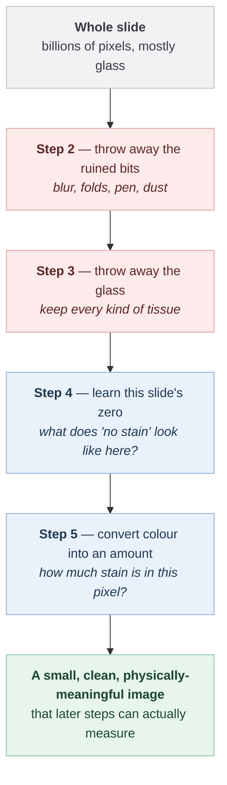
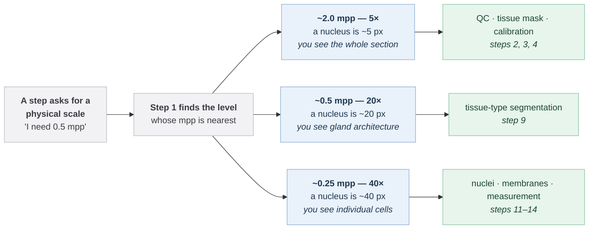
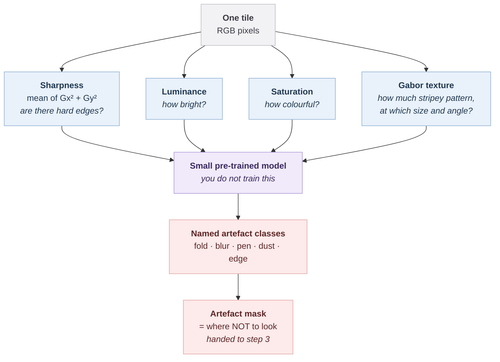
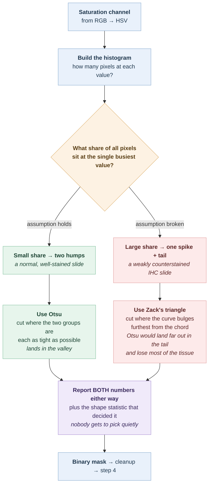
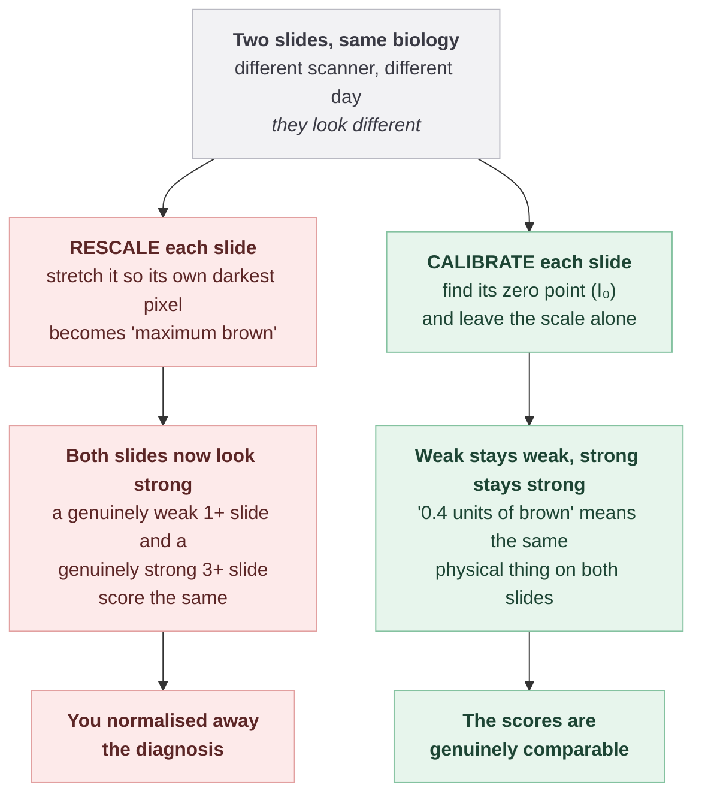
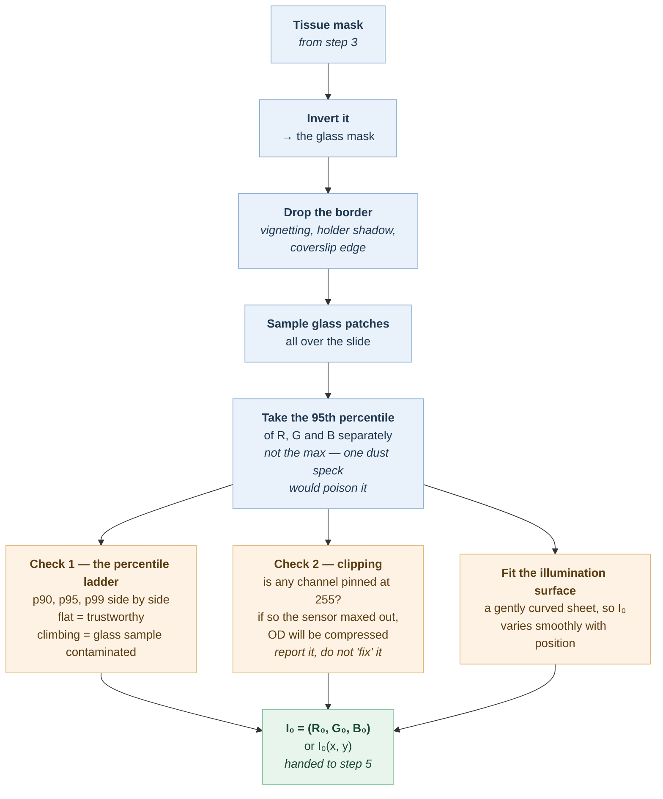
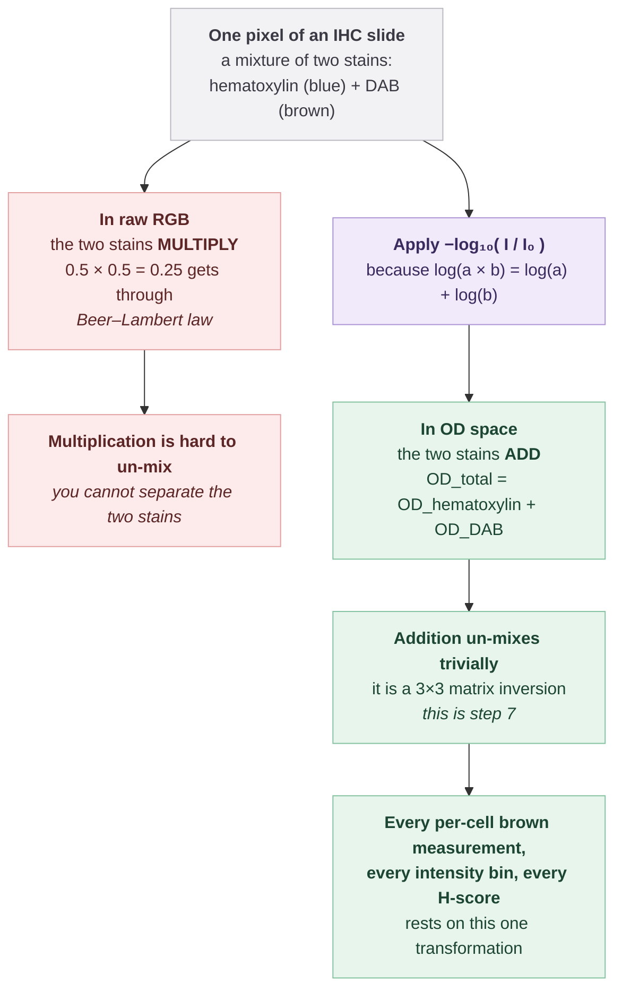
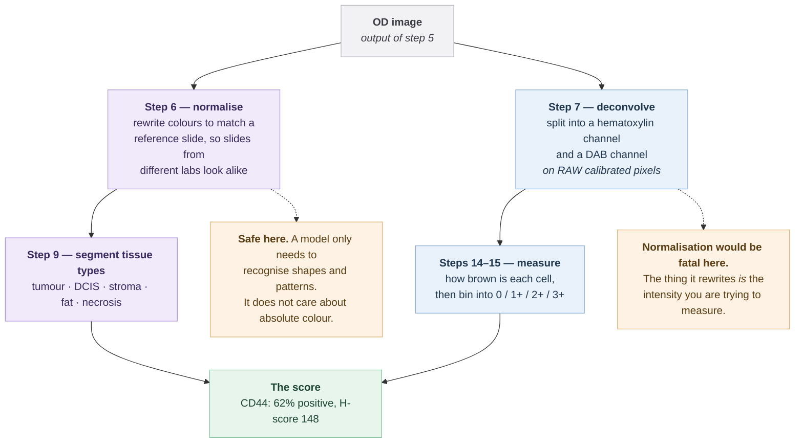
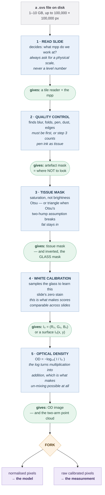

# Steps 1–5 Explained

**Who this is for.** You, tomorrow morning, with a coffee and no code open.

**What this gives you.** For each of the first five steps: what it does in plain
English, *why it has to happen at that point and not later*, the mathematics
explained slowly, and what appears on the screen and how to read it.

**What this does not give you.** Code. Not one line. If you want the code, each
step folder has a `README.md` next to it. Read this first anyway — the code will
make sense afterwards and won't before.

**How to read it.** Straight through, in order. The order is the whole point:
every step exists because the next one needs something from it.

---

## Part 0 — The idea that makes all five steps make sense

The final number this whole system produces looks like this:

```
CD44: 62% positive, H-score 148
```

And underneath, it is always this:

```
score = (how many of the RIGHT cells are stained) / (how many of the RIGHT cells there are)
```

Simple division. All the difficulty is in making each word in that sentence
trustworthy. Steps 1–5 don't count anything and don't score anything. They exist
to make the *later* counting honest. Specifically:

| Steps 1–5 answer | So that later, when we count... |
|---|---|
| Where is the tissue at all? | ...we aren't counting empty glass |
| Which parts of the slide are ruined? | ...we aren't counting blur and pen ink |
| What does "no stain" look like *here*? | ..."brown" means the same thing on every slide |
| How do I turn colour into an amount? | ...we can un-mix blue from brown at all |

Think of it as a funnel that goes from **big and dumb** to **small and smart**:



Every step throws something away or converts something, and each one makes the
input to the next step smaller or more honest. That is the design.

> **Read the colours.** Pink = *throwing something away*. Blue = *converting into
> something more useful*. Green = *ready for the next stage*. That colour code is
> used in every diagram in this document.

---

## Step 1 — Read the slide

### What it is

A whole-slide image is **not a photograph**. If it were, you couldn't open it: a
single slide is 1–10 gigabytes and can be 100,000 × 100,000 pixels. Your laptop
has nowhere to put that.

Instead it is stored as a **pyramid**. The same slide is saved several times over
at decreasing zoom levels, and each level is chopped into small tiles:

```
Level 0:  100,000 x 100,000   full detail, you can see individual cells
Level 1:   50,000 x  50,000   half as detailed
Level 2:   25,000 x  25,000
Level 3:   12,500 x  12,500
   ...
Level 7:      780 x     780   the whole slide as a thumbnail
```

Software never opens the whole thing. It says "give me the tile at position
(4200, 9100) at level 3" and gets back one small square. Exactly like Google
Maps: you don't download the planet, you download the tiles currently on screen.

**Step 1's job** is to open that pyramid, read what's inside it, and answer one
question for everybody downstream: *at what zoom level are we working?*

### Why this step is first

Because it's not really "open a file". It's a **physical decision** that every
later step inherits, and getting it wrong is invisible until your final number is
wrong.

Here's the trap. A junior engineer writes `read_tile(level=2)`. It works. Then a
different scanner is used, whose level 2 is a different amount of zoom. Same
code, same number, completely different physical size of tissue in the tile. The
tissue mask still runs, the cell detector still runs, nothing crashes — and every
measurement afterwards is silently at the wrong scale.

### The mathematics

There is exactly one concept: **mpp**, *microns per pixel*.

> A micron (µm) is a thousandth of a millimetre. A human cell nucleus is roughly
> 7–10 µm across. A red blood cell is about 7 µm. Keep those two numbers in your
> head — they make everything below concrete.

mpp answers: **how much real tissue does one pixel cover?**

```
mpp = physical width of one pixel, in microns
```

If mpp = 0.25, one pixel covers a quarter of a micron. A 10 µm nucleus is then
`10 / 0.25 = 40` pixels across — big, clearly visible, you can see its shape.

If mpp = 2.0, one pixel covers 2 microns. That same nucleus is `10 / 2 = 5`
pixels across — a smudge. You cannot measure it, but you *can* see the overall
shape of the tissue.

The pyramid levels relate to each other by a **downsample factor**:

```
mpp_at_level_N = mpp_at_level_0 x downsample_at_level_N
```

Usually each level halves the resolution, so the downsample factors are
1, 2, 4, 8, 16... and the mpp doubles each time:

| Level | Downsample | mpp (if level 0 = 0.25) | Nucleus is... | Called |
|---|---|---|---|---|
| 0 | 1 | 0.25 | 40 px across | 40× |
| 1 | 2 | 0.5 | 20 px | 20× |
| 2 | 4 | 1.0 | 10 px | 10× |
| 3 | 8 | 2.0 | 5 px | 5× |

**The rule that follows from this:** never ask for a level. Always ask for an
mpp, and let the code find the closest level.

```
"I need 0.5 mpp"  ->  code finds the level whose mpp is nearest 0.5
```

Now the same request means the same *physical* thing on every scanner in the
world. This is the single most important habit in whole-slide imaging.

### Which mpp for which job

Not arbitrary — each is chosen for what you need to *see*:

| mpp | You can see | Used by |
|---|---|---|
| ~2.0 (5×) | the overall shape of the section | tissue mask, QC, calibration |
| ~0.5 (20×) | gland architecture — how tissue is organised | tissue-type segmentation |
| ~0.25 (40×) | individual cells and their membranes | nuclei segmentation, measurement |

Why does architecture need 20× and not 40×? Because at 40× a tile is so zoomed in
that you see cells but lose the *pattern* they form — and the pattern is exactly
what distinguishes cancer trapped inside a duct from cancer that has broken out.
Zoom in too far and you lose the forest for the trees. Literally.



**How to read it.** Nothing ever asks for "level 2". Everything asks for a
*physical* scale and step 1 resolves it. Change the scanner and the level numbers
change; the mpp requests don't.

### What's on screen

A **pan-and-zoom viewer** — drag to move, scroll to zoom, like a map. In the
corner, a live readout:

```
mpp: 0.50    level: 1    tiles loaded: 34
```

**How to read it.** Scrub the zoom slider and watch two things change together:
the mpp number, and the size of the tile grid. That pairing is the lesson. When
you zoom out, mpp goes *up* (each pixel covers more tissue) and fewer, coarser
tiles are needed. When you zoom in, mpp goes *down* and the viewer starts pulling
many small high-detail tiles.

That's the screen that turns the abstract word "gigapixel" into something you've
felt with your hands.

### Screenshot — Step 1 in the demo app

<!-- Save the capture as: screenshots/step_01_read_slide.png -->


*Capture the viewer at two different zoom levels if you can — the mpp readout
changing is the whole point of the screen.*

<br>

### What it hands to the next step

A reader (something that can fetch tiles on demand) and the slide's mpp. Nothing
else. Step 1 does no image processing at all.

---

## Step 2 — Quality control

### What it is

Real glass slides are physical objects handled by humans, and they are full of
defects:

| Defect | What it is | Why it fools the software |
|---|---|---|
| **Blur** | the scanner's focus drifted | smeared cells look like nothing in particular, but a model will still confidently label them |
| **Tissue fold** | the section folded over on itself while being mounted | doubled tissue = doubled darkness = looks intensely stained |
| **Pen mark** | the pathologist circled a region with a marker | dark and strongly coloured — looks exactly like heavily stained tissue |
| **Air bubble** | trapped under the coverslip | bright ring artefacts |
| **Dust / debris** | exactly what it sounds like | small dark specks that look like nuclei |
| **Coverslip edge** | the boundary of the glass cover | a hard straight line that no tissue has |

QC finds these and marks them as **do not use**.

### Why this step is second — before the tissue mask

This ordering surprises people. Surely you find the tissue first, *then* check its
quality? No. Two reasons, and the second is the serious one.

**Reason 1 — cost.** Everything downstream is expensive. Filtering the input
first means you never spend compute on regions you'll throw away.

**Reason 2 — pen marks are the killer.** Step 3 finds tissue by looking for
*colour* (see below). A pen mark is intensely coloured. If QC hasn't already
removed it, step 3 will confidently include the pen mark **as tissue**, step 4
will then sample its "glass" from a slide that thinks ink is tissue, and the
error propagates through the entire pipeline. QC must come first specifically so
that step 3 never sees the ink.

That's the general shape of the argument you'll see over and over in this
pipeline: *step X comes before step Y because Y's method has an assumption that X
is what protects*.

### The mathematics

The core measurement is **sharpness**, and the reasoning is genuinely intuitive.

**What does "blurry" mean, mathematically?** A sharp image has hard edges — places
where the pixel value jumps suddenly. Blur smooths those jumps out. So:

```
sharp image  = big differences between neighbouring pixels
blurry image = small differences between neighbouring pixels
```

"Difference between neighbouring pixels" has a name: the **gradient**.

```
Gx = (pixel to my right) - (pixel to my left)      how fast it changes horizontally
Gy = (pixel below me)    - (pixel above me)        how fast it changes vertically
```

For every pixel you get two numbers. To get one number describing "how much edge
is here", combine them:

```
edge strength at this pixel = Gx^2 + Gy^2
```

Why squared? Two reasons. It makes negatives positive (an edge going dark-to-light
is just as much an edge as light-to-dark), and it emphasises strong edges over
weak noise. Then average over the whole tile:

```
sharpness = mean( Gx^2 + Gy^2 )        <- called the Tenengrad measure
```

**High number = lots of strong edges = in focus. Low number = blurry.**

Then you compare tiles against each other. A tile whose sharpness is far below
the rest of the slide is out of focus, and out it goes.

> **Why compare against the slide's own tiles rather than a fixed cutoff?**
> Because "sharp" isn't absolute — it depends on the tissue, the stain intensity,
> and the scanner. A cutoff that works on one slide rejects half of another. So
> the question asked is always relative: *is this tile unusually blurry
> **for this slide**?*

### What the real implementation adds

The version in this repo doesn't stop at sharpness. It computes a small family of
per-tile features:

- **Luminance** — overall brightness.
- **Saturation** — how colourful (this is also step 3's whole basis; see below).
- **Gabor texture responses** — a Gabor filter is a wave pattern at a particular
  size and angle; sliding it over the image and measuring the response tells you
  "how much stripey texture at this scale and direction is present here". Tissue
  has rich texture at many scales. Blur has almost none. Folds have texture that
  is doubled and directional. So texture features separate defect *types*, not
  just "bad / good".

And on top of those, a small pre-trained segmentation model outputs a per-pixel
map with **named** classes — fold, blur, pen, dust, edge — rather than a single
reject flag. The named classes are what makes the demo screen possible: you can
show *what* was rejected, not just *how much*.

**Nothing here is trained by you.** These are classical features plus a public
pre-trained model.



**How to read it.** The four blue boxes are things you can compute with plain
arithmetic and fully explain. The purple box is the one piece of machine learning
— and it's downloaded, not trained. Its job is only to turn those numbers into
*names*, because a named defect can be shown on screen and defended; a bare
"reject" score cannot.

### What's on screen

Three things:

1. **The thumbnail with a coloured artefact overlay.** Each artefact class gets
   its own colour. You immediately see: that corner is out of focus, that streak
   is pen, that edge is coverslip.

2. **A bar chart: "% of tissue rejected, by artefact type."** Turns a picture into
   a number you can put in a report.

3. **The persuasive one — a `QC on / QC off` toggle with both final scores side
   by side.** Flip it and watch the final score move, because a blurred corner was
   or wasn't included.

**How to read screen 3.** This is the most important screen in the first five
steps, and it isn't about QC at all. It's the demonstration that **the answer
depends on choices**. The score is not a fact read off the slide; it is the
consequence of a chain of decisions. Watching a number change because of a
checkbox is what makes an audience understand that.

### Screenshot — Step 2 in the demo app

<!-- Save the capture as: screenshots/step_02_quality_control.png -->


*If you capture only one thing here, capture the `QC on / QC off` toggle with
both scores visible. That single frame is the best argument in the demo.*

<br>

### What it hands to the next step

An **artefact mask**: a map of where *not* to look. Step 3 will exclude these
regions before it does anything else.

---

## Step 3 — Tissue mask

### What it is

Look at a scanned slide. Most of it is empty glass — often 80–95% of the image.
The tissue section is a small irregular blob somewhere in the middle.

The tissue mask is a black-and-white image the same shape as the thumbnail:
**white where there is tissue, black where there is glass.**

That's it. It's the simplest step conceptually and one of the most useful,
because it shrinks the problem by 5–10× before any expensive work starts.

### Why this step is third

**After QC**, so that pen ink has already been excluded and can't be mistaken for
tissue (explained above).

**Before everything else**, for two reasons:

1. *"Is this tissue at all?"* is a much easier question than *"what kind of tissue
   is this?"* Answering the easy question first shrinks the input to the hard
   question by 60–90%.
2. **Step 4 needs the glass.** And the only way to know where the glass is, is to
   know where the tissue is and take everything else. The tissue mask, inverted,
   *is* the glass mask. This is the clearest example of "each step exists because
   the next one needs something" in the whole pipeline.

### The mathematics — part 1: why saturation, not brightness

The obvious idea is: glass is bright, tissue is dark, so threshold on brightness.

**This fails.** Here's why:

| | Brightness | Colourfulness |
|---|---|---|
| Empty glass | very high | **zero** — it's neutral white |
| Dark tissue | low | high |
| **Pale tissue** | **very high** | **still high** |

Pale, faintly-stained tissue is just as bright as glass. Threshold on brightness
and you delete it. And pale tissue is not rare — weakly counterstained regions,
fat, loose stroma are all pale, and some of them matter.

But look at the third column. Glass is *colourless*. Even the palest tissue is
still *tinted* — pink, blue, faintly brown. Brightness fails to separate them;
colourfulness separates them cleanly.

So convert the image from RGB to **HSV**:

- **H — Hue**: *which* colour (red, blue, green...) — an angle around a colour wheel
- **S — Saturation**: *how colourful* — 0 = grey/white/black, 1 = vivid
- **V — Value**: *how bright*

Throw away H and V. Keep **S**. On the saturation channel, glass is near-black
and all tissue — pale or dark — is clearly brighter. The problem became easy just
by changing coordinates.

> This is worth noticing as a general lesson: a large part of image processing is
> **choosing the representation in which your problem is easy**, then doing
> something trivial. Steps 3, 5 and 7 are all this same move.

### The mathematics — part 2: choosing the threshold

Now you need a cutoff: above this saturation = tissue, below = glass. Where?

**Don't hand-pick it.** A number tuned on one slide is wrong on the next. Let the
image choose, from the shape of its own histogram.

**A histogram** is just: for each possible saturation value 0–255, how many pixels
have it? On a typical slide it has two humps:

```
  count
    |     ####                        ###
    |    ######                     #######
    |   ########                   #########
    |__###########________________############____
      0        glass hump          tissue hump   255
                     ^
                 the valley
```

The threshold should go in the valley. **Otsu's method** finds it automatically.

**How Otsu works, in plain language.** Try every possible threshold from 0 to 255.
Each one splits the pixels into two groups. For each split, ask: *how spread out
is each group internally?* Pick the threshold where the two groups are each as
**tight** as possible.

The intuition: if you cut in the middle of a hump, you've sliced one real
population in half, and both halves are messy. If you cut in the valley, each
group is one clean population, and each is tight. Otsu is a search for the cut
that makes the two groups internally as similar as possible.

Formally it minimises the *within-group variance*, which is the same as
maximising the *between-group variance* — the two are equivalent, and the second
is faster to compute, which is what the algorithm actually does. But the sentence
above is the whole idea.

### The mathematics — part 3: when Otsu fails, and what this repo does about it

Here's the part most tutorials skip, and it's in your code.

**Otsu assumes two humps.** That assumption is right there in "split into two
groups that are each tight". If the histogram genuinely has two humps, Otsu lands
in the valley and you're done.

But an IHC slide with **weak counterstain** doesn't have two humps. It has **one
huge spike near zero** (all that glass) and a **long thin tail** (the faint
tissue):

```
  count
    | #
    | #
    | ##
    | ###______________________________________
      0                                       255
        one spike, and a tail that's almost flat
```

Otsu on this shape does something bad: with no second hump to find, its criterion
gets maximised far out in the tail, the threshold lands way too high, and **the
mask loses most of the tissue section.** Silently. It returns a perfectly valid
number that happens to be useless.

So this repo does something better. It:

1. Computes Otsu **and** a second rule (**Zack's triangle method**).
2. Measures the histogram's *shape* — specifically, what fraction of all pixels
   sit at the single busiest value. A level holding most of the pixels means
   "spike, not hump", which means Otsu's assumption is violated.
3. Picks the appropriate rule — **and reports both numbers either way**, plus the
   shape statistic it decided on.

**What the triangle method does.** Draw a straight line (a chord) from the top of
the spike to the far end of the histogram where the data runs out. Then, for
every point on the histogram curve, measure its perpendicular distance to that
line. The threshold goes where that distance is **greatest** — the point that
"bulges" furthest away from the chord. It's a rule designed for exactly the
one-spike-and-a-tail shape that defeats Otsu.

```
  count
    | #
    | # \                  <- the chord, spike-top to tail-end
    | ##  \
    | ### | \              <- greatest perpendicular gap = the threshold
    | #### v  \
    |___________\______________
```

Here is that whole decision as a picture — it is the most interesting logic in
the first five steps:



> **This is the most valuable thing in steps 1–5 and it isn't a formula.** It's
> the habit: *every method has an assumption; know what breaks it; check whether
> it holds; say which rule you used.* The repo shows both numbers on screen
> precisely so nobody can pick one quietly.

### The mathematics — part 4: cleanup

The raw thresholded mask is speckly — isolated stray pixels in and out. Four
cleanup operations, all classical morphology:

| Operation | What it does | Why |
|---|---|---|
| **Closing** | fills small holes inside white regions | a pale spot inside the section isn't glass |
| **Opening** | removes small isolated white specks | a dust mote isn't a tissue section |
| **Drop small components** | deletes tiny separate blobs | debris at the slide edge |
| **Fill small holes** | same idea, by area | — |

One important detail: the size cutoffs are expressed in **physical units — mm²,
not pixels.** "Delete blobs smaller than 0.01 mm²" survives a change of scanner.
"Delete blobs smaller than 400 pixels" does not, because 400 pixels is a
different physical size at every mpp. Same lesson as step 1.

### The rule you must not break here

**Fat stays in the mask.**

Fat looks pale and empty, so it is very tempting to threshold it out here and
call it "removing fat". Don't. At this stage you only know *tissue vs glass*.
Fat **is** tissue. If you drop it here you also drop pale tumour, glandular
secretions, and any washed-out region — and you keep **no record** of what you
dropped.

Fat gets removed much later (step 9), as an explicit named class from a model.
Then it's *auditable*: you can show a fat overlay on screen and say "we removed
exactly this, and here's why". A brightness threshold can never say that.

The general principle: **remove things at the step where you can name what you're
removing.**

### What's on screen

Four panels, left to right — this is a proof, laid out as pictures:

```
[1] original      [2] saturation      [3] histogram        [4] mask overlay
    thumbnail         channel,            with the             on the original
                      greyscale           threshold line
```

Plus a **manual threshold slider** sitting next to the automatic value.

**How to read it.**

- Panel 2 is the "aha". The tissue leaps out as bright, the glass goes black. You
  see with your own eyes that saturation solved the problem before any threshold
  was applied.
- Panel 3 is the justification. You see the two humps, and you see the line
  landing in the valley between them.
- The slider is the honesty check. Drag it and watch the mask grow and shrink.
  You'll find that the automatic value lands almost exactly where you'd have put
  it by hand. That's the argument that the automatic method isn't a black box —
  it's agreeing with you.
- Drag it *too high* and watch the pale edges of the tissue disappear. That is
  the Otsu-failure mode from part 3, reproduced by hand, in three seconds.

### Screenshot — Step 3 in the demo app

<!-- Save the capture as: screenshots/step_03_tissue_mask.png -->


*Try to catch all four panels in one frame, and note in the caption which rule
the slide chose — Otsu or triangle.*

<br>

### What it hands to the next step

The tissue mask. And, crucially, **its inverse** — the glass mask — which is
step 4's entire input.

---

## Step 4 — White calibration

### What it is

One question, asked of this specific slide: **what colour is "no stain at all"?**

Not "what is white in general". What does *this* slide, scanned on *this*
scanner, on *this* day, with *this* lamp, look like where there is nothing but
empty glass?

That colour — three numbers, one per channel — is called **I₀** (pronounced
"I-nought"), the *incident light*. It's the light that arrived at the sensor
having passed through nothing.

### Why this step is fourth

**After step 3**, because it needs the glass, and step 3's inverted mask is the
only thing that knows where the glass is.

**Before step 5**, because step 5's formula is *defined relative to I₀*. Step 5
literally cannot run without this number.

### Why this step exists at all — the important bit

This is the step whose purpose is least obvious and most important. Here's the
problem it solves.

Two slides. Same patient, same tissue, same biology. One scanned in the morning
on scanner A, one in the afternoon on scanner B. The lamp in scanner A is older
and slightly yellow. The staining batch on Tuesday was 10% stronger than Monday's.

The two images look visibly different. Same biology, different pixels.

Now you want to say "this slide scores 62% positive and that one scores 41%". For
that comparison to *mean* anything, the two numbers must be on the same scale.

There are two ways to do this, and only one is right:

| | **Per-slide rescaling** (wrong) | **Per-slide calibration** (right) |
|---|---|---|
| What it does | stretch each slide so its own darkest becomes "maximum brown" | record what *zero* is on each slide, keep the real scale |
| Effect | every slide's strongest stain becomes 3+ | a weak slide stays weak, a strong slide stays strong |
| Result | a genuinely weak slide and a genuinely strong slide come out identical | they come out different, correctly |

The first one **normalises away the diagnosis.** It sounds reasonable — "put every
slide on a common scale" — and it destroys exactly the information you were trying
to measure.

Calibration is different. It doesn't touch the strong end at all. It only pins
down the *zero point*, so that "0.4 units of brown" means the same physical thing
on every slide. Like the difference between rescaling a thermometer to make each
day's hottest hour read 100°, versus just knowing where 0° is.



**How to read it.** The pink path sounds perfectly reasonable — "put every slide
on a common scale" — and it is the most common serious mistake in this field.
Rescaling touches the *strong* end. Calibration only pins the *zero* end. That is
the entire difference, and it decides whether your numbers mean anything.

**This is the single reason step 4 exists.** Everything else here is detail.

### The mathematics — the simple version

Take the glass pixels. Take a high percentile of each channel.

```
I₀ = ( p95(R over glass pixels),
       p95(G over glass pixels),
       p95(B over glass pixels) )
```

That's it — three numbers.

**Why the 95th percentile and not the maximum?** Because the maximum is whatever
the single brightest pixel happens to be. One dust speck reflecting the lamp, one
sensor hot pixel, one saturated highlight — and your I₀ is wrong, and being wrong
at the *zero point* poisons every measurement downstream. The 95th percentile
says "brighter than 95% of the glass", which is robust: it takes thousands of
pixels to move it.

**Why per channel and not one number?** Because scanner illumination is never
perfectly neutral. A slightly yellow lamp gives you a higher R and G than B. If
you collapsed that into one brightness number you'd throw away the colour cast —
and the colour cast is precisely the thing that would otherwise contaminate your
brown measurement.

**Why drop the border?** The outer edge of the scan often has vignetting, holder
shadows, and the coverslip edge. That isn't representative glass.

### What the real implementation adds

Three things, each solving a real failure:

**1. The percentile ladder.**

Choosing "the 95th" is a *choice*. How do you show that the choice isn't secretly
doing the work? Report I₀ at several percentiles side by side — 90th, 95th, 99th
— and look at the shape:

```
Healthy slide:                      Contaminated glass sample:
  p90: (241, 239, 236)                p90: (198, 201, 205)
  p95: (243, 241, 238)   <- flat      p95: (219, 222, 227)   <- climbing steeply
  p99: (245, 243, 240)                p99: (244, 246, 250)
```

A **flat ladder** means there's plenty of real, consistent glass and any sensible
percentile gives the same answer — the result is trustworthy and the specific
choice didn't matter. A **steeply climbing ladder** means the "glass" sample still
contains tissue or debris, so you're averaging in things that aren't glass, and
the number should not be trusted.

This is a lovely piece of engineering because it converts "trust me, 95 is a
reasonable choice" into a picture the reader can check themselves.

**2. The clipping check.**

Sometimes a channel is pinned at 255 — the sensor maxed out. That means the
scanner ran out of range *before the glass did*, so the true incident light was
brighter than 255 and you have no idea by how much.

The consequence is specific and bad: I₀ is **underestimated**, which **compresses**
optical density. Faint stain and no stain end up measuring closer together than
they really are — exactly the distinction you need most.

No arithmetic can recover it; the information was destroyed at scan time. So the
right response is to **report it**, flag the slide, and not pretend. Which is what
the code does.

> That's a general principle worth absorbing: when an upstream fault destroys
> information, *detect and report* beats *silently correct*. A pipeline that
> quietly patches over bad input produces confident wrong answers, which is worse
> than a loud failure.

**3. The illumination surface.**

Microscope illumination isn't perfectly even — the middle of the field is
typically brighter than the corners (**vignetting**). So I₀ isn't really one
triple, it's a gentle gradient across the slide.

The fix: sample glass in patches all over the slide, then fit a smooth low-order
surface through those samples — a gently curved sheet, like a very slightly
dished tabletop. Now I₀ is a *function of position*:

```
I₀(x, y)  instead of  I₀
```

"Low-order" matters: the surface is deliberately kept too simple to bend around
tissue. It can capture "brighter in the middle, dimmer at the corners" and
nothing more, which is right, because that's all real vignetting is. Give the fit
more freedom and it starts chasing tissue and stops describing illumination.



**How to read it.** The blue chain is the measurement. The three amber boxes are
the step *auditing itself* — is the sample clean, did the sensor cope, is the
lighting even. None of them change I₀; they tell you whether to believe it.

### What's on screen

- **The thumbnail with sampled glass patches marked.** You can see *where* the
  measurement came from. Are the patches spread nicely around the section, or all
  bunched in one corner?
- **The I₀ colour swatch.** A block of the actual colour. Usually a very slightly
  warm off-white — and seeing that it's *not* pure white is the point.
- **The percentile ladder**, as described above. Flat = trust it.
- **The illumination surface**, rendered as a gentle heatmap. Brighter middle,
  dimmer corners.
- **Two different slides side by side, with their two different I₀ values.**

**How to read the last one.** That side-by-side is the entire argument for this
step in one picture. Two slides, two visibly different whites. If you used one
fixed I₀ for both, every measurement on one of them would be biased — not noisy,
*biased*, consistently in one direction. And bias is the kind of error that
averaging more data does not fix.

### Screenshot — Step 4 in the demo app

<!-- Save the capture as: screenshots/step_04_white_calibration.png -->


*The best capture here is two slides side by side with two visibly different I₀
swatches. That one image is the entire justification for the step.*

<br>

### What it hands to the next step

**I₀.** Three numbers (or a smooth surface of them). That's the entire output, and
step 5 cannot exist without it.

---

## Step 5 — Optical density

### What it is

Everything so far has been about *where*. This step is the first one about *how
much*.

It converts the image from **colour** into a **physical quantity**: how much stain
is sitting in each pixel.

That distinction is real, not philosophical. "This pixel is RGB (180, 140, 110)"
is a description of light. "This pixel contains 0.42 units of DAB" is a
measurement of a substance. The second one you can add up, compare across slides,
and put in a report. The first one you cannot.

### Why this step is fifth

**After step 4**, because the formula is defined in terms of I₀.

**Before steps 6 and 7**, because both branches of the pipeline need it. The
pipeline forks right after this step, and *both* forks want optical density
rather than raw colour.

### The mathematics — the formula

```
OD = -log₁₀( I / I₀ )
```

per channel, where `I` is the observed pixel and `I₀` is step 4's white.

Let's take it apart.

**`I / I₀` — transmittance.** What fraction of the available light got through?

```
I / I₀ = 1.0   ->  all the light got through   ->  nothing is here
I / I₀ = 0.5   ->  half got through            ->  something absorbed half
I / I₀ = 0.1   ->  a tenth got through         ->  something dark
```

Notice this is where I₀ earns its keep. Without it you'd be comparing against a
guess. With it, "half the light got through" means half the light *this slide
actually had available*.

**`log₁₀(...)` — the logarithm.** Now the interesting part.

**`-` — the minus sign.** `log` of a number less than 1 is negative, and we'd
rather talk about positive amounts of stain. So flip the sign:

```
I/I₀ = 1.0  ->  OD = 0.0     no stain
I/I₀ = 0.1  ->  OD = 1.0     one "unit" of absorbance
I/I₀ = 0.01 ->  OD = 2.0     twice as much stain
```

**OD = 0 means no stain. Bigger OD means more stain.** Clean and intuitive.

### The mathematics — why the logarithm, which is the whole point

This is the most important paragraph in steps 1–5. Read it twice.

**Light does not add. Light multiplies.**

Suppose one layer of stain lets 50% of light through. Now stack a second,
identical layer on top. How much gets through both?

Not 0% (50% + 50% "used up"). It's **25%** — the second layer passes half of the
half that survived the first.

```
transmission through both = 0.5 x 0.5 = 0.25
```

That's the physics (the **Beer–Lambert law**): absorbers *multiply* their
transmissions. So in raw RGB, two stains sitting on top of each other combine by
multiplication.

**And multiplication is hard to un-mix.** In an IHC slide, every single pixel is a
mixture of two stains: hematoxylin (blue, marks nuclei) and DAB (brown, marks the
protein you care about). You need to separate them. Separating things that got
multiplied together is nasty.

But the logarithm has one property, and it is the property this whole pipeline
rests on:

```
log(a x b) = log(a) + log(b)
```

**The logarithm turns multiplication into addition.**

So in OD space:

```
OD_total = OD_hematoxylin + OD_DAB
```

Plain addition. And addition is something linear algebra un-mixes trivially —
it's a 3×3 matrix inversion, which is step 7.

**Read this once more:** the log isn't a display trick or a way to compress
dynamic range. It's the transformation that makes the un-mixing problem *linear*,
and therefore solvable. Without step 5, step 7 does not exist. Everything after
step 7 — every per-cell brown measurement, every intensity bin, every H-score —
depends on this one line.



**How to read it.** The pink path is where you end up without the logarithm: a
mixture you cannot separate. The purple box is the one move that changes
everything. It is not a display trick and not a way to compress brightness — it
is the transformation that makes un-mixing *linear*, and therefore possible.

### One practical detail

`log(0)` is negative infinity. A pure-black pixel — a dust speck, a sensor dead
pixel — would produce infinity and poison every average it touches. So clip `I`
to a small floor first:

```
I = max(I, 1)      then compute OD
```

Small, boring, and it's the difference between a pipeline that runs and one that
produces NaN halfway through.

### What OD space looks like — the two arms

Here's where it becomes visual and rather beautiful.

Take every pixel in a tile, compute its three OD values, and plot each pixel as a
point in 3-D space with axes OD_red, OD_green, OD_blue.

You don't get a shapeless cloud. You get **two straight arms radiating out from
the origin.**

```
        OD_blue
          |
          |    * *
          |  * *  *          <- arm 1: pixels that are mostly hematoxylin
          | ***  *
          |***
       ---+*********  * * *  <- arm 2: pixels that are mostly DAB
          |     *  * *
          |
```

**Why arms?** Each stain has a fixed *colour* — a fixed direction in OD space.
What varies from pixel to pixel is *how much* of it there is, which moves the
point further along that direction. So all the "pure hematoxylin, varying amount"
pixels line up along one ray from the origin. All the "pure DAB, varying amount"
pixels line up along another. Mixed pixels fall in between, filling the wedge.

**Those two arms are literally the two stains.** You are looking at the physical
basis of colour deconvolution. Once you've seen this picture, step 7 stops being
"multiply by a magic matrix" and becomes "measure the direction of each arm, then
express every pixel in terms of those two directions" — which is obvious.

And notice: the arms are only straight **because of the logarithm**. In raw RGB
this plot is a curved, tangled mess. The log is what straightened it.

### What the real implementation adds

The repo doesn't just compute OD — it *interrogates* the point cloud:

- **Finds the two dominant directions** (the arms) and reports the **angle between
  them**. A healthy H-DAB slide has two well-separated arms. If the angle is
  small, the stains are hard to tell apart on this slide and any un-mixing will
  be unstable.
- **Checks whether that direction estimate is stable** — if you resample the
  pixels, do you get the same arms? An unstable estimate means the tile doesn't
  contain enough of both stains to measure them.
- **Runs an additivity check.** Beer–Lambert *claims* the two stains add in OD
  space. Does the actual data behave that way? This is testing the assumption
  rather than assuming it — the same instinct as step 3 checking Otsu's two-hump
  assumption before using it.

Notice that pattern repeating across these five steps. Step 3 checks its
threshold rule's assumption. Step 4 checks its percentile choice with a ladder and
flags clipped sensors. Step 5 checks Beer–Lambert's additivity. **A good pipeline
doesn't just apply methods; it checks that each method's preconditions hold on
this particular input, and says so.** If you take one engineering habit away from
this document, take that one.

### What's on screen

```
[1] the RGB tile   ->   [2] OD as a heatmap   ->   [3] the OD scatter plot
```

Plus the measured numbers: the angle between the arms, the stability verdict, the
additivity result.

**How to read it.**

- Panel 2: bright where there's lots of stain, dark where there's little. Compare
  it to panel 1 and you'll see it looks like a *density map* rather than a
  photograph. That's the conversion, visible.
- **Panel 3 is the one to stare at.** Find the two arms. That is the single most
  informative picture in the whole first half of this pipeline. Everything from
  step 7 onward is operating on those two directions.
- If the arms look fused rather than separate, this tile is a bad one to measure —
  and the fact that you can *see* that before computing anything is precisely the
  value of the picture.

### Screenshot — Step 5 in the demo app

<!-- Save the capture as: screenshots/step_05_optical_density.png -->


*The scatter plot with the two arms visible is the single most informative image
in the first half of the pipeline. Make sure it is legible in the capture.*

<br>

### What it hands to the next step — and the fork

The OD image. And here the pipeline **splits in two**:



**How to read it.** Purple is the **model branch**, blue is the **measurement
branch**. They start from the same OD image and they never share preprocessing
again. The two amber notes say why. Draw this Y-shape on a whiteboard if someone
asks you what the pipeline looks like — it is the most instructive single picture
in the project.

**They must not be mixed**, and the reason is the same one from step 4:
normalisation rewrites colours to look like a reference slide. That's helpful for
a model, which only needs to recognise shapes and doesn't care about absolute
colour. It's **fatal** for measurement, because the thing it rewrites *is* the
intensity you were trying to measure.

That fork is the subject of the next document. But it starts here, at the output
of step 5, and it's the single most important structural fact about the pipeline.

---

## Part 6 — The whole flow on one page



**How to read it.** Blue = the step. Green = what it hands to the next one. Follow
the green boxes only and you have the dependency chain: step 4 exists because
step 3 produced a glass mask; step 5 exists because step 4 produced I₀. Nothing
in this order is convention.

**The handoff table:**

| Step | Needs from before | Produces | Used by |
|---|---|---|---|
| 1 Read slide | the file | reader, mpp | everything |
| 2 Quality control | reader, mpp | artefact mask | 3, and later tiling |
| 3 Tissue mask | reader, artefact mask | tissue mask | 4 (inverted → glass) |
| 4 White calibration | glass mask | **I₀** | **5** |
| 5 Optical density | I₀, tile | **OD image** | 6 (model), 7 (measurement) |

---

## Part 7 — The five things to actually remember

If tomorrow evening you remember only five sentences, make them these.

1. **Always work in physical units, never pixels or level numbers.** mpp for
   zoom, microns for distances, mm² for areas. Everything else changes when the
   scanner does.

2. **Order is driven by dependency, not convention.** QC is first because step 3
   would otherwise eat pen ink. Step 4 is after step 3 because only step 3 knows
   where the glass is. Step 5 is after step 4 because its formula contains I₀.

3. **Change the representation, then the problem becomes easy.** RGB → saturation
   makes tissue detection a one-line threshold. RGB → optical density makes stain
   un-mixing a matrix multiply. The cleverness is in the coordinate change, not
   the algorithm that follows it.

4. **Calibrate, never rescale.** Pin down the zero point per slide; leave the
   scale alone. Rescaling each slide against itself makes a weak slide and a
   strong slide look identical, which erases the diagnosis you were measuring.

5. **Every method has an assumption — check it and report it.** Otsu assumes two
   humps, so check the histogram's shape. A percentile is a choice, so show the
   ladder. Beer–Lambert claims additivity, so test it. This is what separates a
   measurement instrument from a rendering engine.

---

## Part 8 — Prove it to yourself (the afternoon)

Reading won't do it. Four experiments, an hour, one tile:

1. **Change I₀ by 20%** and recompute OD. Watch every value move. Now you
   understand why step 4 is a whole step and not a constant.

2. **Move the step-3 threshold by hand.** Drag it high and watch the pale edges of
   the tissue vanish. That's the Otsu-failure mode, reproduced in three seconds.

3. **Compute the point cloud with the log, and again without it.** Plot both. Only
   the log version has two straight arms. That's Beer–Lambert, visible, and it's
   the justification for step 7 in one picture.

4. **Turn QC off** and watch the final score move because a blurred corner got
   counted. That's why step 2 is first.

If you can do those four and explain out loud what happened, you understand steps
1–5 well enough to build step 6.
