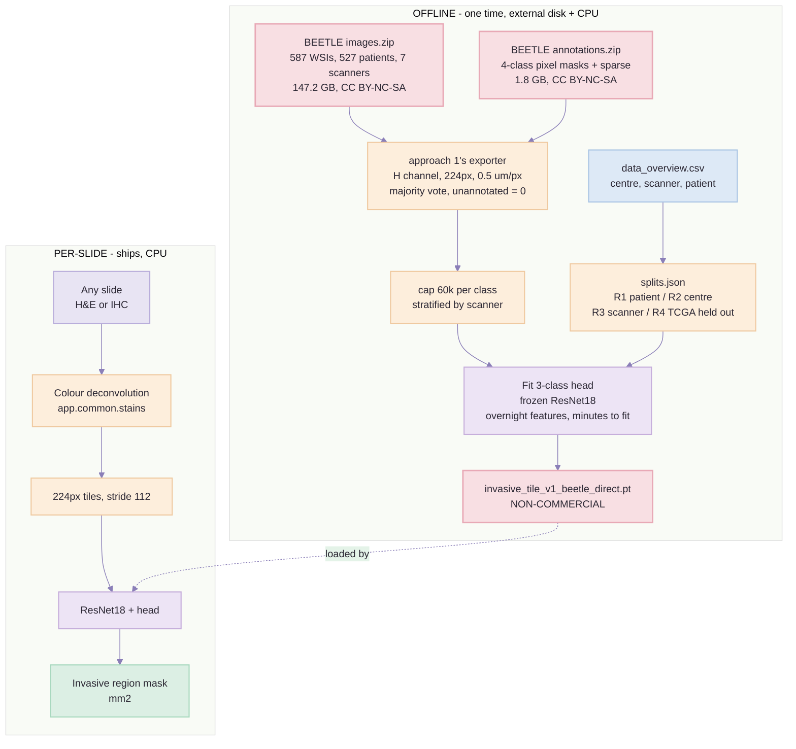

# Approach 4B — Build Plan: BEETLE direct → H-channel ResNet18 *(no BCSS)*

> Created: 2 Sep 2026 | Audience: whoever writes the code.
> **Prerequisite: [`approach-1-training-plan.md`](approach-1-training-plan.md)** for the exporter, the
> tile geometry, the frozen-feature cache and the reporting rules; and
> [`approach-4a-training-plan.md`](approach-4a-training-plan.md) Parts 1–2 for what BEETLE *is*. This
> document is the **Route B** build order, expanded, with BCSS removed from the pipeline entirely.
> Decided by: nothing yet — **this plan is written and not scheduled.**
> [Route A is the committed route](approach-4a-training-plan.md) as of 2 Sep 2026. Build this only if
> Route A fails its Notebook 00 CPU gate or its Notebook 04 pathologist gate.
> Feeds: guide step 9 = **code step 8**, `backend/app/pipeline/step08_tissue_type_segmentation/`.

---

## Part 0 — What this is, in one sentence

Download BEETLE's **data** rather than its weights, tile the 587-slide development set through
approach 1's exporter, and fit the same 3-class head on the same frozen ResNet18 — **no teacher, no
pseudo-labels, no pathologist review of a model's output, and no BCSS.**

**The deliverable:** `models/tissue_type/invasive_tile_v1_beetle_direct.pt` — the same 224 px
haematoxylin tile at 0.5 µm/px, the same three classes, trained on **527 patients across 7 scanners**
with human-assigned labels.

### Dropping BCSS is free here, and only here

This is the one route where the corollary from
[`approach-4a-training-plan.md`](approach-4a-training-plan.md) Part 1 actually holds:

```
BCSS (151 TCGA)  ⊂  TIGER (195)  ⊂  BEETLE dev (587)
```

BCSS's slides **are** in BEETLE, relabelled under a better ontology. Removing BCSS as a source
therefore removes no images, no patients and no institutions — it removes a duplicate. Contrast Route
A, where the same removal would discard 150 independent patients, which is why
[approach 4's Notebook 05](approach-4a-training-plan.md) gives BCSS full weight there.

> ⚠ **But it does remove the clean-licence fallback, and that is the real cost.** BCSS is CC0; BEETLE
> is **CC BY-NC-SA 4.0**. Under Route A the ablation's BCSS-only run is a shippable model that exists
> whatever happens. Under this plan **there is no clean-licence model at all** — every checkpoint it
> produces is non-commercial. See Part 7.

---

## Part 1 — Gate D0: disk, before anything else

**33 GB free on `C:` (measured 2 Sep 2026, 476 GB total, 94 % used). This plan needs roughly 400 GB.**
It cannot run on the project drive. That is not a budgeting note, it is the first gate.

| What | Size | Where |
| --- | --- | --- |
| `images.zip` | **147.2 GB** | external disk |
| extracted WSIs | ~150 GB *(estimate — TIFF, already compressed)* | external disk |
| **peak during extraction** | **~300 GB** | external disk |
| `annotations.zip` + extracted | 1.8 GB + ~5 GB *(estimate)* | external disk |
| exported H-channel tiles | ~2 GB *(see Part 4 cap)* | project drive, `data/tiles/` |
| cached frozen features | ~220 MB | project drive, `data/features/` |

**Gate D0:** an external disk with **≥ 400 GB free**, mounted, writable, and its path recorded in
`beetle_direct_resnet18/data/PATHS.json`. `images.zip` is also the only asset in this project that
cannot be re-fetched quickly — verify space before starting the download, not during it.

> **Do not extract onto the project drive "just for tiling".** A half-extracted 147 GB archive on a
> disk with 33 GB free is the single most expensive failure available in this plan, and it fails
> silently partway through a multi-hour job.

---

## Part 2 — Downloads

Zenodo record **`10.5281/zenodo.16812932`**.

| What | Size | Destination | Verified by |
| --- | --- | --- | --- |
| `images.zip` | **147.2 GB** | external disk | Zenodo MD5, then per-slide checksums after extraction |
| `annotations.zip` | 1.8 GB | external disk | mask/slide name pairing, 100 % matched |
| `data_overview.csv` | 176 kB | `data/meta/` | row count; **this file defines the splits — see Part 3** |

**Not downloaded:** `model.zip`. This route trains from data and never runs the teacher, so the
1.9 GB ensemble, the CPU-inference gate and the pathologist review of pseudo-labels all disappear.

**Download hygiene.** Fetch with a resumable client (`curl -C -` or `wget -c`) — a 147 GB transfer
that has to restart from zero is a lost day. Verify the archive checksum **before** extracting;
verify per-slide checksums **after**. Record all of them in `data/CHECKSUMS`.

**Time:** ~3.5 h at 100 Mbps, ~13 h at 25 Mbps. Measure the first 5 GB and extrapolate before
planning around it.

---

## Part 3 — Splits, which are the best thing about this route

BCSS gave one held-out-institution report from a single TCGA scanner era. BEETLE's development set is
**3 clinical centres + 2 public datasets, across 7 scanners**, so the split can be built on the axis
that actually predicts failure.

### Three nested reports, not one

| Report | Held out | Answers |
| --- | --- | --- |
| **R1 — patient** | `GroupKFold` by patient, 5 folds | model selection only. Never quoted as a result. |
| **R2 — centre** | one clinical centre, entirely | "will this hold at a hospital we did not train on?" |
| **R3 — scanner** | one scanner, entirely | **the one that matters for us** — our Morphle is not among the seven |

R3 is the honest proxy for our deployment. BEETLE's own paper measures the cost of this axis: class
`1` falls from **0.83 internal to 0.65 external, worst centre 0.56**. Reproduce that drop on our own
split; if R3 does not degrade relative to R1, the split is wrong, not the model.

### ⚠ Hold out the TCGA-BRCA subset, and do not train on it

The 151 TCGA-BRCA slides inside BEETLE are the BCSS slides. **Exclude them from training and keep
them as a fourth report, R4.**

Two things this buys, for free:

1. **Comparability with approach 1 without using BCSS as a training source.** Approach 1's numbers are
   measured on those slides. R4 is measured on the same tissue under a better ontology, so the two are
   readable side by side — which is the only comparison this plan can otherwise make, having dropped
   BCSS.
2. **It costs almost nothing.** Per approach 4's Figure 3B table, the TIGER-derived subset carries only
   **9.1 mm² of class `1` against 216 mm² non-TIGER** — about 4 % of the class we are here for.

**Gate S1:** the split is derived from `data_overview.csv` in code, written to
`data/splits.json`, and asserted: no patient appears in two folds, no TCGA slide appears in training,
and every held-out centre and scanner is named. Approach 1's rule stands — **never a random tile
split**, because tiles from one slide are near-duplicates.

---

## Part 4 — Tiles: how many, and why most of class 0 gets thrown away

### The arithmetic

A tile is 224 px at 0.5 µm/px = 112 × 112 µm = **0.012544 mm²**. Annotated area from approach 4's
Part 2 table (Figure 3B readings, dev set, both subsets):

| Our class | BEETLE classes | Area | Tiles at 100 % purity |
| --- | --- | --- | --- |
| `0` non-epithelium | `other` 3,725 + `necrosis` 28 | 3,753 mm² | **~299,000** |
| `2` invasive epithelium | `invasive epithelium` | 705 mm² | **~56,000** |
| `1` non-invasive epithelium | `non-invasive epithelium` | 225 mm² | **~18,000** |
| | | **4,684 mm²** | **~373,000** |

*All estimates.* Majority vote plus the ambiguity filter will drop every boundary tile, and class `1`
is the most fragmented class — small ducts, high perimeter-to-area — so it will lose proportionally
the most. Expect **60–70 % survival overall and perhaps 40–50 % for class `1`**. Notebook 02 prints
the real numbers; if class `1` comes back under ~4,000 the filter or the mask reader is wrong, not the
dataset.

### The cap, and why it is not optional

At approach 1's measured rate (~14,000 tiles cached in ~1.5 h ≈ **0.39 s/tile** on CPU), 250,000
surviving tiles would cost **~27 h of feature extraction**. That is two overnight runs to learn
almost nothing extra, because class `0` at 300,000 tiles is 300,000 views of stroma and fat.

**Cap every class at 60,000 tiles**, sampled **stratified by scanner, then centre, then slide**, so
the cap removes redundancy rather than diversity. Keep class `1` uncapped — it will not reach the cap.

| Class | After filter *(estimate)* | After cap | Feature-extraction cost |
| --- | --- | --- | --- |
| `0` | ~200,000 | 60,000 | |
| `2` | ~38,000 | 38,000 | |
| `1` | ~8,000 | 8,000 | |
| **total** | ~246,000 | **~106,000** | **~11.5 h, one overnight** |

Residual imbalance is then ~7.5 : 4.8 : 1, which is a `class_weight` argument rather than a data
problem. Record the cap, the sampling seed and the per-class counts in the manifest — a cap that is
not written down is an unreproducible result.

### What carries over from approach 1 unchanged

- `unannotated`, `outside_roi` and BEETLE's **sparse** unlabelled pixels carry **zero weight and are
  never a class.** Folding them into class `0` teaches the model that unlabelled tissue is
  non-epithelium and inflates every accuracy number.
- A tile needs a minimum fraction of *labelled* pixels before it gets a label at all.
- **The exporter does not own a colour-deconvolution implementation.** It imports
  `app.common.stains` and `step06_colour_deconvolution.deconvolution.separate` — the same two things
  inference calls. A second exporter in a new folder is exactly where a stray
  `skimage.color.rgb2hed` gets introduced, and the failure looks like a model problem for a week.
- **Store the H channel, not the RGB.**

> **One rule from Route A drops away.** Approach 4's Part 6 rule 6 — *no class may come from a single
> source* — exists because Route A mixes our scanner with BCSS's. This route has one source, so label
> and dataset origin cannot correlate and the shortcut is impossible. Nothing to enforce.

---

## Part 5 — The pipeline, drawn



*(Pink boxes = non-commercial licence. Note that under this route the **deliverable itself** is pink —
there is no clean-licence checkpoint anywhere in the diagram.)*

---

## Part 6 — Development order: six notebooks, each with a gate

Folder: `beetle_direct_resnet18/`, laid out exactly like `tissue_type_model_training/`
(`data/ notebooks/ reports/ scripts/ src/ tests/`). Anything that already exists in
`tissue_type_model_training/src/` is **imported, not copied**.

New code is two files: `src/beetle.py` (4-class mask reader, `data_overview.csv` parsing, split
derivation) and `src/wsi_regions.py` (ROI enumeration over whole-slide TIFF). Everything else —
`hchannel.py`, `export.py`, `datasets.py`, `models.py`, `report.py` — is approach 1's.

### Notebook 00 — smoke test *(1 hour, write it first)*

Approach 1's G0, unchanged, plus the bridge check. Backend imports resolve, and the H channel computed
through `separate(od, RUIFROK_HDAB).haematoxylin` matches a hand-rolled reference on one tile.

**Gate G0b has already been run, and resolved.** *(2 Sep 2026 — see
[`approach-1-training-plan.md`](approach-1-training-plan.md) Part 1 finding 4 for the full table.)*
The IHC/H&E H-channel ratio spans **23× across percentiles** — 0.087 at p75, 2.03 at p99 — so the
H&E → IHC shift changes the *shape* of the distribution, not its strength. No `alpha`, and no
per-slide normalisation, bridges a shape gap: every such correction is monotone. The fix is the
**`gamma`** term in `to_model_input` plus per-tile `standardise`, which take the served
distribution's coverage from 1 of 6 percentiles to 6 of 6.

This route has **no tiles from our scanner at all**, so it leans on that jitter harder than either
other approach. Import `Jitter` and the `standardise` setting from `src/datasets.py` rather than
restating them.

> Note that the stored tile is raw quantised density, so `gamma` and `standardise` are applied at
> **load**, not at export. Revisiting either costs a feature re-cache, not a re-export of 106,000
> tiles — so the export is not hostage to this question.

**Gate G0 + G0b:** both green. Nothing below is worth writing until they are.

### Notebook 01 — inspect the annotations and derive the splits *(2–3 hours after the download lands)*

- pair every mask with its slide, assert **100 % matched** in both directions;
- **re-derive Part 4's area table from the real masks** and replace the Figure 3B estimates with
  measured figures, in this document;
- census the raw class codes the way approach 1 censused `gtruth_codes.tsv`, and write the 4 → 3
  mapping as a table with a unit test behind it;
- confirm the native spacing is ~0.5 µm/px **per slide, from each slide's own metadata** — never from a
  level index. Approach 1's resolution trap applies here too: any slide without a resolvable spacing
  is **excluded and recorded in `data/excluded.json`**, not guessed;
- derive `splits.json` per Part 3.

**Gate S1** (Part 3), plus: measured per-class areas printed, mapping test green, exclusions recorded
with reasons.

### Notebook 02 — export H-channel tiles *(the big job: 6–10 h, disk-bound)* *(estimate)*

Approach 1's exporter with `src/beetle.py` as the reader. 224 px at 0.5 µm/px, majority vote,
`unannotated` at zero weight, the same ambiguity filter, the same manifest checksums. Then the Part 4
cap, stratified by scanner → centre → slide, with the seed recorded.

- **Write the manifest as you go and make the job resumable.** A 6–10 h export that cannot restart
  from the last completed slide will be run twice.
- Print per-class, per-scanner and per-centre tile counts. The per-scanner table is what proves the
  cap preserved diversity.

**Gate G2:** tile counts printed and asserted. **Class `1` must exceed 4,000 tiles.** Manifest
checksums pass. No tile from a TCGA slide appears in a training fold. Every class has tiles from every
scanner — assert it, do not eyeball it.

### Notebook 03 — cache frozen features *(~11.5 h, one overnight)*

Frozen ImageNet ResNet18, penultimate layer, 512-d, one `.npy` per fold plus the manifest join.
Identical to approach 1's Notebook 03 at ~10× the row count.

**Gate G3:** feature count equals tile count, no NaNs, and a reload check — features cached from the
same tile twice are bit-identical.

### Notebook 04 — fit the head and report *(minutes to fit, a day to write up)*

`class_weight` for the ~7.5 : 4.8 : 1 residual, then the four reports from Part 3:

| | R1 patient | R2 centre | R3 scanner | R4 TCGA |
| --- | --- | --- | --- | --- |
| class `1` recall | | | | |
| class `1` precision | | | | |
| class `2` precision | | | | |
| invasive ↔ non-invasive cell | | | | |
| n tiles | | | | |

**The invasive ↔ non-invasive cell on R3 is the number this project is buying.** Everything else is
context for it.

- **Do not set a class-`1` target above 0.65**, and do not quote BEETLE's 0.92 aggregate anywhere —
  it is inflated by `other` at 0.97, which is most of the pixels.
- Report R4 beside approach 1's published numbers, and say plainly that the two share tissue but not
  ontology.
- Stratify accuracy by tumour-content bin, with tile counts, as approach 1 does.

**Gate G4:** all four reports exist, every cell carries its tile count and a confidence interval.
Approach 1's rule stands: **a Dice figure ships with its tile count or it does not ship.**

### Notebook 05 — pin, and hand to step 8 *(half a day)*

Export the checkpoint, SHA-256 it, write `manifest.json` with the split definitions, the cap, the seed
and the per-class counts. Record the Zenodo DOI and the **CC BY-NC-SA licence flag** in the model card
and in `models/README.md`.

**Gate G7** (approach 1's): the same slide tile, scored through the notebook and through
`POST /api/v1/pipeline/...`, returns the same class map. Until that passes the model is not deployed —
it is merely trained.

---

## Part 7 — Cost, risk, and the honest verdict

### Timing

| Day | Work | Ends at |
| --- | --- | --- |
| 1 | External disk, **gate D0**, start download in background, Notebook 00 | **G0 + G0b** |
| 1–2 | Download (3.5–13 h) + extraction + checksums | archive verified |
| 2 | Notebook 01, splits derived | **S1** |
| 3–4 | Notebook 02, the export, and its unit tests | **G2** |
| 4 | Notebook 03 overnight | **G3** |
| 5 | Notebook 04, the fit and the four reports | **G4** |
| 6 | Notebook 05, pin, step 8 integration | **G7** |

**~6 working days**, against Route A's ~2 days plus one overnight. Compute is minutes; the days are
bytes moving and reports being written.

### Risks

| Risk | Severity | Mitigation |
| --- | --- | --- |
| **No external disk with 400 GB** | **blocks the plan entirely** | Gate D0 is first and is hard. There is no partial version of this route. |
| **No clean-licence model exists at the end** | **blocks commercial release, with no fallback** | Keep approach 1's `invasive_tile_v1_imagenet.pt` alive and pinned regardless. It is the only shippable checkpoint until the licence question is settled. |
| Download corrupts or stalls near the end | a lost day, possibly two | resumable client, checksum before extract, per-slide checksums after |
| No tiles from our scanner at all | class `1` may not transfer to Morphle, and nothing measures it | **G0b in Notebook 00**; R3 scanner-holdout as the proxy; and Route A's pseudo-labels remain the complement — the two routes are additive, not exclusive |
| Sparse annotations silently folded into class `0` | inflates every number, invisibly | `unannotated` at zero weight, asserted in the exporter's unit tests |
| The cap removes diversity rather than redundancy | a model that looks fine on R1 and fails R3 | stratify by scanner → centre → slide; assert every class has tiles from every scanner at G2 |
| 0.65 external Dice on class `1` is the ceiling | medium | do not promise above it; the tile task is coarser than segmentation, so treat it as an order-of-magnitude guide rather than a bound |
| BEETLE is ~4 months old (paper Oct 2025) | low | little third-party validation; the TIGER leaderboard comparison is the best independent signal available |

### The verdict

**On data quality this route dominates everything else in the project**, and it is the only route
where dropping BCSS costs nothing: 527 patients, 7 scanners, human-assigned labels, our target spacing
with no resample, an ontology that maps 1 : 1 onto our three classes, and — uniquely — a *scanner*
holdout, which is the axis our deployment actually sits on.

Three honest qualifications:

- **It is 400 GB and six days to Route A's 1.9 GB and two.** That is the entire reason Route A is the
  committed route, and the reason this document is written but not scheduled.
- **It has no domain match whatsoever.** Route A's one real advantage is labels on our scanner, our
  stain, our tissue. This route has none, which is why G0b moves from *advisable* to *load-bearing*.
- **It leaves nothing clean behind.** Under Route A, the ablation's BCSS-only run means a flat result
  still hands us a shippable model. Here, every artefact is CC BY-NC-SA. Do not delete or overwrite
  approach 1's checkpoint on the strength of this plan's numbers.

**The highest-ceiling version of this work is both routes, not one.** Approach 4's own decision rule
says so: Route B's tiles supply patients and scanners, Route A's supply our scanner and stain, and one
exporter with two readers can consume both. If this plan gets built, build it as a **second source
behind the same `sources/` interface**, not as a third folder that owns its own copy of the exporter.

---

## Appendix — sources

| Claim | Source |
| --- | --- |
| BEETLE composition, class areas, annotation method, Dice tables, Figure 3B subset split | Lems et al., *A Multicentric Dataset for Training and Benchmarking Breast Cancer Segmentation in H&E Slides*, arXiv:2510.02037 (2025) |
| File sizes, formats, spacing, DOI | Zenodo `10.5281/zenodo.16812932` |
| BCSS ⊂ TIGER ⊂ BEETLE nesting; 216 vs 9.1 mm² class-1 split | [`approach-4a-training-plan.md`](approach-4a-training-plan.md) Part 1 |
| Exporter contract, tile geometry, feature cache, split discipline, reporting rules, G0/G7 | [`approach-1-training-plan.md`](approach-1-training-plan.md) Parts 1, 4, 6, 8 |
| 0.39 s/tile CPU feature-extraction rate | derived from approach 1's measured ~14,000 tiles in ~1.5 h |
| 33 GB free on `C:` | measured 2 Sep 2026 |
